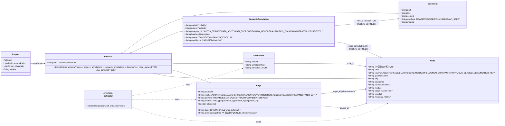
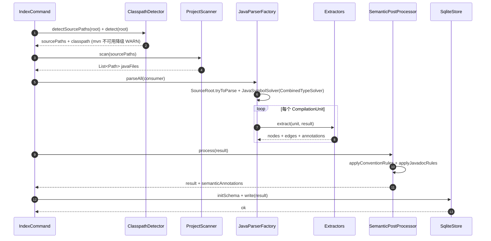
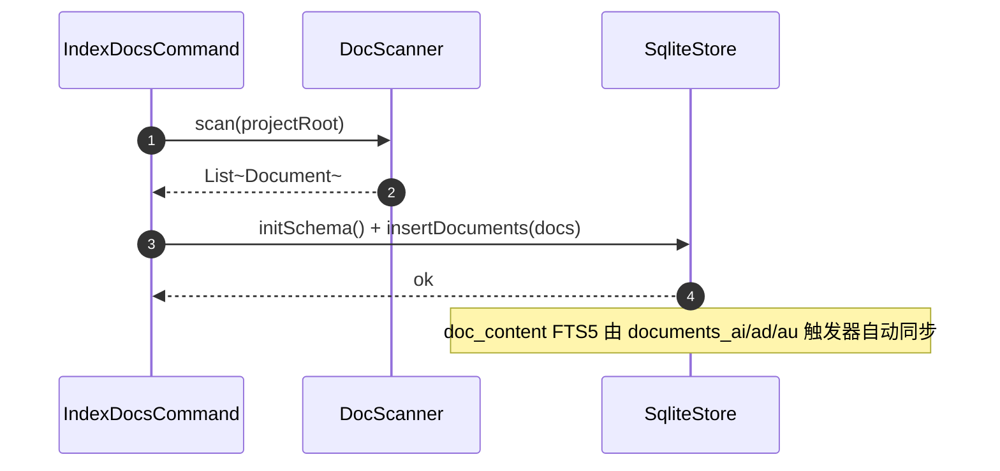
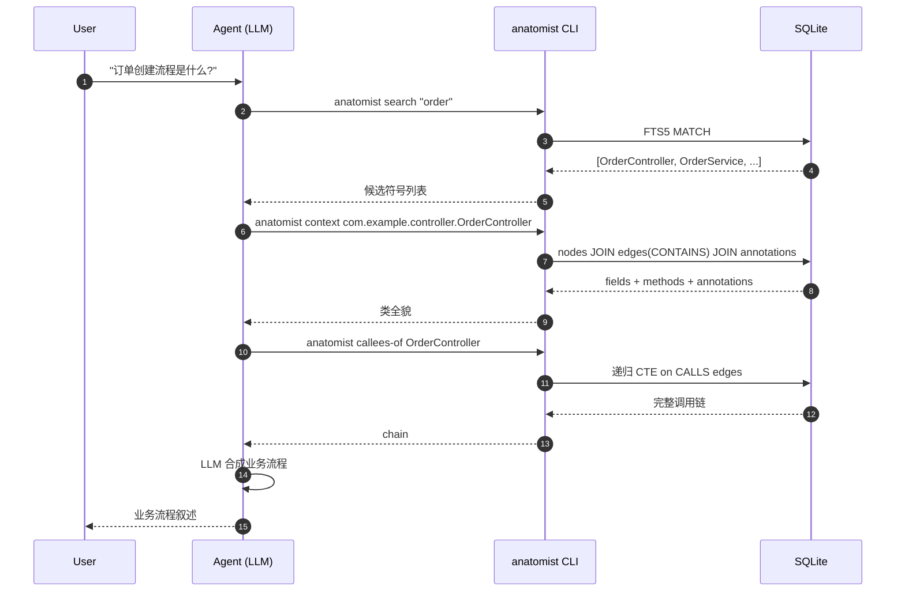

# Domain Model

`.diorama/knowledge/facts/domain-model.md` — anatomist 的领域模型快照。每次 consolidate / survey 增量更新。

anatomist 是面向 Java 项目的代码智能基座,本身**没有业务领域**;它的"领域"是「代码结构与关系的索引与查询」。本文档描述这一元领域。

## 1. 核心实体

## 2. 实体职责与生命周期

| 实体 | 职责 | 生命周期 |
|------|------|---------|
| Project | 描述被索引的 Java 项目(根目录、源码路径、classpath、模块) | 每次 index 命令实例化 |
| Node | 一个 Java 代码实体的索引快照 | index 时写入 SQLite;`anatomist index --incremental` 时增量更新(Phase 4) |
| Edge | Node 间的关系。CASCADE DELETE 跟随 Node | 同 Node |
| Annotation | Node 上的注解。CASCADE DELETE 跟随 Node | 同 Node |
| SemanticAnnotation | 业务语义记录(CONVENTION/JAVADOC/DOC/LLM)。FK SET NULL,Node 删除不连带 | index 期由 SemanticPostProcessor 产出,或后续 LLM 工作流注入 |
| Document | 项目文档记录,触发器同步到 doc_content FTS5 | `anatomist index-docs <path>` 每次覆盖写入 |
| IndexDb | SQLite 物理文件,默认 `<project>/.anatomist/index.db` | 重复索引时覆盖(MVP) |
| Extractor | VoidVisitorAdapter,从 CompilationUnit 产出 Node/Edge/Annotation | 每次 index 实例化,与 ExtractionContext 绑定 |
| SemanticPostProcessor | index 末尾后处理器,applyConventionRules + applyJavadocRules | 每次 index 实例化,纯内存,无 IO |
| DocScanner | 文件树遍历,产出 Document 列表 | `index-docs` 命令实例化 |

## 3. 核心业务规则

- **R1: Node ID 大小写保留** — `com.example.Order`(类)与 `com.example.order`(子包)是不同实体,小写化会撞 ID
- **R2: 方法 ID 用擦除签名** — 重载消歧;`process(List<A>)` 与 `process(List<B>)` 都规约为 `process(java.util.List)` —— 这是 Java 类型擦除的固有现象,工程上接受
- **R3: target 拆分约束** — edges 通过 CHECK 约束强制 `is_external=0 ⇒ target_id 非空 & external_target_fqn 空`,`is_external=1 ⇒ 反之`。SQL 自身防撞名
- **R4: 符号解析失败跳过** — 任何 `MethodCallExpr.resolve()` / `decl.resolve()` 抛 `UnsolvedSymbolException` / `UnsupportedOperationException` 的实体均跳过,不产生半成品 Node;统计 unresolved 计数
- **R5: 两阶段隔离** — Index 阶段调 JavaParser+SymbolSolver,Query 阶段**不**调解析器,只走 SQLite。Agent 多次查询 O(1) 而非 O(N) 重解析
- **R6: SUT 单 DB** — 多模块项目共享一个 index.db,通过 nodes.module 列区分

## 4. 状态/枚举

| 枚举 | 取值 | 说明 |
|------|------|------|
| Node.kind | CLASS / INTERFACE / ENUM / RECORD / METHOD / FIELD / ENUM_CONSTANT / ANONYMOUS_CLASS / LAMBDA / METHOD_REF | 节点类别 |
| Edge.relation | CONTAINS / CALLS / INHERITS / IMPLEMENTS / OVERRIDES / REFERENCES / READS / WRITES / ANNOTATED_WITH | 关系类别 |
| Edge.call_kind | INSTANCE / STATIC / CONSTRUCTOR / SUPER / INTERFACE / NULL | 仅 CALLS 边非空 |
| Edge.context | field_type / parameter_type / return_type / generic_arg / NULL | 仅 REFERENCES 边非空 |
| Node.scope | MAIN / TEST | 区分 src/main/java 与 src/test/java |
| SemanticAnnotation.source | CONVENTION / JAVADOC / DOC / LLM | 语义来源,CHECK 约束 |
| SemanticAnnotation.confidence | HIGH / MEDIUM / LOW | JAVADOC=HIGH, CONVENTION=MEDIUM |
| Document.doc_type | README / DOC / ADR / CHANGELOG / API_SPEC | 路径模式判定 |

## 5. 核心场景与时序图

### 场景 1: 索引(Index)

### 场景 1b: 文档索引(Index Docs)

### 场景 2: Agent 驱动的语义查询(Query)

### 场景 3: 增量更新(Phase 4)

## 6. Phase 1 实际覆盖

| Extractor | 状态 | 备注 |
|-----------|------|------|
| TypeExtractor | ✅ | CLASS / INTERFACE / ENUM + **ANONYMOUS_CLASS** |
| MethodExtractor | ✅ | METHOD + LAMBDA + METHOD_REF + CONTAINS;anonymous 内方法已支持(local 仍跳过);Lambda body 内调用/读写通过 AstEnclosing 归因到 LAMBDA Node;METHOD_REF resolve 失败时 Node 仍发射(metadata.bindingResolved=false),不发 CALLS 边;methodMetadata 含 `isAccessor`(getter/setter 判定) |
| FieldExtractor | ✅ | FIELD + ENUM_CONSTANT + Record 组件 + Record 合成 canonical constructor METHOD Node + CONTAINS;metadata 含 type/isStatic/isFinal(/isRecordComponent) |
| AnnotationExtractor | ✅ | 类/方法/字段/参数 4 层级;参数注解 attributes 含 `_param`/`_name` |
| HierarchyExtractor | ✅ | INHERITS / IMPLEMENTS / OVERRIDES;外部父类支持 |
| ReferenceExtractor | ✅ | field/parameter/return + 泛型 args 递归 depth≤5 + Lambda 参数类型 REFERENCES(source=LAMBDA Node id);**仅项目内** |
| CallGraphExtractor | ✅ | 5 种 call_kind;**含外部**;enclosing 通过 AstEnclosing,识别 Lambda / MethodRef body |
| FieldAccessExtractor | ✅ | READS/WRITES + 复合赋值 + ++/--;**仅项目内字段**;enclosing 同上 |
| TypeExtractor | ✅ | CLASS/INTERFACE/ENUM/ANONYMOUS_CLASS/RECORD;@interface 暂以 INTERFACE kind 入库 |
| ClasspathDetector.detectJavaVersion | ✅ | SAX 遍历所有 pom.xml,优先 `<maven.compiler.source>`、回退 `<java.version>`,多模块取最大值;`--java-version` 显式参数最高优先级 |
| SemanticPostProcessor (Phase 2) | ✅ | CONVENTION(7 注解 + 9 命名规则,naming 仅对类型 kind 生效)+ JAVADOC(首段提炼);填充 semantic_annotations 表 |
| DocScanner + IndexDocsCommand (Phase 2) | ✅ | README/docs/**/*.md/**/ADR-*.md;排除 CHANGELOG/swagger/openapi;FTS5 同步由触发器 |

## 7. 验证基线

Fixture `fixtures/mini-spring-shop/`(api+domain+service 三模块, 15 java 文件)`--no-classpath` 索引产出(20260529-002 task 后):

| 维度 | Phase-1-MVP(001) | Full Phase-1(002) | Gap-closure(20260530-001) |
|------|------------------|-------------------|---------------------------|
| Types(CLASS+INTERFACE+ENUM+ANONYMOUS+RECORD) | 15 | 16 | 16 |
| Methods | 46 | 47 | 47 |
| Fields | 0 | 20 | 20 |
| Annotations | 0 | 23 | 4* |
| CONTAINS | 46 | 68 | 75 |
| INHERITS | 0 | 3 | 1* |
| IMPLEMENTS | 0 | 1 | 1 |
| OVERRIDES | 0 | 4 | 4 |
| REFERENCES | 0 | 35 | 32* |
| CALLS | 0 | 25 | 44 |
| READS | 0 | 42 | 22* |
| WRITES | 0 | 19 | 19 |
| LAMBDA | — | 0 | ≥1 |
| METHOD_REF | — | 0 | ≥1 |
| **Pruned dangling** | 0 | 3 | 6** |

\*  `--no-classpath` 模式下数字会随注解/依赖解析能力变化;以 `≥` 基线为准。
\*\* 残留 dangling 来自 anonymous-class id 编码不一致(pre-existing gap, design.md Amendment 2026-05-31 记录),不在 20260530-001 修复范围。

后续 task 应保证这些数字**单调增长**(REQ-001..005 落地后 LAMBDA / METHOD_REF / CONTAINS / CALLS 不可回退)。
