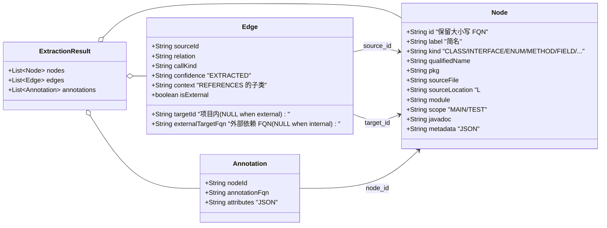
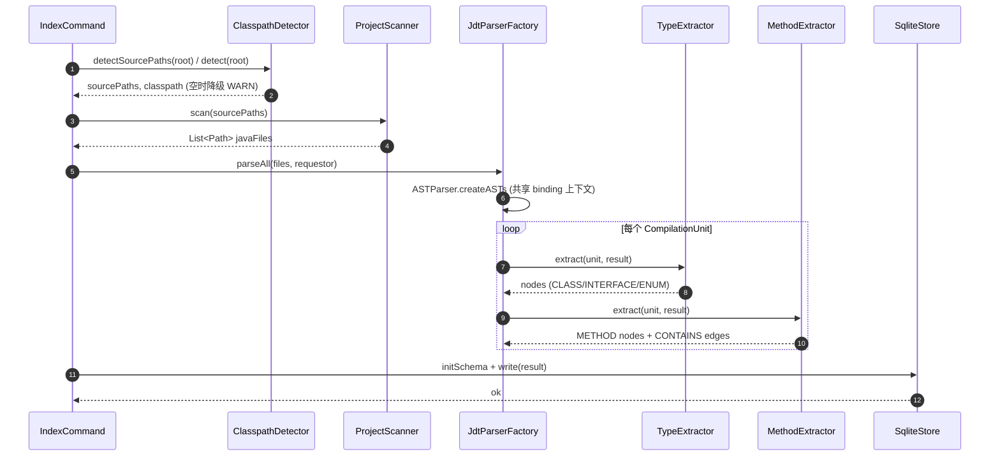

# Domain Model

`.diorama/knowledge/facts/domain-model.md` — anatomist 的领域模型快照。每次 consolidate 增量更新。

## 核心实体

## 索引数据流

## Phase 1 MVP 实际覆盖

| Extractor | 状态 | 说明 |
|-----------|------|------|
| TypeExtractor | ✅ 实现 | CLASS / INTERFACE / ENUM(含 nested,跳过 anonymous/local) |
| MethodExtractor | ✅ 实现 | METHOD + CONTAINS Edge;跳过 anonymous/local 内方法 |
| FieldExtractor | ⏸ 骨架 | 下个 task |
| CallGraphExtractor | ⏸ 骨架 | 下个 task |
| HierarchyExtractor | ⏸ 骨架 | 下个 task |
| ReferenceExtractor | ⏸ 骨架 | 下个 task |
| FieldAccessExtractor | ⏸ 骨架 | 下个 task |
| AnnotationExtractor | ⏸ 骨架 | 下个 task |

## 验证数据

Fixture `fixtures/mini-spring-shop/` 索引产出:
- 15 types (CLASS + INTERFACE + ENUM)
- 46 methods
- 46 CONTAINS edges
- 0 ANNOTATED_WITH(本期不提取)
- 0 CALLS / INHERITS / IMPLEMENTS / REFERENCES(本期不提取)
