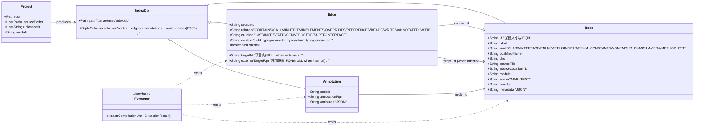
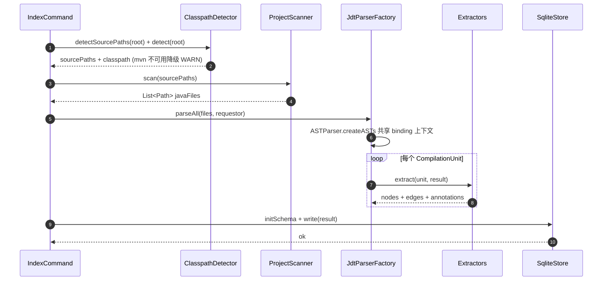
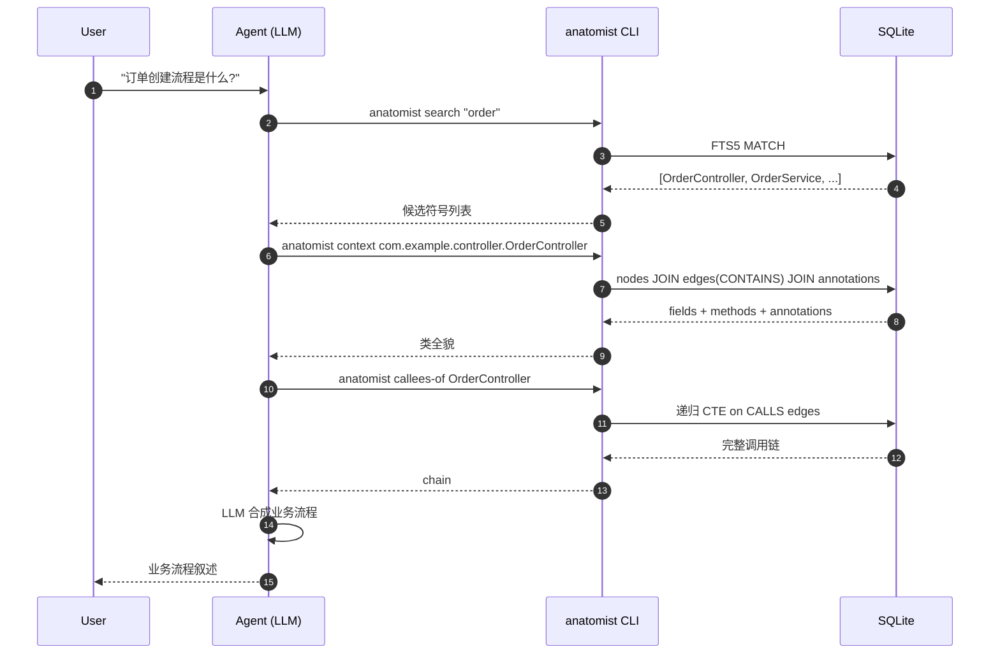
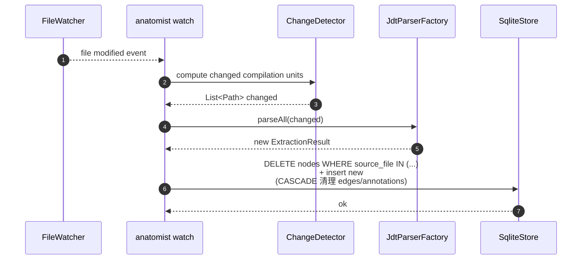

# Domain Model

`.diorama/knowledge/facts/domain-model.md` — anatomist 的领域模型快照。每次 consolidate / survey 增量更新。

anatomist 是面向 Java 项目的代码智能基座,本身**没有业务领域**;它的"领域"是「代码结构与关系的索引与查询」。本文档描述这一元领域。

## 1. 核心实体

## 2. 实体职责与生命周期

| 实体 | 职责 | 生命周期 |
|------|------|---------|
| Project | 描述被索引的 Java 项目(根目录、源码路径、classpath、模块) | 每次 index 命令实例化 |
| Node | 一个 Java 代码实体的索引快照 | index 时写入 SQLite;`anatomist index --incremental` 时增量更新(Phase 4) |
| Edge | Node 间的关系。CASCADE DELETE 跟随 Node | 同 Node |
| Annotation | Node 上的注解。CASCADE DELETE 跟随 Node | 同 Node |
| IndexDb | SQLite 物理文件,默认 `<project>/.anatomist/index.db` | 重复索引时覆盖(MVP) |
| Extractor | ASTVisitor,从 CompilationUnit 产出 Node/Edge/Annotation | 每次 index 实例化,与 ExtractionContext 绑定 |

## 3. 核心业务规则

- **R1: Node ID 大小写保留** — `com.example.Order`(类)与 `com.example.order`(子包)是不同实体,小写化会撞 ID
- **R2: 方法 ID 用擦除签名** — 重载消歧;`process(List<A>)` 与 `process(List<B>)` 都规约为 `process(java.util.List)` —— 这是 JDT 类型擦除的固有现象,工程上接受
- **R3: target 拆分约束** — edges 通过 CHECK 约束强制 `is_external=0 ⇒ target_id 非空 & external_target_fqn 空`,`is_external=1 ⇒ 反之`。SQL 自身防撞名
- **R4: Binding 失败跳过** — 任何 `resolveBinding() == null` 的实体均跳过,不产生半成品 Node;统计 unresolved 计数
- **R5: 两阶段隔离** — Index 阶段调 JDT,Query 阶段**不**调 JDT,只走 SQLite。Agent 多次查询 O(1) 而非 O(N) 重解析
- **R6: SUT 单 DB** — 多模块项目共享一个 index.db,通过 nodes.module 列区分

## 4. 状态/枚举

| 枚举 | 取值 | 说明 |
|------|------|------|
| Node.kind | CLASS / INTERFACE / ENUM / METHOD / FIELD / ENUM_CONSTANT / ANONYMOUS_CLASS / LAMBDA / METHOD_REF | 节点类别 |
| Edge.relation | CONTAINS / CALLS / INHERITS / IMPLEMENTS / OVERRIDES / REFERENCES / READS / WRITES / ANNOTATED_WITH | 关系类别 |
| Edge.call_kind | INSTANCE / STATIC / CONSTRUCTOR / SUPER / INTERFACE / NULL | 仅 CALLS 边非空 |
| Edge.context | field_type / parameter_type / return_type / generic_arg / NULL | 仅 REFERENCES 边非空 |
| Node.scope | MAIN / TEST | 区分 src/main/java 与 src/test/java |

## 5. 核心场景与时序图

### 场景 1: 索引(Index)

### 场景 2: Agent 驱动的语义查询(Query)

### 场景 3: 增量更新(Phase 4)

## 6. Phase 1 MVP 实际覆盖

| Extractor | 状态 | 说明 |
|-----------|------|------|
| TypeExtractor | ✅ 实现 | CLASS / INTERFACE / ENUM(含 nested,跳过 anonymous/local) |
| MethodExtractor | ✅ 实现 | METHOD + CONTAINS Edge;跳过 anonymous/local 内方法 |
| FieldExtractor | ⏸ 骨架 | 下个 task |
| CallGraphExtractor | ⏸ 骨架 | 下个 task |
| HierarchyExtractor | ⏸ 骨架 | 下个 task |
| ReferenceExtractor | ⏸ 骨架 | 下个 task |
| FieldAccessExtractor | ⏸ 骨架 | 下个 task |
| AnnotationExtractor | ⏸ 骨架 | 下个 task |

## 7. 验证基线

Fixture `fixtures/mini-spring-shop/`(api+domain+service 三模块, 15 java 文件)首次索引产出:
- 15 types(CLASS+INTERFACE+ENUM)
- 46 methods
- 46 CONTAINS edges
- 0 ANNOTATED_WITH / CALLS / INHERITS / IMPLEMENTS / REFERENCES(本期不提取)

任何后续 task 实施 Extractor 时,这些数字只会**单调增长**,可作为回归基线。
