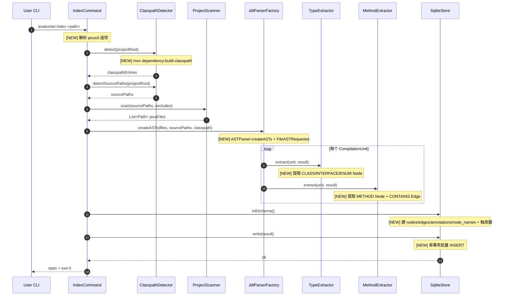

# PRD: 20260529-001-phase1-index-mvp

**Source**: [proposal.md](./proposal.md)
**Tasks**: [tasks.md](./tasks.md)

## 1. 需求概述

落地 anatomist Phase 1 的 **MVP 索引闭环**: `anatomist index <path>` 命令能扫描 Maven 项目源码 → 调用 JDT 解析 → 提取 CLASS/INTERFACE/ENUM/METHOD 节点与 CONTAINS 边 → 写入 SQLite。本期不实现 CallGraph/Hierarchy/Reference/FieldAccess/Annotation 五个 Extractor 与多模块 classpath 合并,聚焦验证"源码 → SQLite"主数据流。

## 2. 术语表

| 术语 | 定义 |
|------|------|
| Node | SQLite `nodes` 表中的一条记录,代表一个 Java 代码实体(类/接口/枚举/方法/字段等),详见 DESIGN.md §nodes 表 |
| Edge | SQLite `edges` 表中的一条记录,代表两个 Node 之间的关系(CONTAINS/CALLS/...),本期只产出 CONTAINS |
| MVP | 本任务范围:仅 TypeExtractor + MethodExtractor,其余 Extractor 不实现 |
| Project Internal | 声明类位于 `--project-source` 路径下的类型,与"外部依赖"对立 |
| Fixture | `fixtures/mini-spring-shop/`,本任务的验收数据源 |

## 3. 功能需求

- **REQ-001**: `anatomist index <path>` 命令接收一个项目根目录,在 `<path>/.anatomist/index.db`(或 `--output` 指定路径)生成 SQLite 索引文件。
- **REQ-002**: 自动检测 Maven 单模块项目: 存在 `pom.xml` 且 `src/main/java` 存在时,把 `src/main/java` 加入 sourcePaths,并执行 `mvn dependency:build-classpath -DincludeScope=compile -Dmdep.outputFile=<tmp>` 提取 classpath。
- **REQ-003**: `ProjectScanner` 递归扫描 sourcePaths 收集 `.java` 文件,默认跳过 `target/` / `build/` / `.gradle/` / `.git/` / `.idea/` / `node_modules/`,`--exclude "a,b"` 追加跳过目录名,不跟符号链接。
- **REQ-004**: `JdtParserFactory` 用 `ASTParser.createASTs(...)` + `FileASTRequestor` 批量解析所有源文件,`setResolveBindings(true)`、`setBindingsRecovery(true)`,默认 `includeRunningVMClasspath = false`,默认 Java 8(`AST.JLS8` + `VERSION_1_8`),`--java-version {11,17,21}` 切换到对应 `AST.JLS*`/`VERSION_*`。
- **REQ-005**: `TypeExtractor` 对每个 `CompilationUnit` 提取 `TypeDeclaration`(含 nested)、`EnumDeclaration` 为 Node;kind = CLASS / INTERFACE / ENUM;Node ID = 完整 FQN(原样大小写)。metadata JSON 至少包含 `isAbstract`、`isInterface` 字段(CLASS/INTERFACE),`constants` 字段(ENUM)。
- **REQ-006**: `MethodExtractor` 对每个 `MethodDeclaration`(含构造函数)提取 METHOD 节点;Node ID = `<class FQN>#<name>(<param erased FQNs, comma-separated>)`,擦除签名来自 `IMethodBinding.getKey()` 的参数部分或回退到 `ITypeBinding.getErasure().getQualifiedName()`;metadata JSON 至少包含 `returnType`、`parameters: [{name,type}]`、`modifiers`、`isConstructor`、`signature`(人类可读)。
- **REQ-007**: 对所有 Type 节点和其方法节点,产出 `relation=CONTAINS` 的 Edge,`is_external=0`,`call_kind=NULL`,`context=NULL`。
- **REQ-008**: `SqliteStore` 按 scenario-1-index.md §完整 DDL 创建 `nodes` / `edges` / `annotations` / `node_names`(FTS5 external content) + 全部索引 + 触发器 + CHECK 约束。重复索引时覆盖旧库(先删文件再建)。
- **REQ-009**: SQLite 批量写入用单事务 + `PreparedStatement.addBatch()`,完成后 commit;失败时回滚并退出码非零。
- **REQ-010**: `mvn` 不存在或 `dependency:build-classpath` 退出码非零时,降级为空 classpath,在 stderr 输出 `WARN: mvn classpath detection failed (<reason>), proceeding with empty classpath`,继续完成索引。
- **REQ-011**: 命令输出运行统计(stderr 或 stdout): 模块类型(Maven/non-Maven)、源文件数、classpath jar 数、Types 数、Methods 数、CONTAINS 边数、耗时;成功时退出码 0。
- **REQ-012**: `--no-classpath` 跳过 classpath 检测,直接用空 classpath。`--classpath <paths>` 覆盖检测结果(按 `File.pathSeparator` 拆分)。`--project-source <paths>` 覆盖默认源码路径检测。

## 4. 业务规则

- **BR-001**: Node ID 严格保留原始大小写 → 关联 REQ-005, REQ-006
- **BR-002**: 方法 Node ID 必须用擦除后的参数 FQN(如 `java.util.List`、`int`),不带泛型实参 → 关联 REQ-006
- **BR-003**: 类内嵌套类(nested type)递归提取为独立 Node,FQN 用 `Outer.Inner` 形式 → 关联 REQ-005
- **BR-004**: 本期不识别项目内/外部(`is_external` 字段对 CONTAINS 始终为 0),不存外部依赖边 → 关联 REQ-007
- **BR-005**: `resolveBinding() == null` 时跳过该实体(Type/Method),不产生半成品 Node;统计输出 unresolved 计数 → 关联 REQ-005, REQ-006
- **BR-006**: 同一 ID 重复出现(如 partial 类) → 后写入覆盖前写入(INSERT OR REPLACE);本期无 partial 场景,但实现需防御 → 关联 REQ-008
- **BR-007**: Anonymous class / Lambda / Field 节点本期不提取(留给后续 task) → 关联 REQ-005

## 5. 场景规格

### S1: 索引 fixture/mini-spring-shop 的 service 模块 [REQ-001..009, REQ-011]

- **Given** `fixtures/mini-spring-shop/service/` 存在,且根目录有 `pom.xml`,`src/main/java` 含 `OrderService.java` 等 4 个类
- **When** 执行 `anatomist index fixtures/mini-spring-shop/service --output /tmp/anatomist-test.db`
- **Then**
  - 退出码 0
  - `/tmp/anatomist-test.db` 存在
  - `SELECT count(*) FROM nodes WHERE kind='CLASS'` ≥ 4(OrderService/OrderValidator/PriceCalculator/BaseService)
  - `SELECT count(*) FROM nodes WHERE kind='INTERFACE'` ≥ 1(OrderRepository,若 service 模块包含)
  - `SELECT id FROM nodes WHERE qualified_name='com.example.shop.service.OrderService'` 返回非空
  - `SELECT count(*) FROM nodes WHERE kind='METHOD' AND id LIKE 'com.example.shop.service.OrderService#%'` ≥ 1
  - `SELECT count(*) FROM edges WHERE relation='CONTAINS'` > 0
  - `SELECT count(*) FROM node_names WHERE node_names MATCH 'OrderService'` ≥ 1
  - SQLite CHECK 约束: 所有 CONTAINS 边 `is_external=0` 且 `target_id IS NOT NULL` 且 `external_target_fqn IS NULL`

### S2: 无 mvn 环境时的降级 [REQ-010]

- **Given** 在 `mvn` 不可用的 PATH 下,目标项目仍是合法 Maven 项目
- **When** 执行 `anatomist index <project>`
- **Then**
  - 退出码 0(不报错)
  - stderr 含 `WARN:` 字样和 `mvn` 关键词
  - SQLite 中 nodes/edges 仍正常产出(项目内 Binding 可能不完整,但不影响 TypeExtractor/MethodExtractor 工作——它们只依赖语法节点和声明 binding)

### S3: 显式跳过 classpath [REQ-012]

- **Given** 同 S1 的 fixture
- **When** 执行 `anatomist index <fixture> --no-classpath --output /tmp/x.db`
- **Then** 不执行 `mvn`,SQLite 产出 nodes/edges,统计输出中 `Classpath: 0 jars`

### S4: 输出文件路径默认行为 [REQ-001]

- **Given** 项目 `<path>` 不指定 `--output`
- **When** 执行 `anatomist index <path>`
- **Then** SQLite 文件落在 `<path>/.anatomist/index.db`,父目录不存在时自动创建

## 6. 变更时序图

### 变更链路时序图



### 参考时序图（来自 domain-model）

无 — `.diorama/knowledge/facts/domain-model.md` 当前为空,无可参考时序图。本项目是新建,后续 survey 会沉淀此场景。

### 变更模型图

#### 变更前模型

无 — Phase 1 之前所有类只是骨架(throw UnsupportedOperationException),无运行时数据模型。

#### 变更后模型

```mermaid
classDiagram
    class IndexCommand {
        +Path projectPath
        +Integer javaVersion
        +String exclude
        +Path output
        +String classpath
        +String projectSource
        +boolean noClasspath
        +Integer call() [MOD: 实现]
    }:::modified

    class ProjectScanner {
        +Set~String~ excludedDirs
        +List~Path~ scan(Path root) [MOD: 实现]
    }:::modified

    class ClasspathDetector {
        +List~String~ detect(Path root) [MOD: 实现]
        +List~Path~ detectSourcePaths(Path root) [MOD: 实现]
    }:::modified

    class JdtParserFactory {
        +int javaVersion
        +List~String~ classpathEntries
        +List~String~ sourcePaths
        +boolean includeRunningVmClasspath
        +ASTParser newParser() [MOD: 实现]
        +void parseAll(List~Path~ files, FileASTRequestor cb) [NEW]
    }:::modified

    class TypeExtractor {
        +void extract(CompilationUnit, ExtractionResult) [MOD: 实现]
    }:::modified

    class MethodExtractor {
        +void extract(CompilationUnit, ExtractionResult) [MOD: 实现]
    }:::modified

    class SqliteStore {
        +Path dbPath
        +void initSchema() [MOD: 实现]
        +void write(ExtractionResult) [MOD: 实现]
        +void close() [MOD: 实现]
    }:::modified

    class NodeIdGenerator {
        +String forType(ITypeBinding) [NEW]
        +String forMethod(IMethodBinding) [NEW]
    }:::new

    IndexCommand --> ClasspathDetector
    IndexCommand --> ProjectScanner
    IndexCommand --> JdtParserFactory
    IndexCommand --> SqliteStore
    JdtParserFactory ..> TypeExtractor : invokes
    JdtParserFactory ..> MethodExtractor : invokes
    TypeExtractor ..> NodeIdGenerator
    MethodExtractor ..> NodeIdGenerator

    classDef new fill:#d4edda,stroke:#28a745,stroke-width:2px
    classDef modified fill:#fff3cd,stroke:#ffc107,stroke-width:2px
```

## 7. 实现上下文

- **入口代码**: `src/main/java/com/anatomist/cli/IndexCommand.java#call()`
- **SUT 边界**:
  - 包括: `cli.IndexCommand` + `core.{ClasspathDetector,ProjectScanner,JdtParserFactory}` + `extract.{TypeExtractor,MethodExtractor}` + `store.SqliteStore` + 新增 `core.NodeIdGenerator`
  - 不包括: 其他 5 个 Extractor(保留骨架,不实现) + 已有 model.{Node,Edge,Annotation,ExtractionResult}(已就绪)
- **外部依赖**:
  - JDT(`org.eclipse.jdt.core` 3.45.0) — 真实使用,不 stub
  - SQLite(`org.xerial:sqlite-jdbc`) — 真实使用,测试用临时文件
  - `mvn` 命令行 — 集成测试中需要识别其可用性,通过覆盖 PATH 或 mock `Process` 调用降级路径(降级测试用单元级 stub)
- **Stub/Mock 策略**:
  - 单元测试: `ProjectScanner` 用临时目录;`SqliteStore` 用内存 SQLite (`jdbc:sqlite::memory:`) 或临时文件;`NodeIdGenerator` 用伪造 `ITypeBinding`/`IMethodBinding` 不现实 → 改为通过真实 JDT 解析最小 Java 代码片段获得 binding
  - 集成测试: 直接对 fixture `fixtures/mini-spring-shop/service/` 跑 IndexCommand,断言 SQLite 内容(无 mock)

### 变更清单

#### 新增

- `src/main/java/com/anatomist/core/NodeIdGenerator.java` — 集中 Node ID 生成规则,供 Extractors 共用
- `src/main/java/com/anatomist/core/ExtractionContext.java` — 共享上下文(projectRoot/sourcePaths/idGenerator/module),先放最小字段
- `src/main/resources/schema.sql` — 完整 DDL,`SqliteStore.initSchema()` 读取并按 `;` 拆分执行
- `src/test/java/com/anatomist/core/ProjectScannerTest.java`
- `src/test/java/com/anatomist/core/JdtParserFactoryTest.java`
- `src/test/java/com/anatomist/extract/TypeExtractorTest.java`
- `src/test/java/com/anatomist/extract/MethodExtractorTest.java`
- `src/test/java/com/anatomist/store/SqliteStoreTest.java`
- `src/test/java/com/anatomist/cli/IndexCommandIT.java` — 集成测试,对 fixture 执行 IndexCommand

#### 修改

- `pom.xml` — 新增 test scope: JUnit 5 (`junit-jupiter` 5.10.x);maven-surefire-plugin 3.x 配置
- `src/main/java/com/anatomist/core/ProjectScanner.java` — 实现 scan
- `src/main/java/com/anatomist/core/ClasspathDetector.java` — 实现 detect + detectSourcePaths
- `src/main/java/com/anatomist/core/JdtParserFactory.java` — 实现 newParser + 新增 parseAll(files, requestor)
- `src/main/java/com/anatomist/extract/TypeExtractor.java` — 实现 extract
- `src/main/java/com/anatomist/extract/MethodExtractor.java` — 实现 extract
- `src/main/java/com/anatomist/store/SqliteStore.java` — 实现 initSchema + write + close
- `src/main/java/com/anatomist/cli/IndexCommand.java` — 实现 call()

#### 删除

无。

## 8. 接口契约

CLI 命令为本工具对外接口,本期定义如下:

### 新增接口

| 接口 | 方法/路径 | 请求体 | 响应体 | 说明 |
|------|----------|--------|--------|------|
| `anatomist index` | CLI `anatomist index <path>` | options: `--java-version <int>`, `--exclude <csv>`, `--output <path>`, `--classpath <paths>`, `--project-source <paths>`, `--no-classpath` | stdout/stderr 文本统计 + 退出码 0/1 + SQLite 文件 | 索引 Java 项目到 SQLite |

### 修改接口

无 — 之前 IndexCommand 抛 UnsupportedOperationException,本期填实现,选项签名不变。

### 删除接口

无。

## 9. 影响面与风险

- **不包含**:
  - CallGraph/Hierarchy/Reference/FieldAccess/AnnotationExtractor 五个 Extractor 的实现(保留骨架,下个 task)
  - 多模块 Maven 项目检测(`<modules>` 解析)
  - Gradle 支持
  - 增量索引 / Watch
  - 文档索引 / 语义注解
  - Anonymous class / Lambda / Field / Method ref Node 类型
- **已知风险**:
  - `mvn dependency:build-classpath` 在 fixture 项目首次执行需联网下载 Spring 依赖,CI 环境耗时不可控 → 缓解: 集成测试默认用 `--no-classpath` 模式;classpath 检测的单元测试 mock Process
  - `IMethodBinding.getKey()` 输出格式跨 JDT 版本可能微调 → 缓解: 用 `binding.getParameterTypes()[i].getErasure().getQualifiedName()` 自行拼接擦除签名,不依赖 getKey()
  - SQLite FTS5 触发器在某些 sqlite-jdbc 版本可能未启用 FTS5 编译选项 → 缓解: 在 initSchema 中先 `CREATE VIRTUAL TABLE` 探测,失败时报清晰错误退出(本期不做回退)
- **依赖**:
  - 已有骨架代码(Phase 1 init commit)
  - fixture `fixtures/mini-spring-shop/` 已就位

## 10. 验收标准

- **AC-001**: [REQ-001..009, REQ-011] 对 `fixtures/mini-spring-shop/service/` 执行 `anatomist index <path> --output /tmp/x.db --no-classpath`,退出码 0,SQLite 内 `nodes` 表 ≥ 5 行 CLASS+INTERFACE,`com.example.shop.service.OrderService` 存在,`edges` 表 CONTAINS 边数 > 0,`node_names` FTS5 表 MATCH 'OrderService' 命中。
- **AC-002**: [REQ-010] mock `mvn` 不可用场景: 执行 `PATH= anatomist index <fixture>`(或 ClasspathDetector 单元测试),不抛异常,stderr 含 `WARN`,索引仍产出。
- **AC-003**: [REQ-008] `SqliteStore.initSchema()` 后,查询 `sqlite_master` 至少能找到表 `nodes/edges/annotations/node_names`、索引 `idx_nodes_kind/idx_edges_source_id/idx_annotations_fqn` 等关键索引。
- **AC-004**: [REQ-005, REQ-006, BR-001..003] 单元测试: 给定 `class A { void foo(String s, java.util.List<Integer> xs){} class B {} }`,提取产出 ID 为 `pkg.A`、`pkg.A.B`、`pkg.A#foo(java.lang.String,java.util.List)`(注意大小写保留、参数擦除)。
- **AC-005**: [REQ-003] 给定临时目录含 `target/X.java` 和 `src/main/java/Y.java`,默认排除生效,只扫描到 Y.java;追加 `--exclude "foo"` 后再增 `foo/Z.java`,Z 被排除。
- **AC-006**: [REQ-004] JdtParserFactory 在两个文件 A.java/B.java 互相调用场景下,`A` 引用 `B` 的 binding 非 null(验证 createASTs 共享 binding 上下文,不必断言 CALLS 边——本期不提取 CALLS)。

### 验证矩阵

| 验证项 | 阶段 | 手段 | 本次覆盖 |
|--------|------|------|---------|
| ProjectScanner 扫描 + exclude | 单元 | JUnit + 临时目录 | — |
| JdtParserFactory binding 共享 | 单元 | JUnit + 内存源码 | — |
| TypeExtractor ID/metadata 正确性 | 单元 | JUnit + 内存源码 | — |
| MethodExtractor ID 擦除签名 | 单元 | JUnit + 内存源码(带泛型/重载) | — |
| SqliteStore schema 一致性 | 单元 | JUnit + 临时 SQLite | — |
| ClasspathDetector 降级 | 单元 | JUnit + 临时目录 + 不存在 mvn | — |
| 端到端 fixture 索引 | 集成 | JUnit IT + fixture/mini-spring-shop | — |

## 11. 遗留问题

无。已就以下两点与用户确认:

- `--include-running-vm-classpath` 本期**不暴露 CLI 选项**,REQ-004 写死 `false`,留待后续 task。
- 集成测试默认使用 `--no-classpath` 模式,**不依赖** `mvn dependency:build-classpath`,避免 CI 联网拉 Spring 依赖;真实 mvn 路径仅在 ClasspathDetector 单元测试中以"mvn 不可用"降级路径验证,不调真实 Process。
