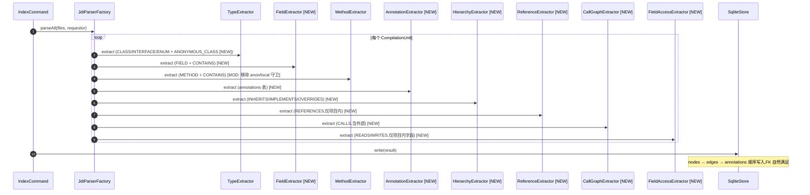

# PRD: 20260529-002-phase1-rest-extractors

**Source**: [proposal.md](./proposal.md)
**Tasks**: [tasks.md](./tasks.md)

## 1. 需求概述

补齐 Phase 1 余下的 5 个 Extractor(Field/Annotation/Hierarchy/Reference/CallGraph/FieldAccess — 共 6 个职责文件),让 SQLite 边集合从 1 种(CONTAINS)扩到 9 种全集。本期同时落地 ANONYMOUS_CLASS Node,移除 MethodExtractor 的临时守卫。LAMBDA 与 METHOD_REF 仍留到后续 task。

## 2. 术语表

继承自 [`.diorama/knowledge/facts/glossary.json`](../../knowledge/facts/glossary.json),本任务无新术语。

## 3. 功能需求

- **REQ-001**: `FieldExtractor` 提取每个 `FieldDeclaration` 为 FIELD Node,ID = `<classFqn>#<fieldName>`(`NodeIdGenerator.forField`),并产生 `CONTAINS` Edge(class → field)。metadata JSON 含 `type`(字段类型简名)、`isStatic`、`isFinal`。
- **REQ-002**: `AnnotationExtractor` 把类 / 方法 / 字段 / 参数上的注解写入 `annotations` 表;`annotation_fqn` 用 `IAnnotationBinding.getAnnotationType().getQualifiedName()`;`attributes` 为 `MemberValuePair` 列表的 JSON 表示(键 = 属性名,值 = 字面量字符串)。
- **REQ-003**: `HierarchyExtractor` 提取
  - `INHERITS` Edge: 子类 → 父类(`ITypeBinding.getSuperclass()`,跳过 `java.lang.Object`);接口 → 父接口
  - `IMPLEMENTS` Edge: 实现类 → 接口
  - `OVERRIDES` Edge: 子类方法 → 父类(含接口)方法(`IMethodBinding.overrides`)
  - 项目内 target 写 `target_id`;外部父类/接口写 `external_target_fqn` + `is_external=1`
- **REQ-004**: `ReferenceExtractor` 提取 `REFERENCES` Edge,只对**项目内** target 发射(BR-EXT-1)。来源:
  - 字段类型 → `context = field_type`
  - 方法参数类型 → `context = parameter_type`
  - 方法返回类型 → `context = return_type`
  - 泛型实参 → `context = generic_arg`(递归展开 `ParameterizedType.typeArguments()`)
- **REQ-005**: `CallGraphExtractor` 提取 `CALLS` Edge,**含外部**(BR-EXT-2):
  - `MethodInvocation` → `INSTANCE` 或 `STATIC`(根据 `Modifier.isStatic`)或 `INTERFACE`(根据 `declaringClass.isInterface()`)
  - `ClassInstanceCreation` → `CONSTRUCTOR`
  - `SuperMethodInvocation` → `SUPER`
  - 外部调用: `is_external=1`, `target_id=NULL`, `external_target_fqn` = `<declClassFqn>#<name>(<erased,params>)`
- **REQ-006**: `FieldAccessExtractor` 提取 `READS` / `WRITES` Edge,**只对项目内字段**:
  - `Assignment` 左侧 / `PrefixExpression(++/--)` / `PostfixExpression(++/--)` 中的字段 → `WRITES`
  - 其它出现的字段(`SimpleName` / `FieldAccess` 解析到 `IVariableBinding.isField()=true`) → `READS`
  - 复合赋值 `+=` `-=` 等 → 同时发 `WRITES` + `READS`
  - 跳过局部变量、方法参数
- **REQ-007**: TypeExtractor 新增对 `AnonymousClassDeclaration` 的处理,发射 `ANONYMOUS_CLASS` Node,ID = `<enclosingMethodId>$anon@L<line>`,metadata 含 `baseType`(直接父类/接口名)。
- **REQ-008**: MethodExtractor 移除 `isAnonymous || isLocal` 临时守卫(原 BR-007 守卫,因为 REQ-007 已经发射了对应 CLASS Node)。
- **REQ-009**: 所有 Extractor 在 `resolveBinding() == null` 时跳过该实体,并在 `ExtractionResult.stats` 上累计 unresolved 计数(按 Extractor 名分桶)。
- **REQ-010**: IndexCommand 注册 6 个新 Extractor 到 acceptAST 回调中,执行顺序固定:**Type → Field → Method → Annotation → Hierarchy → Reference → CallGraph → FieldAccess**(确保前置节点已就绪)。
- **REQ-011**: IndexCommand 输出统计扩展,显示每类边数:`Types/Methods/Fields/Annotations/CONTAINS/INHERITS/IMPLEMENTS/OVERRIDES/REFERENCES/CALLS/READS/WRITES`。

## 4. 业务规则

- **BR-EXT-1**: REFERENCES 边只对项目内目标发射。外部类型在字段/参数/返回值处出现频率极高(每个 `String`/`List` 都算),全存会让 edges 表膨胀且查询噪音过大,业务价值低。
- **BR-EXT-2**: CALLS 边含外部目标(`is_external=1`)。Agent 经常问"这个方法调了什么外部 API",这是 D 类查询的核心价值之一。
- **BR-EXT-3**: READS/WRITES 边只对项目内字段。`System.out`、`Collections.EMPTY_LIST` 等外部静态字段对业务分析无价值。
- **BR-NULL-1**: 任何 `resolveBinding() == null` 都跳过相关 Edge / Node,不发明 ghost。
- **BR-IDORDER-1**: 在同一个 CompilationUnit 内,Extractor 按 REQ-010 固定顺序执行,保证 source/target Node 在被 edge 引用前已经存在于 ExtractionResult.nodes 中。SqliteStore.write 时按 nodes → edges → annotations 写入顺序,FK 约束自然满足。
- **BR-ANON-1**: ANONYMOUS_CLASS Node 的 `source_file` 与 `source_location` 取自 AnonymousClassDeclaration 节点本身,父方法 ID 通过向上遍历 AST 到最近的 MethodDeclaration 计算。Lambda 还不实现,enclosing 找不到 method 时跳过(保守)。
- **BR-OVERRIDE-1**: OVERRIDES 检测只在项目内类范围内做(遍历父类/接口的方法,逐一 `IMethodBinding.overrides`)。父方法外部时仍可发射 OVERRIDES Edge,target 走 external_target_fqn。

## 5. 场景规格

### S1: fixture 端到端边覆盖 [REQ-001..010]

- **Given** `fixtures/mini-spring-shop/` 全三模块作为 sourcePaths
- **When** `anatomist index <fixture> --project-source ... --no-classpath --output /tmp/x.db`
- **Then** SQLite 中:
  - `count(*) FROM edges WHERE relation='CONTAINS'` > 上次基线 46(因加入了 FIELD 子节点)
  - `count(*) FROM edges WHERE relation='INHERITS' AND is_external=0` ≥ 1(OrderService extends BaseService)
  - `count(*) FROM edges WHERE relation='IMPLEMENTS' AND is_external=0` ≥ 1(InMemoryOrderRepository implements OrderRepository)
  - `count(*) FROM edges WHERE relation='CALLS'` ≥ 3(OrderService.createOrder 调多个组件)
  - `count(*) FROM edges WHERE relation='CALLS' AND is_external=1` ≥ 1(@Autowired 注入的 Objects.requireNonNull 或类似 JDK 调用)
  - `count(*) FROM edges WHERE relation='REFERENCES'` ≥ 1
  - `count(*) FROM edges WHERE relation='OVERRIDES'` ≥ 1
  - `count(*) FROM annotations WHERE annotation_fqn='org.springframework.stereotype.Service'` ≥ 1
  - `count(*) FROM nodes WHERE kind='FIELD'` ≥ 4

### S2: 重载方法的 OVERRIDES 不撞 [REQ-003, BR-OVERRIDE-1]

- **Given** 内存源码: `class P { void f(String x){} void f(int x){} } class C extends P { void f(String x){} }`
- **When** HierarchyExtractor 处理 C
- **Then** OVERRIDES Edge 只在 `C#f(java.lang.String)` → `P#f(java.lang.String)` 之间,不与 `P#f(int)` 撞

### S3: 泛型参数递归展开 [REQ-004]

- **Given** `class A { Map<String, List<Order>> orders; }`
- **When** ReferenceExtractor 处理 A
- **Then**
  - 项目内 `Order` 类型产 1 条 REFERENCES,`context=generic_arg`
  - 外部 `Map`/`String`/`List` **不**产 REFERENCES(BR-EXT-1)

### S4: 复合赋值同时产 READS+WRITES [REQ-006]

- **Given** `class A { int n; void inc(){ n += 1; } }`
- **When** FieldAccessExtractor 处理 A
- **Then** 产 1 条 WRITES + 1 条 READS,target_id 均为 `pkg.A#n`,source_id 均为 `pkg.A#inc()`

### S5: 匿名类的方法可正常提取 [REQ-007, REQ-008]

- **Given** 内存源码: `class A { Runnable r = new Runnable(){ public void run(){} }; }`
- **When** TypeExtractor + MethodExtractor 处理 A
- **Then**
  - 产 ANONYMOUS_CLASS Node,id 形如 `pkg.A#<init>(...)$anon@L1` 或基于 enclosing initializer 的某个稳定值(若不在 method 内则跳过)
  - 该 Node 下的 `run()` 方法 Node 也被提取且 CONTAINS Edge 指向匿名类 Node
  - **不**产生 FK 违例

## 6. 变更时序图

### 变更链路时序图



### 参考时序图（来自 domain-model）

从 [domain-model.md §场景 1: 索引](../../knowledge/facts/domain-model.md) 复用 Index 主流程。本次只是在 acceptAST 回调中追加 6 个 Extractor。

### 变更模型图

#### 变更前模型

3 个 Extractor 实现 + 5 个骨架(详见 domain-model.md §6)。

#### 变更后模型

```mermaid
classDiagram
    direction TB
    class TypeExtractor {
        +extract(...) [MOD: +ANONYMOUS_CLASS]
    }:::modified
    class MethodExtractor {
        +extract(...) [MOD: 移除 anon/local 守卫]
    }:::modified
    class FieldExtractor {
        +extract(...) [MOD: 实现]
    }:::modified
    class AnnotationExtractor {
        +extract(...) [MOD: 实现]
    }:::modified
    class HierarchyExtractor {
        +extract(...) [MOD: 实现]
    }:::modified
    class ReferenceExtractor {
        +extract(...) [MOD: 实现,仅项目内]
    }:::modified
    class CallGraphExtractor {
        +extract(...) [MOD: 实现,含外部]
    }:::modified
    class FieldAccessExtractor {
        +extract(...) [MOD: 实现,仅项目内字段]
    }:::modified

    classDef modified fill:#fff3cd,stroke:#ffc107,stroke-width:2px
```

## 7. 实现上下文

- **入口代码**:
  - `src/main/java/com/anatomist/cli/IndexCommand.java#call()` — 注册新 Extractor
  - 6 个 Extractor 源文件(全部已存在为骨架,本期填实现)
  - `src/main/java/com/anatomist/extract/TypeExtractor.java` — 新增 AnonymousClassDeclaration 处理
  - `src/main/java/com/anatomist/extract/MethodExtractor.java` — 移除守卫
  - `src/main/java/com/anatomist/core/ExtractionContext.java` — `isProjectInternal(ITypeBinding)` 已有,本期被密集复用
- **SUT 边界**: `extract/` 包下 6 个 Extractor + TypeExtractor/MethodExtractor 微改 + IndexCommand 集成微改
- **Stub/Mock 策略**:
  - 单测继续用 `JdtTestSupport.parse(unitName, src)` 喂内存代码,断言 ExtractionResult.{nodes,edges,annotations}
  - 集成测试沿用 `IndexCommandIT` 模式,新增断言覆盖 9 种边

### 变更清单

#### 新增

- `src/test/java/com/anatomist/extract/FieldExtractorTest.java`
- `src/test/java/com/anatomist/extract/AnnotationExtractorTest.java`
- `src/test/java/com/anatomist/extract/HierarchyExtractorTest.java`
- `src/test/java/com/anatomist/extract/ReferenceExtractorTest.java`
- `src/test/java/com/anatomist/extract/CallGraphExtractorTest.java`
- `src/test/java/com/anatomist/extract/FieldAccessExtractorTest.java`
- `src/test/java/com/anatomist/cli/IndexCommandIT.java` 新增断言方法(同文件追加测试,不新建文件)

#### 修改

- `src/main/java/com/anatomist/extract/FieldExtractor.java` — 实现
- `src/main/java/com/anatomist/extract/AnnotationExtractor.java` — 实现
- `src/main/java/com/anatomist/extract/HierarchyExtractor.java` — 实现
- `src/main/java/com/anatomist/extract/ReferenceExtractor.java` — 实现
- `src/main/java/com/anatomist/extract/CallGraphExtractor.java` — 实现
- `src/main/java/com/anatomist/extract/FieldAccessExtractor.java` — 实现
- `src/main/java/com/anatomist/extract/TypeExtractor.java` — +AnonymousClassDeclaration
- `src/main/java/com/anatomist/extract/MethodExtractor.java` — 移除 anon/local 守卫
- `src/main/java/com/anatomist/cli/IndexCommand.java` — 注册新 Extractor + 扩 stats 输出

#### 删除

无。

## 8. 接口契约

CLI 接口签名不变。`anatomist index` 的选项、退出码、stdout 格式保持兼容,仅 stdout 统计行新增更多边类型计数(向前兼容,字段名只增不删)。

无接口契约破坏性变更。

## 9. 影响面与风险

- **不包含**: LAMBDA Node、METHOD_REF Node、Lambda 调用链跨越(`callees-of` 透明跨越 Lambda)、多模块 classpath、增量/Watch
- **已知风险**:
  - **annotation 提取 fixture 噪音大**: Spring 注解很多,`attributes` JSON 对复杂注解(如 `@RequestMapping(value="/x", method=POST)`)需要处理多种 MemberValue 类型 → 缓解:本期 attributes 字段使用宽松实现,失败的 attribute 用 `toString()` 兜底
  - **递归泛型展开可能爆栈**: 像 `Map<String, Map<Integer, List<Order>>>` 的递归 typeArguments — 实测 JDT binding 是 DAG,加深度上限 5 防御
  - **OVERRIDES O(N×M)**: 子类方法数 × 父类方法数。fixture 量级下完全可接受,大项目可能慢 — 不在本期优化范围
  - **fixture 仅含 Spring 风格代码**: 调用图断言可能因 Spring 注入间接而不同(`@Autowired` 字段访问不算 CALLS,但字段写入由 Spring 容器完成不在源码可见) — 缓解:S1 断言只要求 CALLS ≥ 3,不要求具体目标
- **依赖**: 上一 task 已落地的 NodeIdGenerator / ExtractionContext / TypeExtractor / MethodExtractor / SqliteStore / IndexCommand

## 10. 验收标准

- **AC-001**: [REQ-001] FieldExtractor 单测:`class A { private int n; static final String S = ""; }` 产 2 个 FIELD Node + 2 条 CONTAINS Edge;`S` metadata 含 `isStatic:true, isFinal:true`
- **AC-002**: [REQ-002] AnnotationExtractor 单测:`@Service class A { @Autowired B b; @Override void f(@Valid C c){} }` 产 4 条 annotations 行(类/字段/方法/参数),`annotation_fqn` 含完整包名
- **AC-003**: [REQ-003] HierarchyExtractor 单测:`class C extends P implements I,J` 产 1 条 INHERITS + 2 条 IMPLEMENTS;重写方法产 OVERRIDES
- **AC-004**: [REQ-004, BR-EXT-1] ReferenceExtractor 单测:`class A { List<Order> os; void f(Order o){} Order g(){return null;} }` 中,只有 `Order`(项目内)产 REFERENCES,`List` 不产
- **AC-005**: [REQ-005, BR-EXT-2] CallGraphExtractor 单测:`class A { void f(){ new B(); B.s(); this.h(); super.toString(); } void h(){} }` 产 CONSTRUCTOR + STATIC + INSTANCE + SUPER 4 种 call_kind;super.toString() 因 Object 外部 → `is_external=1`
- **AC-006**: [REQ-006] FieldAccessExtractor 单测:`class A { int n; void f(){ n = n + 1; n++; int x = n; } }` 产 ≥ 2 条 WRITES + ≥ 2 条 READS;外部字段访问不产生边
- **AC-007**: [REQ-007, REQ-008, S5] TypeExtractor 内存源码 `class A { Runnable r = new Runnable(){ public void run(){} }; }` 走完 Type+Method 后无 FK 违例;ANONYMOUS_CLASS Node 存在;run() METHOD Node 的 declClass 指向匿名类节点
- **AC-008**: [S1] IndexCommandIT 对 fixture 跑通,断言:CONTAINS > 46 / INHERITS ≥ 1 / IMPLEMENTS ≥ 1 / CALLS ≥ 3 / annotations ≥ 6 / FIELD ≥ 4 / OVERRIDES ≥ 1

### 验证矩阵

| 验证项 | 阶段 | 手段 | 本次覆盖 |
|--------|------|------|---------|
| FieldExtractor | 单元 | JUnit + 内存源码 | — |
| AnnotationExtractor(4 层级) | 单元 | JUnit + 内存源码 | — |
| HierarchyExtractor + OVERRIDES | 单元 | JUnit + 内存源码 | — |
| ReferenceExtractor + 泛型 + 外部过滤 | 单元 | JUnit + 内存源码 | — |
| CallGraphExtractor 5 种 call_kind | 单元 | JUnit + 内存源码 | — |
| FieldAccessExtractor 读写 | 单元 | JUnit + 内存源码 | — |
| ANONYMOUS_CLASS + 守卫移除 | 单元 | TypeExtractor/MethodExtractor 测试扩展 | — |
| fixture 9 种边覆盖 | 集成 | IndexCommandIT 新增断言 | — |
| 回归(原 21 测试不变) | 单元/集成 | `mvn test` 全跑 | — |

## 11. 遗留问题

无。三项关键决定已与用户确认(本期一并做 ANONYMOUS_CLASS / REFERENCES 只项目内 / CALLS 含外部 / 注解 4 层级)。
