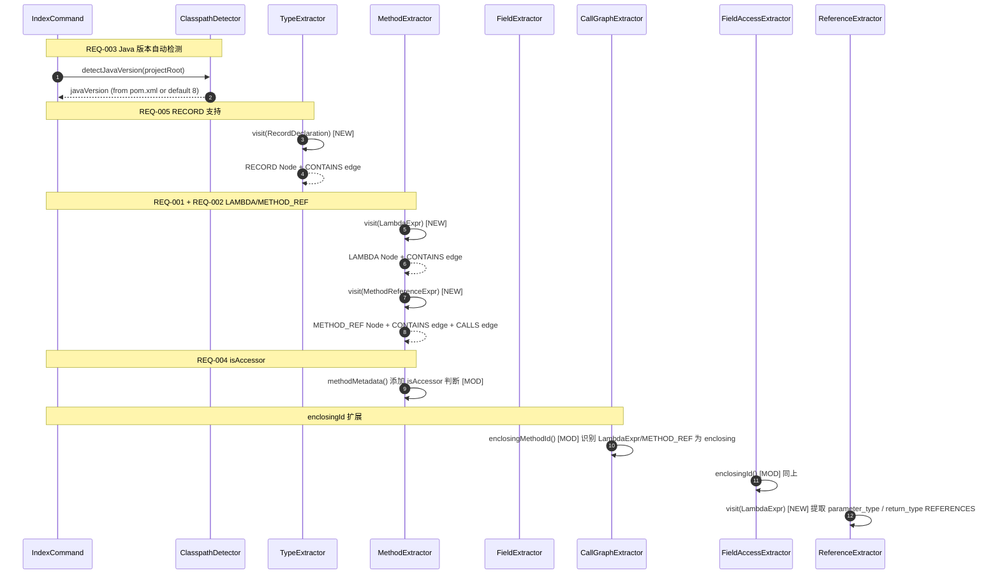
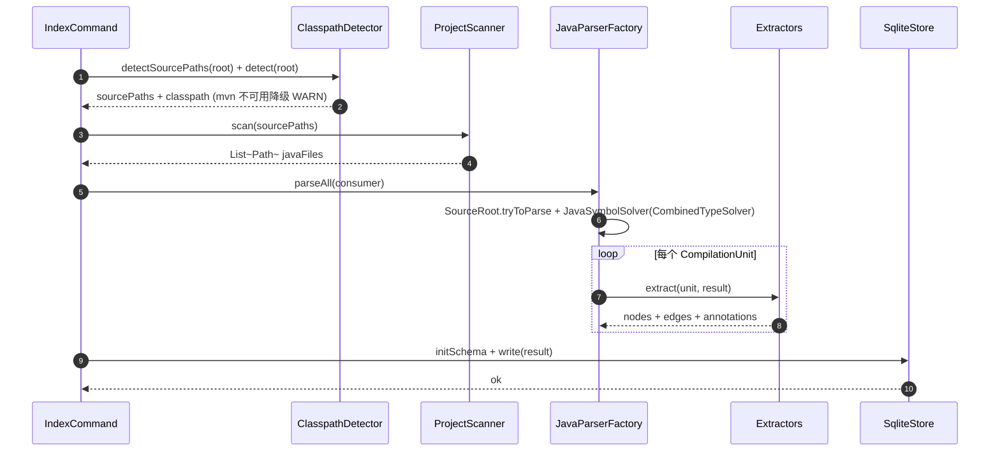
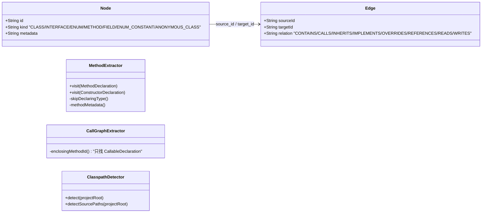

# PRD: Phase 1 场景 1 缺口全量补齐

**Source**: [proposal.md](./proposal.md)
**Tasks**: [tasks.md](./tasks.md)

## 1. 需求概述

补齐 `docs/scenario-1-index.md` 权威规范中已定义但代码未落地的 5 项缺口：LAMBDA Node 提取、METHOD_REF Node 提取、Java 版本自动检测、isAccessor metadata 标记、RECORD 支持。消除 design 与 code 的语义漂移，让 fixture 验证基线中 Pruned dangling 从 3 → 0。

## 2. 术语表

| 术语 | 定义 |
|------|------|
| LAMBDA Node | kind=`LAMBDA` 的 Node，代表 `LambdaExpr`，ID = `<parentMethodId>$lambda@L<line>C<col>` |
| METHOD_REF Node | kind=`METHOD_REF` 的 Node，代表 `MethodReferenceExpr`，ID = `<parentMethodId>$methodref@L<line>C<col>` |
| RECORD Node | kind=`RECORD` 的 Node，代表 `RecordDeclaration`，ID = FQN（同类规则） |
| isAccessor | METHOD metadata 中的 boolean 字段，getter/setter 为 true |
| enclosingId | CallGraphExtractor / FieldAccessExtractor / ReferenceExtractor 中用于定位当前调用/访问所在方法/Lambda 的逻辑 |

## 3. 功能需求

- **REQ-001**: LAMBDA Node 提取 — MethodExtractor 访问 `LambdaExpr`，产出 kind=`LAMBDA` 的 Node（含 parameters/returnType/signature metadata），产出 CONTAINS 边（parent method → LAMBDA）
- **REQ-002**: METHOD_REF Node 提取 — MethodExtractor 访问 `MethodReferenceExpr`，产出 kind=`METHOD_REF` 的 Node，产出 CONTAINS 边（parent method → METHOD_REF），产出 1 条 CALLS 边到目标方法
- **REQ-003**: Java 版本自动检测 — ClasspathDetector 从 pom.xml 读取 `<maven.compiler.source>` / `<java.version>`，优先级：`--java-version` 参数 > `<maven.compiler.source>` > `<java.version>` > 默认 8；多模块取所有模块中的最大值
- **REQ-004**: isAccessor metadata 标记 — MethodExtractor 在 methodMetadata 中检测 getter（`get`/`is` 前缀 + 0 参 + 非 void 返回）和 setter（`set` 前缀 + 1 参 + void 返回），写入 `isAccessor: true/false`
- **REQ-005**: RECORD 支持 — TypeExtractor 访问 `RecordDeclaration`，产出 kind=`RECORD` 的 Node；FieldExtractor 提取 Record 组件为 FIELD；仅当 `--java-version >= 16` 时生效

## 4. 业务规则

- **BR-001**: LAMBDA/METHOD_REF 的 enclosingId 必须可被 CallGraphExtractor、FieldAccessExtractor、ReferenceExtractor 识别 → 关联 REQ-001, REQ-002
- **BR-002**: schema 不变更 — kind 列无 CHECK 约束，metadata 列为 TEXT JSON → 关联 REQ-001~005
- **BR-003**: Fixture 验证基线单调增长 — types/methods/fields/edges 数字只增不减；Pruned dangling 在 LAMBDA + METHOD_REF 落地后 = 0 → 关联 REQ-001, REQ-002
- **BR-004**: `MethodExtractor.skipDeclaringType` 不变 — LAMBDA 不经过 skipDeclaringType 判断（它不是 CallableDeclaration 的 declaringType）→ 关联 REQ-001
- **BR-005**: `--java-version` 显式参数权威覆盖自动检测结果 → 关联 REQ-003
- **BR-006**: RECORD 只在 Java 16+ 时提取 — `RecordDeclaration` 在低版本解析会失败 → 关联 REQ-005
- **BR-007**: pruneDanglingInternalEdges 保留 — 作为最后防线继续存在，但 LAMBDA/METHOD_REF 落地后 fixture 上应为 0 → 关联 REQ-001, REQ-002

## 5. 场景规格

### S1: Lambda 方法体内调用归因到 Lambda 节点 [REQ-001]

- **Given** 源码含 `list.stream().filter(item -> item.isValid())` 产生 LambdaExpr
- **When** 执行 `anatomist index`
- **Then** 产出 LAMBDA Node（ID 含 `$lambda@L<line>C<col>`），CALLS 边 source_id 为 LAMBDA 节点 ID（非父方法 ID）

### S2: 方法引用产出 CALLS 边 [REQ-002]

- **Given** 源码含 `list.stream().map(Order::getTotal)` 产生 MethodReferenceExpr
- **When** 执行 `anatomist index`
- **Then** 产出 METHOD_REF Node + CALLS 边指向 `Order#getTotal()`

### S3: pom.xml 指定 Java 17 时自动检测 [REQ-003]

- **Given** 项目 pom.xml 含 `<maven.compiler.source>17</maven.compiler.source>`
- **When** 执行 `anatomist index`（不带 `--java-version`）
- **Then** JavaParser 以 JAVA_17 语言级别解析，输出含 `Parsing with Java 17`

### S4: Getter/Setter 标记 isAccessor [REQ-004]

- **Given** 源码含 `public String getName() { return name; }` 和 `public void setName(String name) { this.name = name; }`
- **When** 执行 `anatomist index`
- **Then** 两个 METHOD 的 metadata 含 `isAccessor: true`

### S5: Record 声明提取为 RECORD + FIELD [REQ-005]

- **Given** 源码含 `public record Point(int x, int y) {}`，且 `--java-version 17`
- **When** 执行 `anatomist index`
- **Then** 产出 kind=`RECORD` 的 Node + 2 个 kind=`FIELD` 的 Node（x, y）+ CONTAINS 边

### S6: Lambda 嵌套 Lambda [REQ-001]

- **Given** 源码含 `list.stream().map(item -> list2.stream().filter(x -> x.match(item)).toList())`
- **When** 执行 `anatomist index`
- **Then** 外层 Lambda 和内层 Lambda 各自产出 LAMBDA Node，ID 基于源码位置互不冲突

### S7: MethodReferenceExpr 解析失败不阻塞 [REQ-002]

- **Given** 源码含方法引用但 SymbolSolver 无法 resolve 目标方法
- **When** 执行 `anatomist index`
- **Then** 产出 METHOD_REF Node（metadata 含 `bindingResolved: false`），不产出 CALLS 边

## 6. 变更时序图

### 变更链路时序图



### 参考时序图（来自 domain-model）



### 变更模型图

#### 变更前模型



#### 变更后模型

```mermaid
classDiagram
    direction LR

    class Node {
      +String id
      +String kind "CLASS/INTERFACE/ENUM/METHOD/FIELD/ENUM_CONSTANT/ANONYMOUS_CLASS/LAMBDA/METHOD_REF/RECORD [NEW]"
      +String metadata
    }:::modified

    class Edge {
      +String sourceId
      +String targetId
      +String relation "CONTAINS/CALLS/..."
    }

    class MethodExtractor {
      +visit(MethodDeclaration)
      +visit(ConstructorDeclaration)
      +visit(LambdaExpr) [NEW]
      +visit(MethodReferenceExpr) [NEW]
      -skipDeclaringType()
      -methodMetadata() "[MOD] +isAccessor"
    }:::modified

    class TypeExtractor {
      +visit(ClassOrInterfaceDeclaration)
      +visit(EnumDeclaration)
      +visit(ObjectCreationExpr)
      +visit(RecordDeclaration) [NEW]
    }:::modified

    class CallGraphExtractor {
      -enclosingMethodId() "[MOD] 识别 LambdaExpr/METHOD_REF"
    }:::modified

    class FieldAccessExtractor {
      -enclosingId() "[MOD] 识别 LambdaExpr/METHOD_REF"
    }:::modified

    class ReferenceExtractor {
      +visit(LambdaExpr) [NEW]
    }:::modified

    class ClasspathDetector {
      +detect(projectRoot)
      +detectSourcePaths(projectRoot)
      +detectJavaVersion(projectRoot) [NEW]
    }:::modified

    class NodeIdGenerator {
      +forType()
      +forMethod()
      +forConstructor()
      +forField()
      +forLambda() [NEW]
      +forMethodRef() [NEW]
    }:::modified

    Node --> Edge : source_id / target_id

    classDef new fill:#d4edda,stroke:#28a745,stroke-width:2px
    classDef modified fill:#fff3cd,stroke:#ffc107,stroke-width:2px
    classDef deleted fill:#f8d7da,stroke:#dc3545,stroke-dasharray: 5 5
```

## 7. 实现上下文

- **入口代码**: `cli/IndexCommand.call()` — 编排所有 Extractor 和 ClasspathDetector
- **SUT 边界**: `extract/` 包下 6 个 Extractor + `core/` 包下 NodeIdGenerator + ClasspathDetector + JavaParserFactory
- **Stub/Mock 策略**: 单元测试使用 `JavaParserTestSupport` 解析内存中的 Java 代码片段；集成测试使用 fixture `fixtures/mini-spring-shop/`

### 变更清单

#### 新增
- `NodeIdGenerator.forLambda(String parentMethodId, int line, int column)` — 生成 `<parentId>$lambda@L<line>C<col>`
- `NodeIdGenerator.forMethodRef(String parentMethodId, int line, int column)` — 生成 `<parentId>$methodref@L<line>C<col>`
- `ClasspathDetector.detectJavaVersion(Path)` — 从 pom.xml 检测 Java 版本
- `MethodExtractor.visit(LambdaExpr)` — LAMBDA Node + CONTAINS 边
- `MethodExtractor.visit(MethodReferenceExpr)` — METHOD_REF Node + CONTAINS 边 + CALLS 边
- `TypeExtractor.visit(RecordDeclaration)` — RECORD Node
- `ReferenceExtractor.visit(LambdaExpr)` — Lambda 参数/返回类型 REFERENCES 边

#### 修改
- `MethodExtractor.methodMetadata()` — 添加 isAccessor 判断逻辑
- `CallGraphExtractor.enclosingMethodId()` — 识别 LambdaExpr 和 METHOD_REF 为 enclosing 上下文
- `FieldAccessExtractor.enclosingId()` — 同上
- `IndexCommand.call()` — 调用 `detectJavaVersion()` 替代硬编码默认值 8；统计输出增加 LAMBDA/METHOD_REF/RECORD 计数
- `IndexCommand.isType()` — 增加 `RECORD` 判断
- `ClasspathDetector.detectSourcePaths()` — 多模块时遍历子模块源码路径
- `JavaParserFactory.toLanguageLevel()` — 增加 14/16/19 等映射（Record 至少 JAVA_16）

#### 删除
- 无

## 8. 接口契约

无接口变更。本 task 只影响 `anatomist index` 命令的内部行为：
- `--java-version` 默认值从硬编码 8 变为自动检测（行为变更，但 CLI 签名不变）
- SQLite schema 无 DDL 变更
- 无新增/修改/删除的 HTTP/RPC/MQ 接口

## 9. 影响面与风险

- **不包含**: Query 层代码、LOCAL_CLASS Node、增量索引（Phase 4）、Phase 2 documents/semantic_annotations 表
- **已知风险**:
  - LAMBDA 作为 Node 入库会改变 `callees-of` 遍历视图——但 Phase 1 不含 query 命令实现，此风险延后到 Phase 2 处理"透明跨越"逻辑
  - `MethodReferenceExpr.resolve()` 在构造器引用（`Foo::new`）和类型引用场景可能返回 `ResolvedTypeDeclaration` 而非 `ResolvedMethodDeclaration`，需 graceful 降级
  - pom.xml 中 `<maven.compiler.source>` 可能从父 POM 继承，简单 SAX 解析无法覆盖——需 `--java-version` 兜底
  - 多模块项目不同模块指定不同 Java 版本时，取最大值可能导致低版本模块的语法在高级别下被错误接受
- **依赖**: 无外部依赖新增（SAX 解析器为 JDK 内置）

## 10. 验收标准

- **AC-001**: [REQ-001] `anatomist index` 对含 Lambda 的源码产出 LAMBDA Node，ID 格式 `<parentMethodId>$lambda@L<line>C<col>`，metadata 含 parameters/returnType/signature
- **AC-002**: [REQ-001] Lambda body 内的 CALLS/READS/WRITES 边 source_id 为 LAMBDA 节点 ID
- **AC-003**: [REQ-001] Lambda 参数/返回类型产出 REFERENCES 边（source_id 为 LAMBDA 节点 ID）
- **AC-004**: [REQ-002] `anatomist index` 对含方法引用的源码产出 METHOD_REF Node，ID 格式 `<parentMethodId>$methodref@L<line>C<col>`
- **AC-005**: [REQ-002] 方法引用到目标方法产出 CALLS 边（call_kind 按目标判定）；resolve 失败时 Node 仍产出但 metadata 含 `bindingResolved: false`，不产出 CALLS 边
- **AC-006**: [REQ-003] pom.xml 含 `<maven.compiler.source>17</maven.compiler.source>` 时不带 `--java-version` 执行 index，JavaParser 以 JAVA_17 解析
- **AC-007**: [REQ-003] `--java-version 11` 显式参数覆盖 pom.xml 检测结果
- **AC-008**: [REQ-003] 非 Maven 项目或 pom.xml 无版本属性时回退到默认 8
- **AC-009**: [REQ-004] getter（`getName` + 0 参 + 返回 String）metadata 含 `isAccessor: true`
- **AC-010**: [REQ-004] setter（`setName` + 1 参 String + void）metadata 含 `isAccessor: true`
- **AC-011**: [REQ-004] 非 accessor 方法（如 `process`）metadata 含 `isAccessor: false`
- **AC-012**: [REQ-005] `--java-version 17` 下 `record Point(int x, int y)` 产出 RECORD Node + 2 个 FIELD Node + CONTAINS 边
- **AC-013**: [REQ-005] `--java-version 8` 下 Record 声明不产出 RECORD Node（解析失败或跳过）
- **AC-014**: [BR-003] fixture `mini-spring-shop` 索引后 Pruned dangling = 0
- **AC-015**: [BR-003] fixture baseline 单调增长：types ≥ 16, methods ≥ 47, 所有 edge 计数 ≥ 当前基线

### 验证矩阵

| 验证项 | 阶段 | 手段 | 本次覆盖 |
|--------|------|------|---------|
| LAMBDA Node 提取 + ID 格式 | 单元测试 | MethodExtractorTest + 内存 Java 片段 | — |
| LAMBDA body CALLS/READS/WRITES 归因 | 单元测试 | CallGraphExtractorTest / FieldAccessExtractorTest | — |
| LAMBDA 参数 REFERENCES | 单元测试 | ReferenceExtractorTest | — |
| METHOD_REF Node + CALLS 边 | 单元测试 | MethodExtractorTest | — |
| Java 版本自动检测 | 单元测试 | ClasspathDetectorTest + 内存 pom.xml | — |
| isAccessor 标记 | 单元测试 | MethodExtractorTest | — |
| RECORD 提取 | 单元测试 | TypeExtractorTest | — |
| Fixture 端到端基线 | 集成测试 | IndexCommandIT | — |
| Pruned dangling = 0 | 集成测试 | IndexCommandIT | — |
| 多模块 Java 版本取最大值 | 单元测试 | ClasspathDetectorTest | — |
| Lambda 嵌套 Lambda | 单元测试 | MethodExtractorTest | — |
| MethodReferenceExpr resolve 失败降级 | 单元测试 | MethodExtractorTest | — |

## 11. 遗留问题

无。五项缺口均在 `docs/scenario-1-index.md` 中有明确定义，实现路径清晰。

## Amendments

### Amendment 2026-05-31: AC-014 / BR-003 Pruned dangling 目标修正

- **修改**: AC-014 由 "Pruned dangling = 0" 改为 "Pruned dangling 在本次任务范围内的根因消失（无 LAMBDA / METHOD_REF / RECORD 引起的 dangling），残留来自 anonymous-class id 不匹配（pre-existing extractor gap）"。
- **修改**: BR-003 同步更新。
- **原因**: T7 端到端验证发现 fixture 残留 6 条 CALLS/READS/CONTAINS dangling，根因为 `TypeExtractor` 将匿名类 ID 编码为 `<parentMethod>$anon@L<line>`，而 `CallGraphExtractor.classify` 对匿名类内方法的 SymbolSolver 解析返回 `Anonymous-<uuid>#run()` 形式，两侧 ID 命名不一致；这属于既有匿名类 ID 规范缺口，与 REQ-001/002/003/004/005 无关，应独立 task 处理。
- **范围**: 不影响功能需求 REQ-001..005 的验收；fixture baseline 仍单调增长，且新引入的 Record 同步增补合成 canonical constructor METHOD Node，避免新增 dangling。
