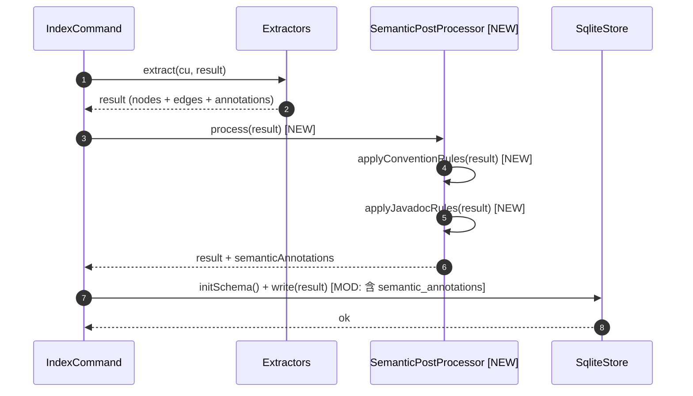
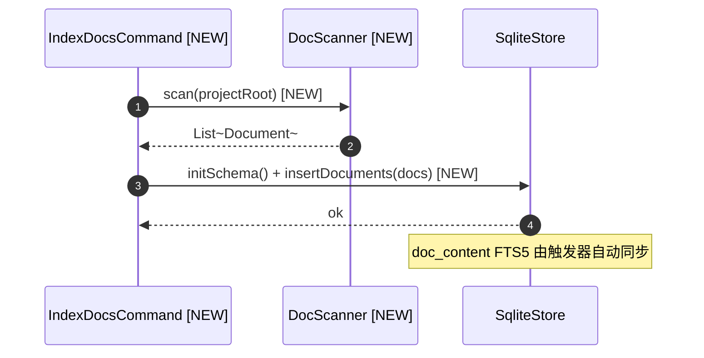
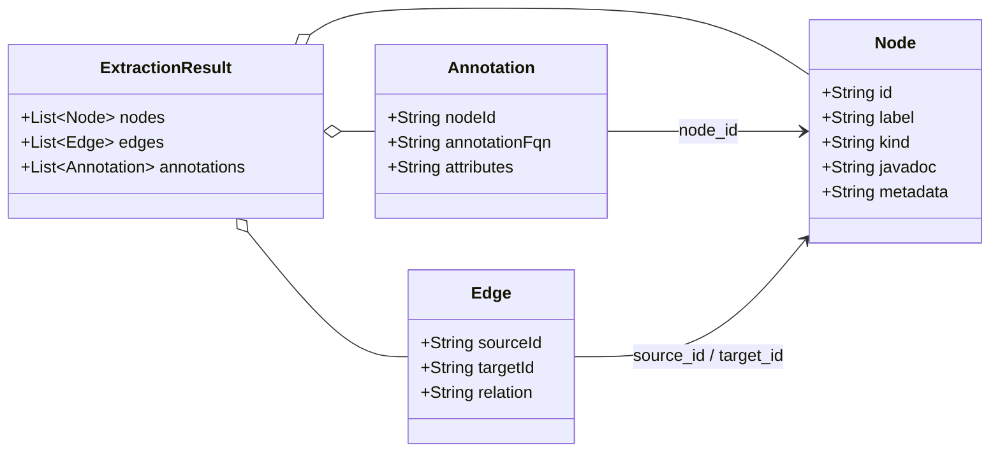

# PRD: Phase 2 语义层 + 文档索引层

**Source**: [proposal.md](./proposal.md)
**Tasks**: [tasks.md](./tasks.md)

## 1. 需求概述

为 anatomist 新增语义层后处理和文档索引层：在 `anatomist index` 流程末尾自动执行约定推导(CONVENTION)和 Javadoc 提炼(JAVADOC)，将结果写入 `semantic_annotations` 表；新增独立子命令 `anatomist index-docs` 扫描项目文档写入 `documents` 表 + `doc_content` FTS5 全文索引。两条链路打通"结构→语义"和"代码↔文档"的最低闭环，不涉及 LLM 工作流。

## 2. 术语表

| 术语 | 定义 |
|------|------|
| Semantic Annotation | semantic_annotations 表记录，描述一个 Node 或 Document 的业务语义(category/business_label/business_description 等) |
| CONVENTION | source 列取值，表示语义来自代码约定(注解或命名模式)，confidence = MEDIUM |
| JAVADOC | source 列取值，表示语义来自 Javadoc 注释提炼，confidence = HIGH |
| Convention Rule | 11 条约定推导规则，按注解 FQN 或节点 label 模式匹配，生成 CONVENTION 语义注解 |
| doc_type | documents 表列，枚举值 README/DOC/ADR/CHANGELOG/API_SPEC |
| doc_content | FTS5 虚拟表，external content 模式镜像 documents 表的 title/content/doc_type 列 |
| index-docs | 新增 CLI 子命令，扫描项目 markdown 文档写入 documents + doc_content |

## 3. 功能需求

- **REQ-001**: 建 `semantic_annotations` 表(id/node_id/doc_id/category/business_label/business_description/domain_context/source/confidence/created_at)，source ∈ {CONVENTION, JAVADOC, DOC, LLM}，confidence ∈ {HIGH, MEDIUM, LOW}，FK node_id → nodes.id(ON DELETE SET NULL)，FK doc_id → documents.id(ON DELETE SET NULL)
- **REQ-002**: 建 `documents` 表(id/path/title/content/doc_type/module/indexed_at)，doc_type ∈ {README, DOC, ADR, CHANGELOG, API_SPEC}
- **REQ-003**: 建 `doc_content` FTS5 虚拟表，external content 模式(content='documents', content_rowid='rowid')，索引 title/content/doc_type 三列，配合 INSERT/DELETE/UPDATE 触发器与 documents 表同步
- **REQ-004**: 实现 11 条约定推导规则，在 `anatomist index` 流程末尾自动执行：注解类规则(@Service→BUSINESS_SERVICE / @Repository→DATA_ACCESS / @RestController/@Controller→API_ENDPOINT / @Entity→DOMAIN_MODEL / @Transactional→TRANSACTION_BOUNDARY / @Component→INFRASTRUCTURE)和命名类规则(*Service→BUSINESS_SERVICE / *DTO|*Request|*Response→DTO / *Repository|*Dao→DATA_ACCESS / *Controller→API_ENDPOINT / *Config|*Configuration→INFRASTRUCTURE)，全部写入 semantic_annotations(source=CONVENTION, confidence=MEDIUM)
- **REQ-005**: 注解类规则优先级高于命名匹配；同节点多规则命中时全部写入，由 query 层按 confidence/source 决策
- **REQ-006**: Javadoc 二次提炼：扫描 nodes.javadoc 非空的 Node，将 Javadoc 第一段(摘要句)写入 semantic_annotations 的 business_description(source=JAVADOC, confidence=HIGH)
- **REQ-007**: `anatomist index` 默认行为不变，自动包含 CONVENTION + JAVADOC 推导，产出统计输出新增 `Semantic annotations: <n>` 行
- **REQ-008**: 新增 CLI 子命令 `anatomist index-docs <path> [--output ...]`，扫描 README.md / docs/**/*.md / **/ADR-*.md，写入 documents 表 + doc_content FTS5 同步；title 解析取 markdown 第一个 `#` 标题，无则取文件名；doc_type 由路径模式判定；module 从路径前缀推断(多模块)，无则 null

## 4. 业务规则

- **BR-001**: semantic_annotations.node_id 可空 — 未来 LLM 注入的注解可能只关联 doc_id 不关联 node → 关联 REQ-001
- **BR-002**: semantic_annotations.doc_id 可空 — CONVENTION/JAVADOC 来源只关联 node_id — 关联 REQ-001
- **BR-003**: 注解类规则从 annotations 表匹配 annotation_fqn，只匹配注解标注的 node(类或方法) — 关联 REQ-004
- **BR-004**: 命名类规则从 nodes.label 模式匹配，只对 kind ∈ {CLASS, INTERFACE, ENUM, RECORD} 生效(方法/字段不做命名推导) — 关联 REQ-004
- **BR-005**: Javadoc 提炼的"第一段"指 Javadoc 文本中第一个空行之前的内容(去除 `@param`/`@return` 等标签后的摘要) — 关联 REQ-006
- **BR-006**: doc_content FTS5 使用 external content 模式，与 node_names 保持一致架构 — 关联 REQ-003
- **BR-007**: index-docs 不扫描 CHANGELOG.md / swagger*.json / openapi*.json — 关联 REQ-008
- **BR-008**: 推导逻辑全部在 index phase 完成，query 侧只读 — 关联 REQ-004/REQ-006
- **BR-009**: 不引入新生产依赖；markdown 标题解析手写正则，不引入 commonmark — 关联 REQ-008

## 5. 场景规格

### S1: 约定推导 — 注解匹配 [REQ-004]

- **Given** 一个类节点 OrderService 标注了 @Service 注解(annotations 表有记录)
- **When** `anatomist index` 执行约定推导
- **Then** semantic_annotations 表新增一条记录: node_id=OrderService 的 id, category=BUSINESS_SERVICE, source=CONVENTION, confidence=MEDIUM

### S2: 约定推导 — 命名匹配 [REQ-004]

- **Given** 一个类节点 OrderValidator 没有 @Service 等注解，但 label 以 "Validator" 结尾
- **When** `anatomist index` 执行约定推导
- **Then** OrderValidator 不匹配任何命名规则(Validator 不在 11 条规则中)，不会产生 CONVENTION 语义注解

### S3: 约定推导 — 多规则命中 [REQ-005]

- **Given** 一个类节点 OrderService 标注了 @Service 且 label 以 "Service" 结尾
- **When** `anatomist index` 执行约定推导
- **Then** semantic_annotations 表新增两条记录: 一条来自注解规则(category=BUSINESS_SERVICE, source=CONVENTION)，一条来自命名规则(category=BUSINESS_SERVICE, source=CONVENTION)

### S4: @Transactional 方法级推导 [REQ-004]

- **Given** 方法节点 OrderService#applyDiscount 标注了 @Transactional
- **When** `anatomist index` 执行约定推导
- **Then** semantic_annotations 表新增一条记录: node_id=方法节点 id, category=TRANSACTION_BOUNDARY, source=CONVENTION

### S5: Javadoc 提炼 [REQ-006]

- **Given** 类节点 OrderService 的 javadoc 字段为 "订单服务，负责处理订单的创建和支付\n\n@param order 订单\n@return 结果"
- **When** `anatomist index` 执行 Javadoc 提炼
- **Then** semantic_annotations 表新增一条记录: node_id=OrderService 的 id, business_description="订单服务，负责处理订单的创建和支付", source=JAVADOC, confidence=HIGH

### S6: Javadoc 为空时不写入 [REQ-006]

- **Given** 类节点 OrderItem 的 javadoc 字段为 null
- **When** `anatomist index` 执行 Javadoc 提炼
- **Then** 不为 OrderItem 生成 JAVADOC 语义注解

### S7: index-docs 扫描 README [REQ-008]

- **Given** 项目根目录下存在 README.md，内容第一行为 `# Mini Spring Shop`
- **When** 执行 `anatomist index-docs /path/to/project`
- **Then** documents 表新增一条记录: path=README.md, title="Mini Spring Shop", doc_type=README, module=null；doc_content FTS5 同步更新

### S8: index-docs 扫描 ADR [REQ-008]

- **Given** 项目存在 `docs/ADR-001-use-cqrs.md`，无 `#` 标题
- **When** 执行 `anatomist index-docs /path/to/project`
- **Then** documents 表新增一条记录: path=docs/ADR-001-use-cqrs.md, title="ADR-001-use-cqrs", doc_type=ADR, module=null

### S9: index-docs 多模块 module 推断 [REQ-008]

- **Given** 多模块项目，存在 `domain/docs/order-model.md`
- **When** 执行 `anatomist index-docs /path/to/project`
- **Then** documents 表新增一条记录: module="domain"

### S10: index 统计输出 [REQ-007]

- **Given** `anatomist index` 完成 CONVENTION + JAVADOC 推导
- **When** 命令输出统计信息
- **Then** 输出包含 `Semantic annotations: <n>` 行

## 6. 变更时序图

### 变更链路时序图

#### 链路 A: anatomist index 新增语义后处理



#### 链路 B: anatomist index-docs 新增文档索引



### 参考时序图（来自 domain-model）

场景 1: 索引(Index) — 见 domain-model.md §5 场景 1，本次变更在该流程末尾追加 SemanticPostProcessor 步骤。

### 变更模型图

#### 变更前模型



#### 变更后模型

```mermaid
classDiagram
    direction LR

    class Node {
      +String id
      +String label
      +String kind
      +String javadoc
      +String metadata
    }

    class Edge {
      +String sourceId
      +String targetId
      +String relation
    }

    class Annotation {
      +String nodeId
      +String annotationFqn
      +String attributes
    }

    class SemanticAnnotation {
      +String nodeId [NEW]
      +Integer docId [NEW]
      +String category [NEW]
      +String businessLabel [NEW]
      +String businessDescription [NEW]
      +String domainContext [NEW]
      +String source [NEW]
      +String confidence [NEW]
    }:::new

    class Document {
      +String path [NEW]
      +String title [NEW]
      +String content [NEW]
      +String docType [NEW]
      +String module [NEW]
    }:::new

    class ExtractionResult {
      +List~Node~ nodes
      +List~Edge~ edges
      +List~Annotation~ annotations
      +List~SemanticAnnotation~ semanticAnnotations [NEW]
    }:::modified

    SemanticAnnotation --> Node : node_id (nullable)
    SemanticAnnotation --> Document : doc_id (nullable)
    ExtractionResult o-- SemanticAnnotation

    classDef new fill:#d4edda,stroke:#28a745,stroke-width:2px
    classDef modified fill:#fff3cd,stroke:#ffc107,stroke-width:2px
```

## 7. 实现上下文

- **入口代码**: IndexCommand.call() — 在 pruneDanglingInternalEdges() 之后、store.write() 之前插入 SemanticPostProcessor.process(result)
- **SUT 边界**: SemanticPostProcessor(纯 Java 后处理，输入 ExtractionResult 输出填充 semanticAnnotations) + IndexDocsCommand(新子命令，文件扫描+DB写入) + SqliteStore(新增 insertSemanticAnnotations / insertDocuments)
- **Stub/Mock 策略**: SemanticPostProcessor 单元测试只需 ExtractionResult 内存数据，不需要 mock；IndexDocsCommand IT 用 @TempDir + fixture 目录

### 变更清单

#### 新增
- `com.anatomist.model.SemanticAnnotation` — 语义注解模型类
- `com.anatomist.model.Document` — 文档模型类
- `com.anatomist.semantic.SemanticPostProcessor` — 约定推导 + Javadoc 提炼后处理器
- `com.anatomist.semantic.ConventionRule` — 单条约定规则定义(enum 或 record)
- `com.anatomist.doc.DocScanner` — 文档扫描器(文件发现 + title/doc_type/module 解析)
- `com.anatomist.cli.IndexDocsCommand` — index-docs 子命令(picocli Callable)
- schema.sql 追加: documents 表 + doc_content FTS5 + 同步触发器 + semantic_annotations 表 + 索引
- 测试: SemanticPostProcessorTest / IndexDocsCommandIT / SqliteStore 新增 write 场景

#### 修改
- `ExtractionResult` — 新增 `List<SemanticAnnotation> semanticAnnotations` 字段
- `SqliteStore` — 新增 `insertSemanticAnnotations()` 方法；新增 `insertDocuments()` 方法；write() 中调用 insertSemanticAnnotations
- `IndexCommand` — 在 store.write() 前调用 SemanticPostProcessor.process(result)；统计输出新增 `Semantic annotations:` 行
- `AnatomistCli` — subcommands 数组新增 IndexDocsCommand.class
- `IndexCommandIT` — 新增 semantic_annotations 行数断言

#### 删除
- 无

## 8. 接口契约

### 新增接口

| 接口 | 方法/路径 | 请求体 | 响应体 | 说明 |
|------|----------|--------|--------|------|
| IndexDocsCommand | `anatomist index-docs <path> [--output ...]` | CLI 参数 | stdout 统计输出 | 独立子命令，扫描 markdown 文档 |

### 修改接口

| 接口 | 变更类型 | 变更前 | 变更后 | 兼容性 |
|------|---------|--------|--------|--------|
| IndexCommand stdout | 新增输出行 | 无 Semantic annotations 行 | 新增 `Semantic annotations: <n>` | 向前兼容(新增行，不影响已有输出) |

## 9. 影响面与风险

- **不包含**: LLM enrich/annotate 工作流、API_SPEC(swagger/openapi)解析、CHANGELOG 扫描、向量相似度、增量索引
- **已知风险**:
  - CONVENTION 命名规则可能误匹配(如 TestService 会被 *Service 规则匹配为 BUSINESS_SERVICE)—— 通过 confidence=MEDIUM 标记，query 层可结合 source=CONVENTION 降权
  - Javadoc 摘要提取使用 `firstBlankLineOrTag` 启发式，极端情况(无空行无标签的长 Javadoc)会整段写入 business_description —— 可接受，MEDIUM/HIGH 置信度区分足够
  - doc_content FTS5 external content 模式在 Reindex 时需先删 documents 再重建 —— 当前 MVP 每次覆盖 index.db，无增量问题
- **依赖**: schema.sql 既有 DDL 零改动；Phase 1 baseline(16 types / 47 methods / 75 CONTAINS 等)必须保持

## 10. 验收标准

- **AC-001**: [REQ-001] semantic_annotations 表存在，DDL 列定义与 proposal 一致，FK 约束生效
- **AC-002**: [REQ-002] documents 表存在，DDL 列定义与 proposal 一致
- **AC-003**: [REQ-003] doc_content FTS5 虚拟表存在，external content 模式 + 三触发器(nodes_ai/ad/au 模式)
- **AC-004**: [REQ-004] 11 条约定推导规则各自有单元测试通过(参数化 11 用例)
- **AC-005**: [REQ-005] 同节点多规则命中时，semantic_annotations 写入多条记录
- **AC-006**: [REQ-006] Javadoc 提炼有/无 Javadoc 两种场景单元测试通过(≥ 2 用例)
- **AC-007**: [REQ-007] `anatomist index` stdout 包含 `Semantic annotations: <n>` 行
- **AC-008**: [REQ-008] `anatomist index-docs` 扫描 README / docs/ / ADR 三种场景测试通过(≥ 3 用例)
- **AC-009**: Phase 1 baseline 零回归 — IndexCommandIT 既除断言全部通过
- **AC-010**: `anatomist index` 在 fixture 上产出 semantic_annotations 行数 ≥ 期望基线。在 `--no-classpath` 下,SymbolSolver 无法解析 Spring 注解 FQN(只剩 java.lang.Override),所以 IT 基线退化为命名规则 ≥6 条;注解规则(7 条)与 Javadoc 规则覆盖改由 SemanticPostProcessorTest 单元测试保证。Full-classpath IT 留作后续 task。

### 验证矩阵

| 验证项 | 阶段 | 手段 | 本次覆盖 |
|--------|------|------|---------|
| 11 条 CONVENTION 规则 | 单元测试 | SemanticPostProcessorTest 参数化 | — |
| Javadoc 有/无提炼 | 单元测试 | SemanticPostProcessorTest | — |
| semantic_annotations DDL + FK | 集成测试 | SqliteStoreWriteTest / IndexCommandIT | — |
| index-docs README/DOC/ADR | 集成测试 | IndexDocsCommandIT | — |
| doc_content FTS5 同步 | 集成测试 | IndexDocsCommandIT (FTS5 MATCH 查询) | — |
| Phase 1 baseline 不回归 | 集成测试 | IndexCommandIT | — |
| index stdout 统计行 | 集成测试 | IndexCommandIT | — |
| fixture semantic_annotations 基线 | 集成测试 | IndexCommandIT | — |

## 11. 遗留问题

无

## Amendments

- **2026-05-31**: AC-010 baseline 修正 — 在 `--no-classpath` IT 环境下,Spring 注解无法被 SymbolSolver 解析(只剩 `java.lang.Override`),因此 IT 仅断言命名规则的 ≥6 条 baseline;注解规则与 Javadoc 规则的覆盖完整性由 SemanticPostProcessorTest 单元测试承担。后续若需 full-classpath IT,作为新 task 引入。
