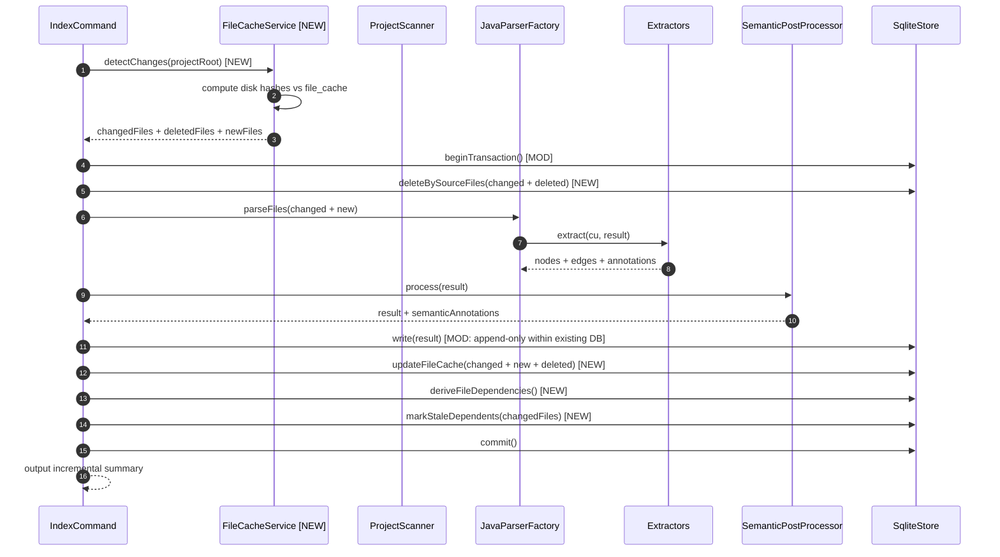
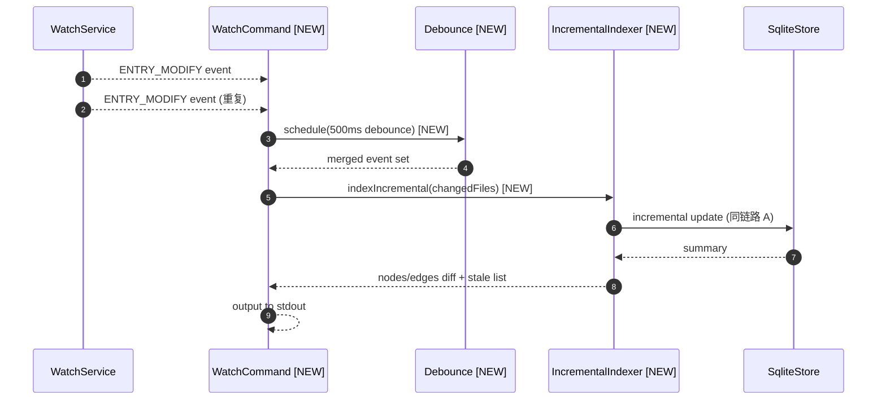
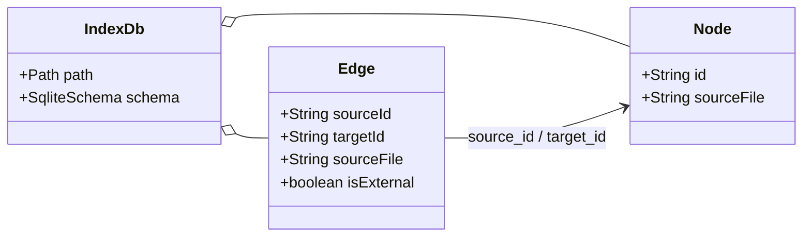

# PRD: Phase 4 Watch + 增量更新

**Source**: [proposal.md](./proposal.md)
**Tasks**: [tasks.md](./tasks.md)

## 1. 需求概述

为 anatomist 新增增量索引和文件监控能力：增量模式下只重解析变更文件（基于 SHA-256 hash 检测），watch 模式通过 Java NIO WatchService 监听源码目录并自动触发增量更新。同时引入文件依赖跟踪和 stale 级联标记，显式暴露跨文件依赖失效，避免沉默的数据不一致。全量索引行为不变，但增加 file_cache 持久化以支撑后续增量判定。

## 2. 术语表

| 术语 | 定义 |
|------|------|
| Incremental Index | 增量索引模式，只重解析 hash 变化的文件，复用未变更文件的索引数据 |
| File Cache | file_cache 表记录，存储已索引文件的 SHA-256 hash / node_count / edge_count / stale 标记 |
| Stale | file_cache.stale=1 状态，表示该文件的索引数据可能因上游依赖变更而失效 |
| Cascade | 级联 stale 标记：当被依赖文件变更时，反向标记所有依赖方文件为 stale |
| Debounce | 防抖：IDE 保存文件时连续触发多个事件，500ms 窗口合并为单次重解析 |
| Schema Version | file_cache.schema_version 字段，DDL/Extractor 升级时递增，整库失效触发全量重索引 |

## 3. 功能需求

- **REQ-001**: 新增 `file_cache` 表(source_file PK / hash / schema_version / last_indexed / node_count / edge_count / stale / stale_reason)，记录已索引文件的 hash 和统计信息
- **REQ-002**: 新增 `project_meta` 表(key PK / value)，存储项目级元数据(java_version / classpath_hash / index_version 等)
- **REQ-003**: 新增 `file_dependencies` 表(source_file / depends_on_file 复合 PK + idx_file_deps_target 索引)，记录文件间符号解析依赖关系
- **REQ-004**: `anatomist index --incremental` 增量索引模式：(1)比较 file_cache hash vs 磁盘 SHA-256 检测变更文件；(2)在单事务内 DELETE 旧数据 + 重新提取 + INSERT 新数据；(3)schema_version 变化时整库失效回退全量；(4)重新执行 SemanticPostProcessor 产出受影响文件的 semantic_annotations
- **REQ-005**: `anatomist index` 默认行为改为：(1)不再 Files.deleteIfExists(dbPath)，改为 DELETE FROM nodes WHERE 1=1 等清表操作保留 schema；(2)索引完成后写入 file_cache + project_meta + file_dependencies；(3)`--full` 显式全量重索引（与默认行为一致，语义清晰化）
- **REQ-006**: 索引后从 edges 表推导 file_dependencies：`SELECT DISTINCT e.source_file, n.source_file FROM edges e JOIN nodes n ON e.target_id = n.id WHERE e.is_external=0 AND e.source_file != n.source_file`
- **REQ-007**: 级联 stale 标记：文件 B 变更重索引后，反查 file_dependencies WHERE depends_on_file = B，将依赖方文件 A 的 file_cache.stale 置 1 并记录 stale_reason；watch 输出附带 stale 文件清单
- **REQ-008**: `anatomist watch <path>` — WatchService 监听源码目录，500ms 防抖合并事件，检测到变更时输出变更摘要
- **REQ-009**: `anatomist watch <path> --auto-index` — 监听 + 自动增量索引，变更文件自动重解析并更新 SQLite
- **REQ-010**: `anatomist watch <path> --extensions ".java,.xml"` — 指定监控的文件扩展名（默认 ".java"）
- **REQ-011**: pom.xml / build.gradle 变更检测：索引时记录 classpath hash 到 project_meta；watch 模式检测到 build 文件变更时比较 classpath hash，变化则触发全量重索引

## 4. 业务规则

- **BR-001**: 增量更新必须在单 SQLite 事务内完成（DELETE 旧 + INSERT 新），避免中间状态被查询读到 → 关联 REQ-004
- **BR-002**: 增量更新时先删除 semantic_annotations（WHERE node_id IN 已删除 nodes），再删除 nodes（CASCADE 清理 edges/annotations），再 INSERT 新数据 → 关联 REQ-004。semantic_annotations 的 ON DELETE SET NULL 不会自动清理，必须显式 DELETE
- **BR-003**: schema_version 定义为常量（如 `1`），DDL 或 Extractor 逻辑变更时递增。file_cache 中 schema_version 与当前常量不同的行视为 stale → 关联 REQ-001/REQ-004
- **BR-004**: file_cache 为空时（首次索引或 schema 升级后），`--incremental` 自动降级为全量索引并写入 file_cache → 关联 REQ-004
- **BR-005**: file_dependencies 从 edges 表 post-hoc 推导，不在 Extractor 中实时追踪。推导时机：全量索引完成后 / 增量索引完成后 → 关联 REQ-006
- **BR-006**: stale 标记不自动重解析，仅提示用户。`--cascade` 模式可选：自动重解析 1 跳受影响文件 → 关联 REQ-007
- **BR-007**: watch 输出变更摘要格式：`[MODIFY/CREATE/DELETE] <file>` + 节点/边增减统计 + stale 文件清单 → 关联 REQ-008/REQ-009
- **BR-008**: 防抖窗口 500ms。IDE 保存场景下单个文件可能触发 2-3 个 MODIFY 事件，合并为单次重解析 → 关联 REQ-008
- **BR-009**: pom.xml/build.gradle 变更导致 classpath hash 变化时，全量重索引（增量无法处理符号解析范围变化）→ 关联 REQ-011
- **BR-010**: 删除文件时，从 file_cache 删除对应行，并从索引库删除该文件的所有 nodes（CASCADE 清理 edges/annotations/semantic_annotations）→ 关联 REQ-004

## 5. 场景规格

### S1: 增量索引 — 文件修改 [REQ-004]

- **Given** 项目已全量索引，file_cache 记录 OrderService.java hash=a1b2c3
- **When** OrderService.java 被修改（磁盘 hash=b4d5e6），执行 `anatomist index /path --incremental`
- **Then** 只重解析 OrderService.java：删除旧 nodes/edges/annotations/semantic_annotations，插入新数据；file_cache 更新为 hash=b4d5e6；未修改文件跳过

### S2: 增量索引 — 新增文件 [REQ-004]

- **Given** 项目已全量索引
- **When** 新文件 OrderValidator.java 被创建，执行 `anatomist index /path --incremental`
- **Then** OrderValidator.java 不在 file_cache 中 → 视为新增 → 重解析并插入数据；file_cache 新增一行

### S3: 增量索引 — 删除文件 [REQ-004]

- **Given** 项目已全量索引，file_cache 记录 DeprecatedService.java
- **When** DeprecatedService.java 被删除（磁盘文件不存在），执行 `anatomist index /path --incremental`
- **Then** 从索引库删除 DeprecatedService.java 的所有 nodes（CASCADE 清理 edges/annotations）；file_cache 删除该行

### S4: 增量索引 — schema 升级整库失效 [REQ-004/BR-003/BR-004]

- **Given** file_cache 中所有行 schema_version=1，当前索引器 schema_version=2
- **When** 执行 `anatomist index /path --incremental`
- **Then** 检测到 schema_version 不匹配 → 自动降级为全量索引

### S5: 增量索引 — file_cache 为空时降级 [REQ-004/BR-004]

- **Given** index.db 存在但 file_cache 为空（从未执行过带 cache 的索引）
- **When** 执行 `anatomist index /path --incremental`
- **Then** 自动降级为全量索引，完成后写入 file_cache

### S6: file_dependencies 推导 [REQ-006]

- **Given** 全量索引完成后，OrderService.java 的方法调用了 BaseService.java 的方法
- **When** 推导 file_dependencies
- **Then** file_dependencies 包含 (source_file=OrderService.java, depends_on_file=BaseService.java)

### S7: 级联 stale 标记 [REQ-007]

- **Given** file_dependencies 记录 OrderService.java depends on BaseService.java
- **When** BaseService.java 变更并被增量重索引
- **Then** file_cache 中 OrderService.java 行 stale=1, stale_reason="依赖的 BaseService.java 已变更"

### S8: watch 监控 + 变更摘要 [REQ-008]

- **Given** `anatomist watch /path` 正在运行
- **When** OrderService.java 被修改
- **Then** 输出 `[MODIFY] src/main/java/.../OrderService.java`，500ms 防抖后输出变更摘要

### S9: watch --auto-index 自动增量 [REQ-009]

- **Given** `anatomist watch /path --auto-index` 正在运行
- **When** OrderService.java 被修改
- **Then** 自动执行增量重索引，输出节点/边增减统计 + stale 文件清单

### S10: pom.xml 变更触发全量重索引 [REQ-011]

- **Given** watch --auto-index 运行中，project_meta 记录 classpath_hash=abc
- **When** pom.xml 变更导致 classpath_hash 变为 xyz
- **Then** 触发全量重索引而非增量

### S11: 全量索引写入 file_cache [REQ-005]

- **Given** 执行 `anatomist index /path`（默认全量）
- **When** 索引完成
- **Then** file_cache 写入所有文件的 hash/计数；project_meta 写入 java_version/classpath_hash/index_version；file_dependencies 推导写入

## 6. 变更时序图

### 变更链路时序图

#### 链路 A: anatomist index --incremental 增量索引



#### 链路 B: anatomist watch --auto-index



### 参考时序图（来自 domain-model）

场景 1: 索引(Index) — 见 domain-model.md §5 场景 1，本次变更在 `Files.deleteIfExists(dbPath)` 处改为清表 + 写入 file_cache，并在末尾新增 file_dependencies 推导步骤。

场景 3: 增量更新(Phase 4) — 见 domain-model.md §5 场景 3，本次实现与该时序图一致。

### 变更模型图

#### 变更前模型



#### 变更后模型

```mermaid
classDiagram
    direction LR

    class IndexDb {
      +Path path
      +SqliteSchema schema
    }

    class Node {
      +String id
      +String sourceFile
    }

    class Edge {
      +String sourceId
      +String targetId
      +String sourceFile
      +boolean isExternal
    }

    class FileCache {
      +String sourceFile [PK]
      +String hash [NEW]
      +Integer schemaVersion [NEW]
      +String lastIndexed [NEW]
      +Integer nodeCount [NEW]
      +Integer edgeCount [NEW]
      +Integer stale [NEW]
      +String staleReason [NEW]
    }:::new

    class ProjectMeta {
      +String key [PK]
      +String value [NEW]
    }:::new

    class FileDependency {
      +String sourceFile [NEW]
      +String dependsOnFile [NEW]
    }:::new

    IndexDb o-- Node
    IndexDb o-- Edge
    IndexDb o-- FileCache
    IndexDb o-- ProjectMeta
    IndexDb o-- FileDependency
    Edge --> Node : source_id / target_id
    FileDependency --> Node : source_file / depends_on_file (via source_file join)

    classDef new fill:#d4edda,stroke:#28a745,stroke-width:2px
    classDef modified fill:#fff3cd,stroke:#ffc107,stroke-width:2px
```

## 7. 实现上下文

- **入口代码**: IndexCommand.call() — 新增 `--incremental` / `--full` 参数，修改全量索引流程（不再 Files.deleteIfExists，改为清表 + 写 file_cache）；新增 WatchCommand.call() 子命令
- **SUT 边界**: FileCacheService(文件 hash 计算 + 变更检测) + IncrementalIndexer(增量重解析 + 事务更新) + WatchCommand(WatchService + debounce) + SqliteStore(新增 deleteBySourceFiles / updateFileCache / deriveFileDependencies / markStaleDependents)
- **Stub/Mock 策略**: FileCacheService 单元测试用 @TempDir 文件系统；IncrementalIndexer IT 用 fixture + @TempDir；WatchCommand 生命周期测试用 @TempDir + 手动触发文件事件

### 变更清单

#### 新增
- `com.anatomist.model.FileCacheEntry` — file_cache 行模型(record)
- `com.anatomist.incremental.FileCacheService` — hash 计算 + 变更检测（changed/new/deleted 文件列表）
- `com.anatomist.incremental.IncrementalIndexer` — 增量重解析 + 事务更新（协调 FileCacheService + JavaParserFactory + Extractors + SemanticPostProcessor + SqliteStore）
- `com.anatomist.cli.WatchCommand` — watch 子命令(picocli Callable)
- schema.sql 追加: file_cache 表 + project_meta 表 + file_dependencies 表 + 索引
- 测试: FileCacheServiceTest / IncrementalIndexerIT / WatchCommandIT

#### 修改
- `IndexCommand` — 新增 `--incremental` / `--full` 参数；全量流程改为清表而非删 DB 文件；末尾写入 file_cache / project_meta / file_dependencies；`--incremental` 委托 IncrementalIndexer
- `SqliteStore` — 新增 `deleteBySourceFiles(List<String>)` / `updateFileCache(List<FileCacheEntry>)` / `deriveFileDependencies()` / `markStaleDependents(List<String>)` / `readFileCache()` / `readProjectMeta()` 方法
- `AnatomistCli` — subcommands 数组新增 WatchCommand.class
- `ProjectScanner` — 可能需新增方法返回所有源文件的相对路径集合（用于增量删除检测）

#### 删除
- `IndexCommand.call()` 中的 `Files.deleteIfExists(dbPath)` — 改为清表

## 8. 接口契约

### 新增接口

| 接口 | 方法/路径 | 请求体 | 响应体 | 说明 |
|------|----------|--------|--------|------|
| IndexCommand --incremental | `anatomist index <path> --incremental` | CLI 参数 | stdout 增量统计 | 增量索引模式 |
| WatchCommand | `anatomist watch <path>` | CLI 参数 | stdout 变更事件流 | 文件监控 |
| WatchCommand --auto-index | `anatomist watch <path> --auto-index` | CLI 参数 | stdout 变更事件+索引统计 | 监控+自动增量 |
| WatchCommand --extensions | `anatomist watch <path> --extensions ".java,.xml"` | CLI 参数 | stdout 变更事件流 | 指定监控扩展名 |

### 修改接口

| 接口 | 变更类型 | 变更前 | 变更后 | 兼容性 |
|------|---------|--------|--------|--------|
| IndexCommand 默认行为 | 行为变更 | `Files.deleteIfExists(dbPath)` 后重建 | 清表后重建 + 写入 file_cache/project_meta/file_dependencies | 向前兼容（输出格式不变，新增 `File cache: <n> entries` 行） |
| IndexCommand stdout | 新增输出行 | 无 File cache 行 | 新增 `File cache: <n> entries` 行 | 向前兼容(新增行) |

## 9. 影响面与风险

- **不包含**: Scenario-4/5、向量相似度、LLM 工作流、多进程/远程 watch、Daemon 模式（Ctrl+C 终止）
- **已知风险**:
  - 增量重解析的单文件符号绑定精度可能不如全量 `SourceRoot.tryToParse()`（缺少其他文件的解析缓存）—— stale 标记机制显式暴露此问题，用户可手动 `--full` 修复
  - file_dependencies 推导依赖 edges 表数据完整性——若存在 dangling edges 则依赖关系缺失——已有 `pruneDanglingInternalEdges` 兜底
  - WatchService 在 macOS 上对大型目录的注册可能有延迟——首次 watch 时输出"Watching <path>..."确认
  - 删除文件时的 CASCADE 会连带删除 edges/annotations，但 semantic_annotations 是 SET NULL——需显式 DELETE
- **依赖**: schema.sql 既有 DDL 零改动；Phase 1+2 baseline 必须保持

## 10. 验收标准

- **AC-001**: [REQ-001] file_cache 表存在，DDL 列定义与 PRD 一致
- **AC-002**: [REQ-002] project_meta 表存在，DDL 列定义与 PRD 一致
- **AC-003**: [REQ-003] file_dependencies 表存在，复合 PK + idx_file_deps_target 索引
- **AC-004**: [REQ-004] `anatomist index --incremental` 只重解析变更文件，未修改文件跳过
- **AC-005**: [REQ-004] 增量更新在单事务内完成（DELETE + INSERT），中间状态不可读
- **AC-006**: [REQ-005] 全量索引完成后 file_cache / project_meta / file_dependencies 已写入
- **AC-007**: [REQ-006] file_dependencies 从 edges 表推导正确（IT 验证 fixture 跨文件依赖）
- **AC-008**: [REQ-007] 级联 stale 标记：修改被依赖文件后，依赖方 stale=1
- **AC-009**: [REQ-008] `anatomist watch` 输出变更事件摘要，500ms 防抖
- **AC-010**: [REQ-009] `anatomist watch --auto-index` 自动增量重索引并输出统计
- **AC-011**: [REQ-011] pom.xml 变更导致 classpath_hash 变化时触发全量重索引
- **AC-012**: Phase 1+2 baseline 零回归 — IndexCommandIT 既除断言全部通过

### 验证矩阵

| 验证项 | 阶段 | 手段 | 本次覆盖 |
|--------|------|------|---------|
| file_cache DDL + CRUD | 单元测试 | SqliteStoreWriteTest 扩展 | — |
| project_meta DDL + CRUD | 单元测试 | SqliteStoreWriteTest 扩展 | — |
| file_dependencies DDL + 推导 | 单元测试 | SqliteStoreWriteTest 扩展 | — |
| 增量索引 changed/new/deleted | 集成测试 | IncrementalIndexerIT | — |
| 增量索引 schema_version 降级 | 集成测试 | IncrementalIndexerIT | — |
| file_dependencies 跨文件推导 | 集成测试 | IncrementalIndexerIT | — |
| stale 级联标记 | 集成测试 | IncrementalIndexerIT | — |
| watch 变更事件输出 | 集成测试 | WatchCommandIT | — |
| watch --auto-index 增量更新 | 集成测试 | WatchCommandIT | — |
| pom.xml 变更全量重索引 | 集成测试 | WatchCommandIT | — |
| Phase 1+2 baseline 不回归 | 集成测试 | IndexCommandIT | — |

## 11. 遗留问题

无
