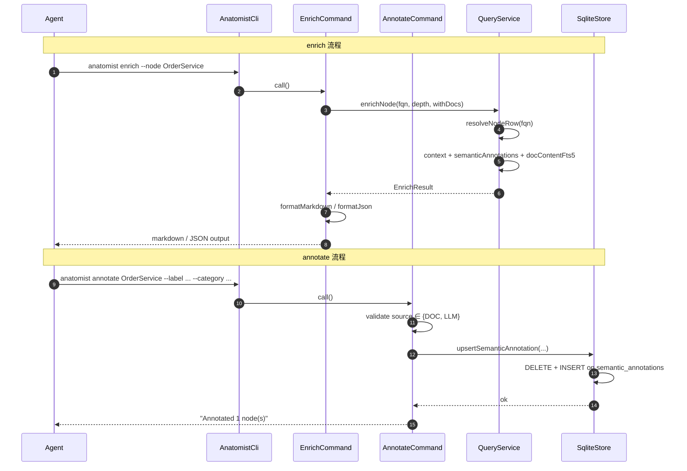
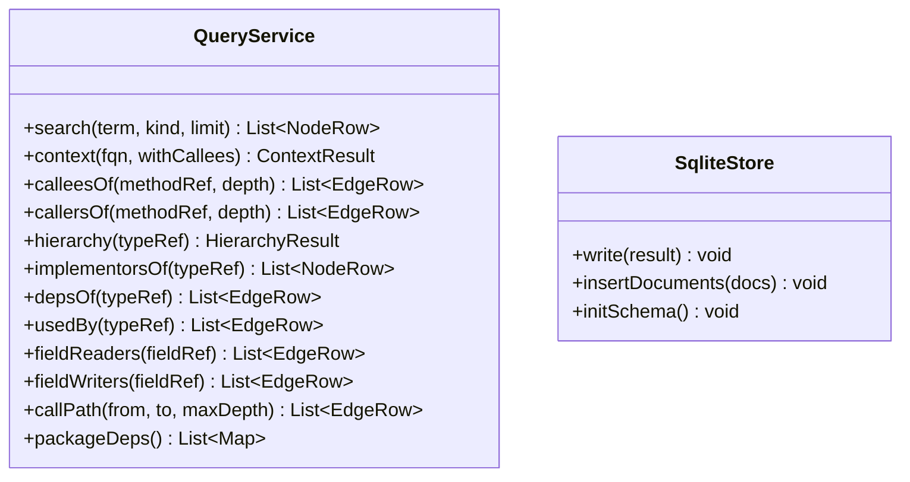

# PRD: 20260531-003-enrich-annotate-semantic-cli

**Source**: [proposal.md](./proposal.md)
**Tasks**: [tasks.md](./tasks.md)

## 1. 需求概述

为 anatomist 新增 `enrich` 和 `annotate` 两条 CLI 命令，补齐「结构查询 → Agent 推理 → 业务语义写回」闭环的最后一块。`enrich` 把指定节点/包的结构 + javadoc + 关联文档片段 + 已有语义注解 + 建议下一步查询打包输出（默认 markdown），供 Agent 或人直接消费；`annotate` 把 Agent/人合成的业务语义结论写回 `semantic_annotations` 表，重复写同 (node_id, category, source) 走 upsert。同时在 `anatomist-skill.md` 增加工作流引导，让 Agent 主动使用 enrich + annotate 闭环。

## 2. 术语表

| 术语 | 定义 |
|------|------|
| Enrich | 聚合多数据源（nodes + edges + annotations + semantic_annotations + documents FTS5）为单次输出的命令，供 Agent 消费 |
| Annotate | 向 semantic_annotations 表写入/更新业务语义记录的命令 |
| Upsert Key | annotate 命令的幂等键：(node_id, category, source)。同键写入时更新而非新增 |
| Doc Match | enrich --with-docs 时通过 doc_content FTS5 搜索节点 label/qualified_name 匹配关联文档 |
| Suggested Query | enrich 输出中基于节点特征（kind / annotations / semantic_annotations）静态推导的下一步查询建议 |

## 3. 功能需求

- **REQ-001**: `anatomist enrich --node <fqn>` 输出指定节点的聚合视图，包含：节点基本信息、CONTAINS 成员、注解、语义注解、出向 CALLS（--depth 控制，默认 1）、关联文档片段（--with-docs）、建议下一步查询
- **REQ-002**: `anatomist enrich --package <pkg>` 输出包级聚合视图，包含：包内所有类型概要（kind + label + category）、包级依赖、关联文档片段（--with-docs）、建议下一步查询
- **REQ-003**: enrich 支持 `--format markdown|json`，默认 markdown。markdown 输出控制在 ~200 行内（mini-spring-shop 单节点量级）
- **REQ-004**: `anatomist annotate <node-id> --label <text> --category <text>` 写入 semantic_annotations 表，source 默认 LLM，confidence 默认 MEDIUM
- **REQ-005**: annotate 支持 `--context <text>`、`--source LLM|DOC|JAVADOC`、`--confidence HIGH|MEDIUM|LOW` 可选参数
- **REQ-006**: annotate 同 (node_id, category, source) 组合写入时走 upsert（先 DELETE 再 INSERT），不堆积历史行
- **REQ-007**: annotate 支持 `--from-json <file>` 批量写入，文件为 JSON 数组，每个元素包含 node_id + category + source 等字段
- **REQ-008**: 在 anatomist-skill.md 增加 "Writing architecture docs from code" 工作流节，引导 Agent 使用 enrich + annotate + 现有查询命令完成闭环

## 4. 业务规则

- **BR-001**: enrich 不触发 JavaParser，纯 SQL + FTS5 查询 → 关联 REQ-001, REQ-002
- **BR-002**: enrich markdown 输出按段落折叠：节点概要 → 成员列表 → 语义注解表 → 关联文档 → 建议查询。超 200 行时截断 callees 并标注 `… truncated, use callees-of --depth N for more` → 关联 REQ-003
- **BR-003**: enrich --with-docs 匹配规则：doc_content FTS5 MATCH 节点 label（优先）和 qualified_name；每个节点最多返回 3 条文档片段，每片段截取 title + 前 200 字符 → 关联 REQ-001
- **BR-004**: annotate source 字段必须在 schema CHECK 范围内（CONVENTION|JAVADOC|DOC|LLM），CLI 层预校验 → 关联 REQ-005
- **BR-005**: annotate 不允许 source=CONVENTION（约定注解由 SemanticPostProcessor 自动产出，CLI 手写会与自动产出冲突），source=JAVADOC 同理。CLI 层限制 source ∈ {DOC, LLM} → 关联 REQ-005
- **BR-006**: annotate --from-json 的 JSON 数组中每条记录必须包含 node_id、category、source，其余字段可选。CLI 层校验 → 关联 REQ-007
- **BR-007**: enrich 建议查询基于静态规则集（见 §5 场景规格），不内嵌 LLM → 关联 REQ-001

## 5. 场景规格

### S1: enrich 单节点 — Agent 查看类全貌 [REQ-001, REQ-003]

- **Given** 一个已索引的项目，index.db 包含 OrderService 节点及其语义注解
- **When** Agent 执行 `anatomist enrich --node OrderService`
- **Then** 输出 markdown 格式的聚合视图，包含：节点概要（kind/package/source_file）、字段列表、方法签名列表、语义注解表、1 层 callees、建议查询

### S2: enrich 包级 — Agent 俯瞰包结构 [REQ-002, REQ-003]

- **Given** 一个已索引的项目，com.example.service 包含多个 Service 类
- **When** Agent 执行 `anatomist enrich --package com.example.service`
- **Then** 输出该包所有类型的概要表（kind/label/category/annotations），包级依赖摘要，建议查询

### S3: enrich 带文档关联 [REQ-001]

- **Given** 项目已执行 `anatomist index-docs`，doc_content 中包含提及 OrderService 的文档
- **When** Agent 执行 `anatomist enrich --node OrderService --with-docs`
- **Then** 输出中包含 "Related Documentation" 段，列出匹配文档的 title 和摘要片段

### S4: enrich JSON 输出 [REQ-003]

- **Given** 同 S1
- **When** Agent 执行 `anatomist enrich --node OrderService --format json`
- **Then** 输出 JSON，遵循 QueryEnvelope 结构

### S5: annotate 单条写入 [REQ-004, REQ-005, REQ-006]

- **Given** 一个已索引的项目，OrderService 节点存在于 nodes 表
- **When** Agent 执行 `anatomist annotate com.example.service.OrderService --label "订单服务" --category BUSINESS_SERVICE`
- **Then** semantic_annotations 表新增一行，source=LLM, confidence=MEDIUM

### S6: annotate upsert — 重复写入更新 [REQ-006]

- **Given** semantic_annotations 已有 (OrderService, BUSINESS_SERVICE, LLM) 行
- **When** Agent 再次执行 `anatomist annotate OrderService --label "订单核心服务" --category BUSINESS_SERVICE`
- **Then** 原行被更新（business_label 变为 "订单核心服务"），不新增行

### S7: annotate 批量写入 [REQ-007]

- **Given** 文件 annotations.json 包含 5 条语义注解
- **When** Agent 执行 `anatomist annotate --from-json annotations.json`
- **Then** 5 条注解全部写入，每条走 upsert 语义

### S8: annotate source 校验 [BR-004, BR-005]

- **Given** Agent 执行 `anatomist annotate OrderService --label "test" --category BUSINESS_SERVICE --source CONVENTION`
- **When** CLI 校验 source 参数
- **Then** 输出错误 "source must be DOC or LLM (CONVENTION and JAVADOC are auto-generated)"

### S9: skill 引导闭环 [REQ-008]

- **Given** Agent 读取 anatomist-skill.md
- **When** Agent 想要 "从代码理解业务并沉淀知识"
- **Then** skill 文档中有明确的工作流模板引导 Agent 使用 enrich → LLM 推理 → annotate 闭环

## 6. 变更时序图

### 变更链路时序图



### 参考时序图（来自 domain-model）

场景 2（Agent 驱动的语义查询）已在 domain-model.md 中，enrich/annotate 是该场景的扩展：Agent 不再只查询，还能写回语义。

### 变更模型图

#### 变更前模型



#### 变更后模型

```mermaid
classDiagram
    class QueryService {
      +search(term, kind, limit) List~NodeRow~
      +context(fqn, withCallees) ContextResult
      +calleesOf(methodRef, depth) List~EdgeRow~
      +callersOf(methodRef, depth) List~EdgeRow~
      +hierarchy(typeRef) HierarchyResult
      +implementorsOf(typeRef) List~NodeRow~
      +depsOf(typeRef) List~EdgeRow~
      +usedBy(typeRef) List~EdgeRow~
      +fieldReaders(fieldRef) List~EdgeRow~
      +fieldWriters(fieldRef) List~EdgeRow~
      +callPath(from, to, maxDepth) List~EdgeRow~
      +packageDeps() List~Map~
      +enrichNode(fqn, depth, withDocs) EnrichResult [NEW]
      +enrichPackage(pkg, depth, withDocs) EnrichResult [NEW]
    }:::modified

    class SqliteStore {
      +write(result) void
      +insertDocuments(docs) void
      +initSchema() void
      +upsertSemanticAnnotation(sa) void [NEW]
      +upsertSemanticAnnotations(sas) void [NEW]
    }:::modified

    class EnrichResult {
      +NodeRow node
      +List~NodeRow~ members
      +List~Map~ annotations
      +List~SemanticAnnotationRow~ semanticAnnotations [NEW]
      +List~EdgeRow~ callees
      +List~DocSnippet~ relatedDocs [NEW]
      +List~String~ suggestedQueries [NEW]
    }:::new

    class DocSnippet {
      +String title [NEW]
      +String path [NEW]
      +String snippet [NEW]
      +String docType [NEW]
    }:::new

    class SemanticAnnotationRow {
      +String category [NEW]
      +String businessLabel [NEW]
      +String businessDescription [NEW]
      +String domainContext [NEW]
      +String source [NEW]
      +String confidence [NEW]
    }:::new

    QueryService --> EnrichResult : produces
    EnrichResult --> DocSnippet : contains
    EnrichResult --> SemanticAnnotationRow : contains

    classDef new fill:#d4edda,stroke:#28a745,stroke-width:2px
    classDef modified fill:#fff3cd,stroke:#ffc107,stroke-width:2px
```

## 7. 实现上下文

- **入口代码**: AnatomistCli.java（注册 EnrichCommand、AnnotateCommand 子命令）
- **SUT 边界**: QueryService（enrich 查询逻辑）+ SqliteStore（annotate 写入逻辑）+ 新 CLI 命令类
- **Stub/Mock 策略**: 集成测试使用 mini-spring-shop fixture 的真实 index.db；单元测试可 mock Connection

### 变更清单

#### 新增
- `src/main/java/com/anatomist/cli/EnrichCommand.java` — enrich CLI 入口（picocli）
- `src/main/java/com/anatomist/cli/AnnotateCommand.java` — annotate CLI 入口（picocli）
- `src/main/java/com/anatomist/query/EnrichResult.java` — enrich 聚合结果 DTO
- `src/main/java/com/anatomist/query/DocSnippet.java` — 文档片段 DTO
- `src/main/java/com/anatomist/query/SemanticAnnotationRow.java` — 语义注解行 DTO
- `src/main/java/com/anatomist/query/MarkdownFormatter.java` — markdown 格式化输出
- `src/test/java/com/anatomist/cli/EnrichCommandIT.java` — enrich 集成测试
- `src/test/java/com/anatomist/cli/AnnotateCommandIT.java` — annotate 集成测试
- `src/test/java/com/anatomist/query/EnrichResultTest.java` — enrich 结果 + markdown 格式化单测

#### 修改
- `src/main/java/com/anatomist/cli/AnatomistCli.java` — 注册 EnrichCommand、AnnotateCommand
- `src/main/java/com/anatomist/query/QueryService.java` — 新增 enrichNode / enrichPackage / readSemanticAnnotations / searchRelatedDocs 方法
- `src/main/java/com/anatomist/store/SqliteStore.java` — 新增 upsertSemanticAnnotation / upsertSemanticAnnotations 方法
- `src/main/resources/schema.sql` — 新增 UNIQUE 索引 `idx_semantic_annotations_upsert_key ON semantic_annotations(node_id, category, source)`
- `anatomist-skill.md` — 增加 "Writing architecture docs from code" 工作流节

#### 删除
- 无

## 8. 接口契约

### 新增接口

| 接口 | 方法/路径 | 请求体 | 响应体 | 说明 |
|------|----------|--------|--------|------|
| enrich CLI | `anatomist enrich` | CLI args: --node/--package, --format, --with-docs, --depth, --index | markdown 或 JSON to stdout | 聚合查询输出 |
| annotate CLI | `anatomist annotate` | CLI args: <node-id>, --label, --category, --context, --source, --confidence, --from-json, --index | 摘要文本 to stdout | 语义注解写入 |

### 修改接口

| 接口 | 变更类型 | 变更前 | 变更后 | 兼容性 |
|------|---------|--------|--------|--------|
| semantic_annotations 表 | 新增索引 | 无 UNIQUE 约束 | UNIQUE(node_id, category, source) | 向前兼容（现有数据无重复键冲突；CONVENTION 行可能需 dedup，但 initSchema 时全量清表重建） |

### 删除接口

无接口删除。

## 9. 影响面与风险

- **不包含**: scenario 5 的 export 系列（mermaid/json/subgraph 导出）— 明确不做
- **不包含**: 对现有 11 条查询子命令的行为或输出格式变更
- **已知风险**:
  - schema.sql 新增 UNIQUE 索引可能使已有 index.db 中的重复 (node_id, category, source) 行报错。但 anatomist index 每次全量清表重建，不存在脏数据。对 annotate 命令操作的已有 DB，upsert 使用 DELETE + INSERT 模式，不依赖 UNIQUE 索引也可正常工作
  - enrich markdown 格式在不同节点上输出行数差异大（大类可能超 200 行）。通过 callees 截断 + 包级模式使用概要表来控制
  - enrich --with-docs 的 FTS5 匹配可能返回不相关文档（短类名如 "Order" 命中过多）。通过限制每节点最多 3 条 + 按 relevance 排序缓解
- **依赖**: 无新依赖；enrich/annotate 均在现有 4 个 prod dep 范围内

## 10. 验收标准

- **AC-001**: [REQ-001] `anatomist enrich --node OrderService` 输出包含节点概要、成员列表、语义注解、1 层 callees、建议查询的 markdown
- **AC-002**: [REQ-002] `anatomist enrich --package com.example.service` 输出包含包内类型概要表和包级依赖的 markdown
- **AC-003**: [REQ-003] `anatomist enrich --node OrderService --format json` 输出合法 JSON，遵循 QueryEnvelope 结构
- **AC-004**: [REQ-004] `anatomist annotate OrderService --label "订单服务" --category BUSINESS_SERVICE` 成功写入 semantic_annotations，source=LLM, confidence=MEDIUM
- **AC-005**: [REQ-006] 重复执行同 annotate 命令，semantic_annotations 行数不变，business_label 更新
- **AC-006**: [REQ-007] `anatomist annotate --from-json batch.json` 批量写入成功
- **AC-007**: [BR-005] `anatomist annotate ... --source CONVENTION` 返回错误码 1
- **AC-008**: [REQ-008] anatomist-skill.md 包含 "Writing architecture docs from code" 工作流节
- **AC-009**: 现有 96 单元 + 62 IT 全绿
- **AC-010**: [REQ-003] enrich --node 在 mini-spring-shop OrderService 上输出 ≤ 200 行 markdown

### 验证矩阵

| 验证项 | 阶段 | 手段 | 本次覆盖 |
|--------|------|------|---------|
| enrich 单节点 markdown 输出 | IT | EnrichCommandIT + fixture | — |
| enrich 包级 markdown 输出 | IT | EnrichCommandIT + fixture | — |
| enrich JSON 输出 | IT | EnrichCommandIT | — |
| enrich --with-docs | IT | index-docs + enrich + fixture | — |
| annotate 单条写入 + upsert | IT | AnnotateCommandIT | — |
| annotate --from-json 批量 | IT | AnnotateCommandIT | — |
| annotate source 校验 | 单元 | AnnotateCommand 校验逻辑 | — |
| markdown 格式化 | 单元 | EnrichResultTest | — |
| enrich 200 行约束 | 单元 | EnrichResultTest 行数断言 | — |
| skill 文档更新 | 手工 | 人工审阅 | — |
| 现有测试全绿 | CI | mvn test | — |

## 11. 遗留问题

enrich --package 模式忽略 --depth 参数，仅输出类型概要（kind + label + category），不含 callees。--depth 仅在 --node 模式下控制 callees 层数。
