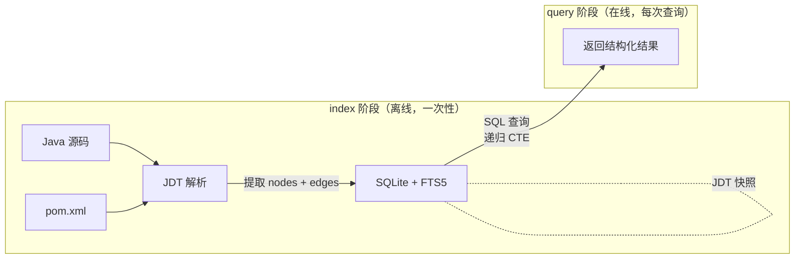
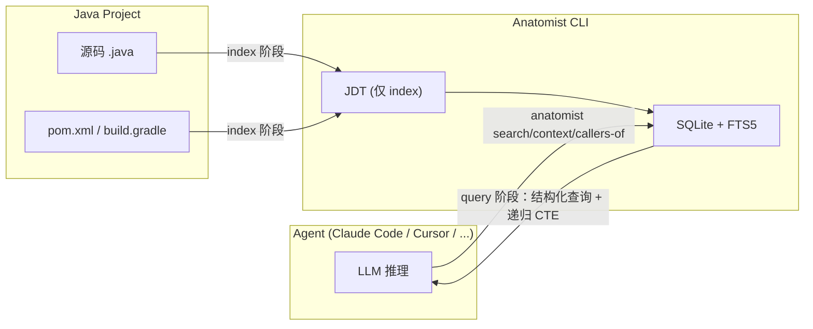
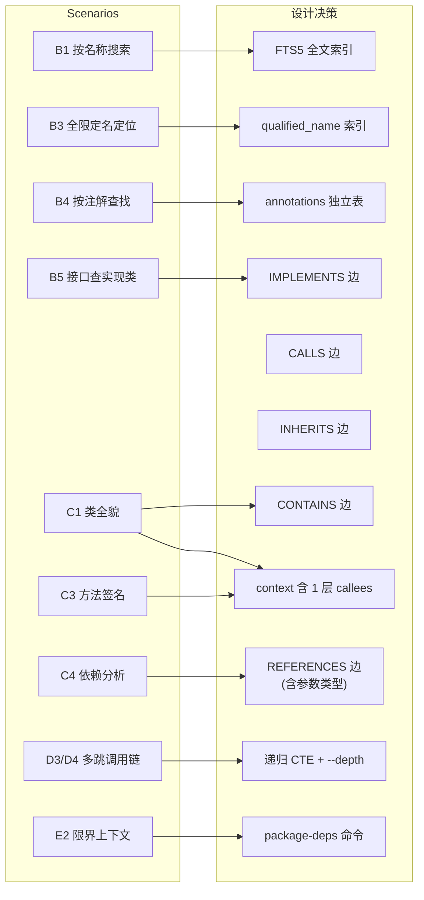
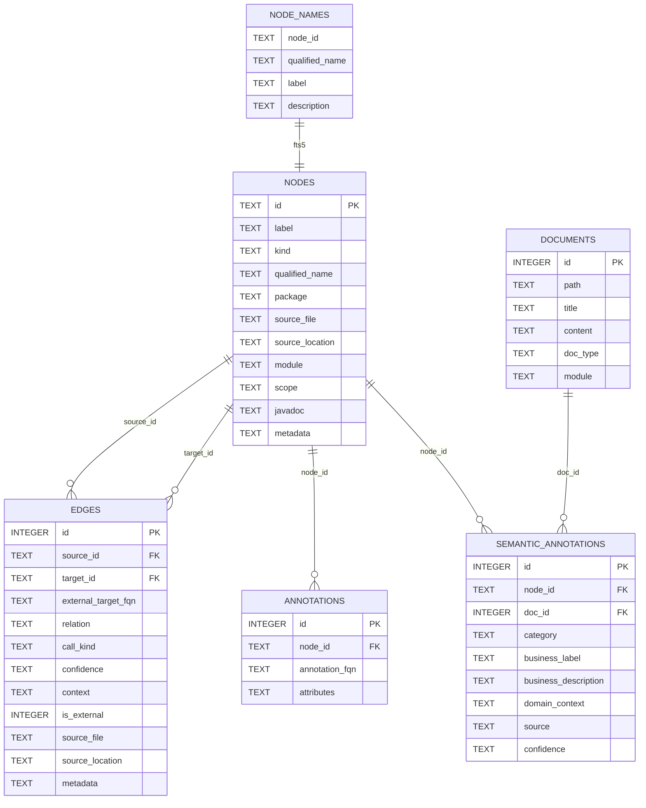
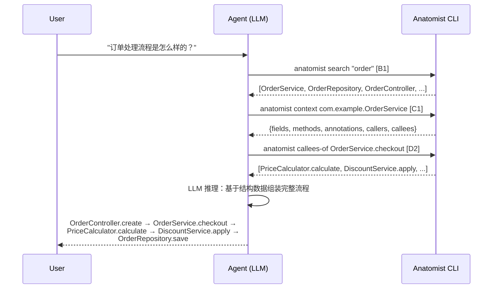
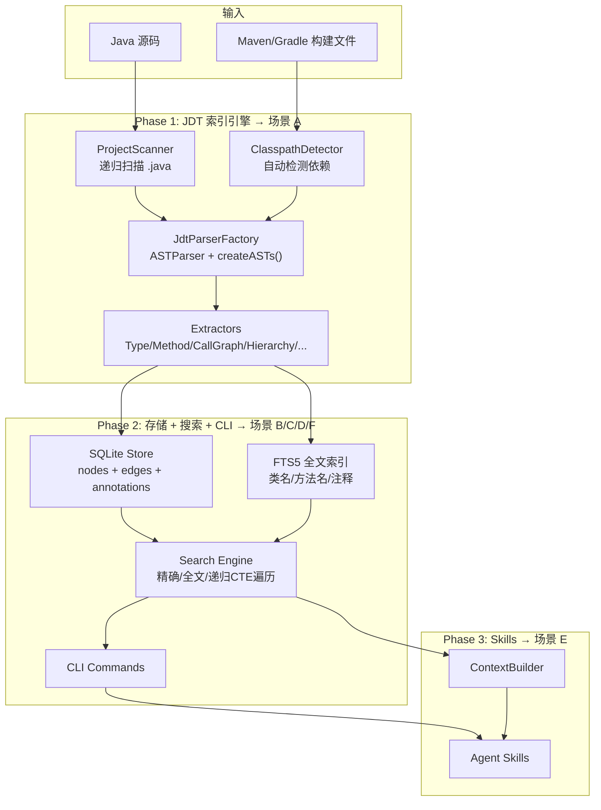
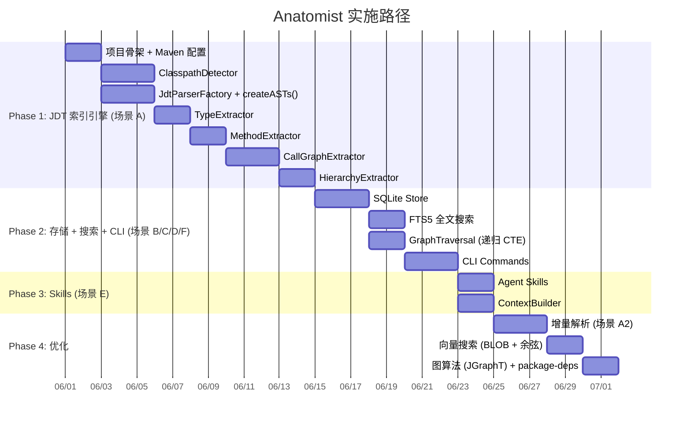

# Anatomist — Java Code Intelligence

基于 JDT 的 Java 源码索引与结构化分析工具，配合 Agent LLM 实现精确语义搜索。

## 核心理念

**JDT 提供精确结构化数据，Agent 提供 LLM 推理能力。**

Anatomist 不嵌入 LLM 调用，而是作为 Agent 可调用的代码智能基座，通过 CLI 暴露结构化查询能力，由 Agent（Claude Code / Cursor / Copilot 等）利用自身 LLM 完成语义理解和推理。

## 两阶段数据流

anatomist 的运行严格分为两个阶段，**JDT 只在 index 阶段参与，查询阶段完全走 SQLite**。



| 阶段 | 触发 | 数据流 | JDT 参与 | 耗时 |
|------|------|--------|---------|------|
| **index** | `anatomist index /path` | Java 源码 → JDT 解析 → SQLite | 是 | 秒~分钟级 |
| **query** | `anatomist search/context/callers-of/...` | SQLite → SQL 查询 → 结果 | **否** | 毫秒级 |

**为什么查询不重新走 JDT**：JDT 解析一个项目需要几秒到几十秒，Agent 每次查询都重解析不现实。SQLite 中的数据就是 JDT Binding 的持久化快照，查询直接读快照即可。

**数据如何保持新鲜**：源码变更后执行 `anatomist index --incremental`（Phase 4），仅重解析变更文件并更新 SQLite。



## 场景清单

**场景是一切设计的源头。** 后续每个设计决策——存什么关系、建什么索引、暴露什么命令——都从这里推导。

| # | 场景 | 详细分析 | Phase |
|---|------|---------|-------|
| 1 | 索引 | [scenario-1-index.md](docs/scenario-1-index.md) | Phase 1 |
| 2 | 查询（精确 + 模糊） | [scenario-2-query.md](docs/scenario-2-query.md) | Phase 2 |
| 3 | 监控 + 增量更新 | [scenario-3-watch.md](docs/scenario-3-watch.md) | Phase 4 |
| 4 | Skills 对接 CLI | [scenario-4-skills.md](docs/scenario-4-skills.md) | Phase 3 |
| 5 | 导出 / 可视化 | [scenario-5-export.md](docs/scenario-5-export.md) | Phase 2+4 |

**测试策略**: [docs/testing-strategy.md](docs/testing-strategy.md) — fixture 设计、JDK 8 验证边界、golden file 模式、CI 流程。Fixture B 实现见 [fixtures/mini-spring-shop/](fixtures/mini-spring-shop/)。

### 子场景一览

#### 场景 1：索引 → [详细分析](docs/scenario-1-index.md)

| # | 子场景 | 命令 |
|---|--------|------|
| 1.1 | 首次索引项目 | `anatomist index /path/to/project` |
| 1.2 | 指定 Java 版本 | `anatomist index /path --java-version 8` |
| 1.3 | 排除目录 | `anatomist index /path --exclude "generated,test"` |
| 1.4 | 指定输出路径 | `anatomist index /path --output ./my-index.db` |
| 1.5 | 指定 classpath | `anatomist index /path --classpath "/lib/a.jar:/lib/b.jar"` |
| 1.6 | 指定源码目录 | `anatomist index /path --project-source "api/src/main/java:service/src/main/java"` |
| 1.7 | 无 classpath 索引 | `anatomist index /path --no-classpath` |

#### 场景 2：查询 → [详细分析](docs/scenario-2-query.md)

| # | 子场景 | 命令 |
|---|--------|------|
| B1 | 按名称搜索类 | `anatomist search OrderService` |
| B2 | 按名称搜索方法 | `anatomist search checkout --kind METHOD` |
| B3 | 按全限定名精确定位 | `anatomist context com.example.service.OrderService` |
| B4 | 按注解查找 | `anatomist search @RestController --by-annotation` |
| B5 | 按接口查找实现类 | `anatomist implementors-of OrderRepository` |
| C1 | 查看类的全貌 | `anatomist context OrderService` |
| C2 | 查看继承链 | `anatomist hierarchy OrderService` |
| C3 | 查看方法签名 | `anatomist context OrderService.checkout` |
| C4 | 查看类的依赖 | `anatomist deps-of OrderService` |
| C5 | 查看谁依赖了这个类 | `anatomist used-by OrderService` |
| D1 | 方法调用了谁 | `anatomist callees-of OrderService.checkout` |
| D2 | 谁调用了这个方法 | `anatomist callers-of OrderService.checkout` |
| D3 | 完整调用链（多跳） | `anatomist callees-of ... --depth 5` |
| D4 | 入口方法追踪 | `anatomist callees-of Controller.create --depth 5` |
| F1 | 方法修改影响 | `anatomist callers-of checkout --depth 5` |
| F2 | 接口变更影响 | `anatomist implementors-of OrderRepository` |
| F3 | 类删除影响 | `anatomist used-by DiscountService` |

#### 场景 3：监控 + 增量 → [详细分析](docs/scenario-3-watch.md)

| # | 子场景 | 命令 |
|---|--------|------|
| 3.1 | 启动文件监控 | `anatomist watch /path/to/project` |
| 3.2 | 手动增量更新 | `anatomist index /path --incremental` |
| 3.3 | 监控 + 自动增量 | `anatomist watch /path --auto-index` |

#### 场景 4：Skills → [详细分析](docs/scenario-4-skills.md)

| # | 子场景 | Agent 工作流 |
|---|--------|-------------|
| E1 | 识别核心领域模型 | B4 查 @Entity → C1 看字段 → LLM 推理 |
| E2 | 识别限界上下文 | B4 查 @Service → C4 依赖 → LLM 推理 |
| E3 | 分析业务流程 | B4 查 Controller → D3 调用链 → LLM 合成 |
| E4 | 识别领域事件 | B1 搜索 "*Event" → D2 查 publish → LLM 推理 |
| 4.1 | Skill 文件引导 Agent | anatomist-skill.md |
| 4.2 | Agent 直接调用 CLI | CLI 命令集成 |
| 4.3 | ContextBuilder | 组装查询上下文 |

#### 场景 5：导出 → [详细分析](docs/scenario-5-export.md)

| # | 子场景 | 命令 |
|---|--------|------|
| 5.1 | 导出调用图为 Mermaid | `anatomist export --format mermaid --type call-graph` |
| 5.2 | 导出类依赖为 Mermaid | `anatomist export --format mermaid --type class-deps` |
| 5.3 | 导出继承图 | `anatomist export --format mermaid --type hierarchy` |
| 5.4 | 导出完整图为 JSON | `anatomist export --format json` |
| 5.5 | 导出子图 | `anatomist export --root OrderService --depth 3` |
| 5.6 | 导出包级依赖图 | `anatomist export --type package-deps` |

### 场景 → 设计追溯总览



## 场景推导：为什么需要持久化关系？

**问题**: JDT 已能解析所有关系，为什么还要持久化到 SQLite？

**答案**: JDT 解析一个项目要几秒到几十秒，Agent 每问一次都重解析不现实。**关系的持久化 = JDT Binding 的快照**，使后续查询 O(1) 而不是 O(N) 重解析。

**不需要图库**: SQLite 的 edges 表就是图，SQL 递归 CTE 就是遍历，MVP 阶段不需要 JGraphT 等图库。

```sql
-- D3 场景：多跳调用链，递归 CTE 替代图库
WITH RECURSIVE chain AS (
    SELECT source_id, target_id, 1 AS depth
    FROM edges WHERE source_id = ? AND relation = 'CALLS'
    UNION ALL
    SELECT e.source_id, e.target_id, c.depth + 1
    FROM edges e JOIN chain c ON e.source_id = c.target_id
    WHERE c.depth < 10
)
SELECT * FROM chain;
```

**图库什么时候需要**: 社区发现（Leiden/Louvain）、介数中心性等图算法，属于 Phase 4+ 的高级分析能力。

## 场景推导：存什么关系？

从场景倒推，只存 Agent 真正会问的。不存的不做。

### 核心 5 种（覆盖 80% 场景）

| 关系 | JDT 来源 | 存什么 | 追溯场景 |
|------|---------|--------|---------|
| **CONTAINS** | `TypeDeclaration` → 其中的 MethodDeclaration / FieldDeclaration | class 节点 → method/field 节点 | **C1**: "OrderService 有什么方法和字段" |
| **CALLS** | `MethodInvocation.resolveMethodBinding()`（含 `ClassInstanceCreation`、`SuperMethodInvocation`） | 调用方 method 节点 → 被调用 method 节点；`call_kind` 列区分 INSTANCE / STATIC / CONSTRUCTOR / SUPER / INTERFACE | **D1/D2/D3**: 调用链追踪；**F1**: 方法修改影响 |
| **INHERITS** | `ITypeBinding.getSuperclass()` | 子类 → 父类 | **C2**: 继承链 |
| **IMPLEMENTS** | `ITypeBinding.getInterfaces()` | 实现类 → 接口 | **B5**: "谁实现了这个接口"；**F2**: 接口变更影响 |
| **ANNOTATED_WITH** | TypeDeclaration / MethodDeclaration 上的 Annotation | 节点 → 注解 | **B4**: "所有 @RestController"；**E1/E2**: Spring 注解分析 |

### 补充 4 种（覆盖剩余 20%）

| 关系 | JDT 来源 | 存什么 | 追溯场景 |
|------|---------|--------|---------|
| **OVERRIDES** | `IMethodBinding.overrides(superMethod)` | 子类方法 → 父类方法 | **C2**: 多态场景——"checkout 覆盖了谁的实现" |
| **REFERENCES** | 字段类型、方法参数类型、返回类型的 `ITypeBinding` | 使用方 → 被引用的类 | **C4/C5**: "OrderService 依赖了哪些类"；**F3**: 类删除影响 |
| **READS** | `SimpleName` / `FieldAccess` 解析到 `IVariableBinding`（字段），且不在赋值左侧 | 方法节点 → 字段节点 | **F1**: "谁读了 order.status" |
| **WRITES** | `Assignment` / `PrefixExpression` / `PostfixExpression` 中字段在左侧 | 方法节点 → 字段节点 | **F1**: "谁修改了 order.status"——影响分析高频问题 |

### 不存的

| 关系 | 为什么不存 | 如果需要怎么办 |
|------|-----------|--------------|
| IMPORTS | 被 REFERENCES 覆盖，import 只是语法糖 | 不需要 |
| USES | 太模糊，CALLS + REFERENCES 已覆盖 | 不需要 |
| semantically_similar_to | Agent LLM 推理，不需要持久化 | Agent 运行时推理 |

## 场景推导：数据模型

### SQLite 表结构



### nodes 表 — 所有代码实体

| 列 | 类型 | 说明 | 索引 | 追溯场景 |
|----|------|------|------|---------|
| `id` | TEXT PK | FQN 形式标识，保留大小写（见 [Node ID 生成规则](#node-id-生成规则)） | PRIMARY | B3 精确查找 |
| `label` | TEXT | 简名 `OrderService` | FTS5 | B1/B2 搜索 |
| `kind` | TEXT | CLASS/METHOD/FIELD/INTERFACE/ENUM/ENUM_CONSTANT/ANONYMOUS_CLASS/LAMBDA/METHOD_REF | INDEX | B2 按类型筛选 |
| `qualified_name` | TEXT | 人类可读 FQN（方法不带签名） `com.example.OrderService#checkout` | UNIQUE INDEX | B3 精确定位 |
| `package` | TEXT | 所属包 `com.example.service`（从 `PackageDeclaration` 直接提取，非源码路径切片） | INDEX | E2 包级聚合 / package-deps |
| `source_file` | TEXT | 相对路径 | INDEX | 按文件查询 |
| `source_location` | TEXT | `L42` | — | 定位代码行 |
| `module` | TEXT | 所属模块名（多模块项目），单模块为 null | INDEX | 按模块筛选 |
| `scope` | TEXT | `MAIN` 或 `TEST` | INDEX | 按源码范围过滤 |
| `javadoc` | TEXT | Javadoc 注释文本 | FTS5 | 语义搜索 |
| `metadata` | TEXT | JSON 扩展字段 | — | C3 方法签名 |

#### Node ID 生成规则

ID **保留原始大小写**,以 FQN 为基底,只引入有限的语法分隔符。这样 ID 自身即可逆地表达节点身份,无需依赖 `qualified_name` 列还原。

```
CLASS/INTERFACE/ENUM:   FQN 原样                                    → com.example.OrderService
METHOD:                 类FQN + # + 方法名 + (擦除签名)              → com.example.OrderService#checkout(java.lang.String,java.util.List)
FIELD:                  类FQN + # + 字段名（无括号即字段）           → com.example.OrderService#orderRepo
ENUM_CONSTANT:          枚举FQN + # + 常量名                         → com.example.OrderStatus#PENDING
ANONYMOUS_CLASS:        父方法ID + $anon@L<line>                     → com.example.OrderService#checkout(...)$anon@L42
LAMBDA:                 父方法ID + $lambda@L<line>C<col>             → com.example.OrderService#checkout(...)$lambda@L42C18
```

**关键决策**：

| 决策 | 原因 |
|------|------|
| 保留大小写 | `com.example.Order`(类)与 `com.example.order`(子包)是不同实体,小写化会冲突 |
| 方法用完整擦除签名 | 重载消歧权威方式;直接用 JDT `IMethodBinding.getKey()` 派生,不再人工标准化 |
| 字段/方法用 `#` 而非 `__` | `#` 是 Java 文档惯例(Javadoc 引用),字段无括号方法有,语法即可区分 |
| Lambda/匿名类用源码位置(`@L42C18`) | 序号在文件内新增 Lambda 后会漂移,导致增量更新破坏所有引用;位置稳定 |
| 字符集 | 仅 `[A-Za-z0-9._#$()@,]`,无空格,SQL/CLI/Mermaid 友好 |

**ID 字符的特殊语义**:
- `.`  → 包/类层级分隔(原 FQN)
- `#`  → 类与成员分隔
- `()` → 方法签名包装
- `,`  → 方法参数分隔
- `$`  → 合成符号前缀(匿名/Lambda)
- `@`  → 源码位置标注

#### metadata JSON 结构（按 kind 不同）

```jsonc
// kind = CLASS
{
  "isAbstract": false,
  "isInterface": false,
  "typeParameters": ["<T>"],
  "superClass": "BaseService<Order>",
  "interfaces": ["Serializable", "Runnable"]
}

// kind = METHOD
{
  "returnType": "OrderResult",
  "parameters": [
    {"name": "orderId", "type": "String"},
    {"name": "items", "type": "List<OrderItem>"}
  ],
  "isStatic": false,
  "isAbstract": false,
  "isConstructor": false,
  "isAccessor": false,
  "modifiers": ["public"],
  "signature": "checkout(String orderId, List<OrderItem> items)"
}

// kind = ANONYMOUS_CLASS
{
  "baseType": "Runnable",
  "methods": ["run"]
}

// kind = LAMBDA
{
  "parameters": [{"name": "item", "type": "OrderItem"}],
  "returnType": "boolean",
  "signature": "lambda1(OrderItem item) -> boolean"
}

// kind = FIELD
{
  "type": "OrderRepository",
  "isStatic": false,
  "isFinal": false
}

// kind = INTERFACE
{
  "typeParameters": ["<T>", "<ID>"],
  "methods": ["findById", "save", "delete"]
}

// kind = ENUM
{
  "constants": ["PENDING", "CONFIRMED", "SHIPPED", "DELIVERED"]
}
```

### edges 表 — 所有关系

| 列 | 类型 | 说明 | 索引 | 追溯场景 |
|----|------|------|------|---------|
| `id` | INTEGER PK | 自增 | PRIMARY | — |
| `source_id` | TEXT FK→nodes.id | 调用方/子类/包含方 | INDEX | D1/D2/C4 查调用和依赖 |
| `target_id` | TEXT FK→nodes.id | 被调用方/父类/被包含方；**仅项目内节点**，外部依赖时为 NULL | INDEX | D1/D2/C5 反向查找 |
| `external_target_fqn` | TEXT | 外部依赖时填写 FQN（如 `java.util.List#add(java.lang.Object)`）；项目内为 NULL | INDEX | 显示外部方法全限定名 |
| `relation` | TEXT | CALLS/CONTAINS/INHERITS/IMPLEMENTS/OVERRIDES/REFERENCES/READS/WRITES/ANNOTATED_WITH | INDEX | 按关系类型筛选 |
| `call_kind` | TEXT | 仅 CALLS 边：INSTANCE / STATIC / CONSTRUCTOR / SUPER / INTERFACE；其他关系为 NULL | INDEX | 多态分析、构造调用筛选 |
| `confidence` | TEXT | EXTRACTED | — | JDT 解析均为 EXTRACTED |
| `context` | TEXT | REFERENCES: `field_type` / `parameter_type` / `return_type` / `generic_arg`；CALLS: 空 | — | 区分引用类型 |
| `is_external` | INTEGER | 0 = 项目内（target_id 有效），1 = 外部依赖（external_target_fqn 有效） | INDEX | 过滤外部调用 |
| `source_file` | TEXT | 边所在文件 | INDEX | — |
| `source_location` | TEXT | 边所在行 | — | — |
| `metadata` | TEXT | JSON 扩展 | — | bindingResolved 等 |

> **target 拆分原因**：原方案让 `target_id` 同时存内部 Node ID 和外部 FQN 文本，查询时一旦忘记带 `AND is_external = 0` 就可能撞名（外部 `com.example.X` 与项目内同名节点）。拆为 `target_id`（强 FK）+ `external_target_fqn` 后，schema 自身保证查询正确性。
>
> **复合索引**：`(relation, is_external, target_id)` 和 `(relation, is_external, external_target_fqn)`，避免大边表全扫。

### annotations 表 — 注解独立建表

| 列 | 类型 | 说明 | 索引 | 追溯场景 |
|----|------|------|------|---------|
| `id` | INTEGER PK | 自增 | PRIMARY | — |
| `node_id` | TEXT FK | 被标注的节点 | INDEX | B4 反查节点 |
| `annotation_fqn` | TEXT | `org.springframework.web.bind.annotation.RestController` | INDEX | **B4**: 按注解名高效查询 |
| `attributes` | TEXT | JSON `{"value": "/api/orders"}` | — | E2: Spring 路由分析 |

> 注解独立建表是因为 B4 场景（"所有 @RestController 类"）需要 SQL 精确查询，存 metadata JSON 无法高效索引。

### node_names 表 — FTS5 虚拟表

| 列 | 说明 | 追溯场景 |
|----|------|---------|
| `qualified_name` | 全限定名 | B1: 搜索 "OrderService" 命中 com.example.OrderService |
| `label` | 简名 | B1: 搜索 "Order" 命中 OrderService |
| `javadoc` | Javadoc 文本 | 语义关键词搜索 |

```sql
CREATE VIRTUAL TABLE node_names USING fts5(
    qualified_name,
    label,
    javadoc,
    content='nodes',
    content_rowid='rowid'
);
```

> external content 模式必须配 INSERT/UPDATE/DELETE 触发器同步，否则 FTS5 不会自动跟随 `nodes` 表变化。完整触发器 DDL 见 [scenario-1 §完整 DDL](docs/scenario-1-index.md#完整-ddl)。

## 场景 → SQL 查询映射

每个场景对应的 SQL 查询，验证数据模型是否完整覆盖。

| 场景 | 查询方式 |
|------|---------|
| **B1** 按名称搜索 | `SELECT * FROM node_names WHERE node_names MATCH ? JOIN nodes ON ...` |
| **B2** 按名称搜索方法 | B1 + `WHERE kind = 'METHOD'` |
| **B3** 全限定名精确 | `SELECT * FROM nodes WHERE qualified_name = ?` |
| **B4** 按注解查找 | `SELECT n.* FROM nodes n JOIN annotations a ON n.id = a.node_id WHERE a.annotation_fqn = ?` |
| **B5** 接口实现类 | `SELECT n.* FROM nodes n JOIN edges e ON n.id = e.source_id WHERE e.target_id = ? AND e.relation = 'IMPLEMENTS' AND e.is_external = 0` |
| **C1** 类全貌 | nodes + edges WHERE source_id = ? AND relation = 'CONTAINS' + annotations WHERE node_id = ? |
| **C2** 继承链 | 递归 CTE on `INHERITS` edges |
| **C3** 方法签名 | nodes WHERE qualified_name = ? + 解析 metadata JSON |
| **C4** 依赖了谁 | edges WHERE source_id = ? AND relation IN ('CALLS', 'REFERENCES', 'WRITES', 'READS')；默认 `DISTINCT target_id` 折叠 context 维度，`--detailed` 才展开 |
| **C5** 谁依赖了我 | edges WHERE (target_id = ? OR external_target_fqn = ?) AND relation IN ('CALLS', 'REFERENCES', 'WRITES', 'READS') |
| **D1** 被谁调用 | `SELECT * FROM edges WHERE target_id = ? AND relation = 'CALLS' AND is_external = 0` |
| **D2** 调用了谁 | `SELECT * FROM edges WHERE source_id = ? AND relation = 'CALLS'` |
| **D3** 多跳调用链 | 递归 CTE on `CALLS` edges (depth = N)，遍历时跨越 LAMBDA 节点合并到所属外部方法 |
| **D4** 入口追踪 | B4 查 @RequestMapping 方法 + 递归 CTE on `CALLS` edges |
| **E1** 领域模型 | B4 查 @Entity + C1 看字段关系 |
| **E2** 限界上下文 | B4 查 @Service/@RestController + C4 依赖 + 按 `nodes.package` 分组（package-deps） |
| **E3** 业务流程 | B4 查 Controller + D1/D3 调用链 |
| **E4** 领域事件 | B1 搜索 "*Event" + D2 查 publish 调用 |
| **F1** 方法修改影响 | D2 递归 callers-of；字段级 "谁改了 X" 用 `edges WHERE target_id = ? AND relation = 'WRITES'` |
| **F2** 接口变更影响 | B5 implementors-of |
| **F3** 类删除影响 | C5 used-by |

## 真实示例

以一个 Spring 项目为例，展示 JDT 提取的完整数据：

```java
@Service
public class OrderService extends BaseService {
    @Autowired
    private OrderRepository orderRepo;
    private PriceCalculator calculator;

    public OrderResult checkout(String orderId, List<OrderItem> items) {
        Order order = orderRepo.findById(orderId);
        double total = calculator.calculate(items);
        double discount = applyDiscount(total);
        return new OrderResult(order, total - discount);
    }

    @Override
    protected double applyDiscount(double amount) {
        return amount > 100 ? amount * 0.1 : 0;
    }
}
```

### 提取的 Nodes

```
ID: com.example.OrderService
  label: OrderService
  kind: CLASS
  qualified_name: com.example.OrderService
  package: com.example
  source_file: src/main/java/com/example/OrderService.java
  source_location: L2
  metadata: {"isAbstract":false, "superClass":"BaseService"}

ID: com.example.OrderService#checkout(java.lang.String,java.util.List)
  label: checkout
  kind: METHOD
  qualified_name: com.example.OrderService#checkout
  source_file: src/main/java/com/example/OrderService.java
  source_location: L7
  metadata: {"returnType":"OrderResult", "parameters":[{"name":"orderId","type":"String"},{"name":"items","type":"List<OrderItem>"}], "modifiers":["public"], "signature":"checkout(String orderId, List<OrderItem> items)"}

ID: com.example.OrderService#applyDiscount(double)
  label: applyDiscount
  kind: METHOD
  qualified_name: com.example.OrderService#applyDiscount
  source_location: L13
  metadata: {"returnType":"double", "parameters":[{"name":"amount","type":"double"}], "modifiers":["protected"], "signature":"applyDiscount(double amount)"}

ID: com.example.OrderService#orderRepo
  label: orderRepo
  kind: FIELD
  qualified_name: com.example.OrderService#orderRepo
  source_location: L4
  metadata: {"type":"OrderRepository", "isStatic":false, "isFinal":false}

ID: com.example.OrderService#calculator
  label: calculator
  kind: FIELD
  qualified_name: com.example.OrderService#calculator
  source_location: L5
  metadata: {"type":"PriceCalculator", "isStatic":false, "isFinal":false}
```

### 提取的 Edges

```
-- CONTAINS: 类包含什么 → 场景 C1
source: com.example.OrderService                                          target: com.example.OrderService#checkout(java.lang.String,java.util.List)
source: com.example.OrderService                                          target: com.example.OrderService#applyDiscount(double)
source: com.example.OrderService                                          target: com.example.OrderService#orderRepo
source: com.example.OrderService                                          target: com.example.OrderService#calculator

-- CALLS: 方法调用了谁 → 场景 D1/D2/D3/F1（call_kind 区分 INSTANCE/STATIC/CONSTRUCTOR/SUPER/INTERFACE）
source: com.example.OrderService#checkout(...)  target: com.example.OrderRepository#findById(java.lang.String)  is_external=0  call_kind=INSTANCE
source: com.example.OrderService#checkout(...)  target: com.example.PriceCalculator#calculate(java.util.List)   is_external=0  call_kind=INSTANCE
source: com.example.OrderService#checkout(...)  target: com.example.OrderService#applyDiscount(double)          is_external=0  call_kind=INSTANCE
source: com.example.OrderService#checkout(...)  target: NULL  is_external=1  external_target_fqn=java.util.Objects#requireNonNull(java.lang.Object)  call_kind=STATIC

-- INHERITS: 继承 → 场景 C2
source: com.example.OrderService           target: com.example.BaseService

-- OVERRIDES: 方法覆盖 → 场景 C2
source: com.example.OrderService#applyDiscount(double)  target: com.example.BaseService#applyDiscount(double)

-- REFERENCES: 类型引用 → 场景 C4/C5/F3
source: com.example.OrderService#orderRepo                            target: com.example.OrderRepository
source: com.example.OrderService#checkout(...)                        target: com.example.OrderResult
source: com.example.OrderService#checkout(...)                        target: com.example.OrderItem
source: com.example.OrderService#checkout(...)                        target: com.example.CreateOrderRequest

-- WRITES / READS: 字段访问 → 场景 F1（"谁改了 order.status"）
source: com.example.OrderService#checkout(...)  target: com.example.Order#status      relation=WRITES
source: com.example.OrderService#checkout(...)  target: com.example.OrderService#orderRepo  relation=READS
```

### 提取的 Annotations

```
-- 场景 B4/E1/E2
node_id: com.example.OrderService                              annotation_fqn: org.springframework.stereotype.Service
node_id: com.example.OrderService#orderRepo                     annotation_fqn: org.springframework.beans.factory.annotation.Autowired
node_id: com.example.OrderService#applyDiscount(double)         annotation_fqn: java.lang.Override
```

## 搜索流程

Agent 驱动的语义搜索流程（覆盖场景 E3）：



## 端到端流程验证："创建订单的流程是什么？"

用真实数据走一遍 Agent 使用 anatomist 回答此问题的完整流程，验证设计是否完整。

### Step 1: Agent 接收问题

```
用户: "创建订单的流程是什么？"
```

Agent 通过 anatomist-skill.md 知道要使用 anatomist 的结构化查询能力。

### Step 2: 定位入口 — 搜索 Order 相关类

```
Agent → anatomist search "order"
```

返回：

```json
[
  {"id": "com.example.controller.OrderController", "label": "OrderController", "kind": "CLASS", "qualified_name": "com.example.controller.OrderController"},
  {"id": "com.example.service.OrderService", "label": "OrderService", "kind": "CLASS", "qualified_name": "com.example.service.OrderService"},
  {"id": "com.example.repository.OrderRepository", "label": "OrderRepository", "kind": "CLASS", "qualified_name": "com.example.repository.OrderRepository"},
  {"id": "com.example.entity.Order", "label": "Order", "kind": "CLASS", "qualified_name": "com.example.entity.Order"},
  {"id": "com.example.entity.OrderItem", "label": "OrderItem", "kind": "CLASS", "qualified_name": "com.example.entity.OrderItem"},
  {"id": "com.example.dto.OrderResult", "label": "OrderResult", "kind": "CLASS", "qualified_name": "com.example.dto.OrderResult"}
]
```

### Step 3: 查看 Controller 全貌，找到入口方法

```
Agent → anatomist context com.example.controller.OrderController
```

返回：

```json
{
  "node": {"id": "com.example.controller.OrderController", "label": "OrderController", "kind": "CLASS", "metadata": {"isAbstract": false}},
  "annotations": [
    {"annotation_fqn": "org.springframework.web.bind.annotation.RestController"},
    {"annotation_fqn": "org.springframework.web.bind.annotation.RequestMapping", "attributes": {"value": "/api/orders"}}
  ],
  "fields": [
    {"id": "com.example.controller.OrderController#orderService", "label": "orderService", "kind": "FIELD", "metadata": {"type": "OrderService"}}
  ],
  "methods": [
    {
      "id": "com.example.controller.OrderController#create(com.example.dto.CreateOrderRequest)",
      "label": "create",
      "kind": "METHOD",
      "source_location": "L23",
      "metadata": {"returnType": "ResponseEntity", "parameters": [{"name": "request", "type": "CreateOrderRequest"}], "signature": "create(CreateOrderRequest request)"},
      "annotations": [{"annotation_fqn": "org.springframework.web.bind.annotation.PostMapping", "attributes": {"value": "/"}}]
    },
    {
      "id": "com.example.controller.OrderController#getById(java.lang.String)",
      "label": "getById",
      "kind": "METHOD",
      "source_location": "L30",
      "metadata": {"returnType": "ResponseEntity", "parameters": [{"name": "id", "type": "String"}], "signature": "getById(String id)"},
      "annotations": [{"annotation_fqn": "org.springframework.web.bind.annotation.GetMapping", "attributes": {"value": "/{id}"}}]
    }
  ]
}
```

> 默认 `context` 不返回 callees,Agent 需要展开调用关系时显式追加 `--with-callees[=N]`(N 默认 1)。设计原因见[CLI 命令](#cli-命令)。

**Agent 推理**: `create` 方法有 `@PostMapping`，这是创建订单的 HTTP 入口。

### Step 4: 递归追踪 create 的调用链

```
Agent → anatomist callees-of com.example.controller.OrderController#create --depth 5
```

返回（递归 CTE 一次展开完整调用链）：

```json
{
  "root": "com.example.controller.OrderController#create(com.example.dto.CreateOrderRequest)",
  "chain": [
    {"source": "com.example.controller.OrderController#create(...)", "target": "com.example.service.OrderService#createOrder(com.example.dto.CreateOrderRequest)", "depth": 1},
    {"source": "com.example.service.OrderService#createOrder(...)", "target": "com.example.service.OrderValidator#validate(com.example.dto.CreateOrderRequest)", "depth": 2},
    {"source": "com.example.service.OrderService#createOrder(...)", "target": "com.example.service.PriceCalculator#calculate(java.util.List)", "depth": 2},
    {"source": "com.example.service.OrderService#createOrder(...)", "target": "com.example.service.OrderService#applyDiscount(double)", "depth": 2},
    {"source": "com.example.service.OrderService#createOrder(...)", "target": "com.example.repository.OrderRepository#save(com.example.entity.Order)", "depth": 2},
    {"source": "com.example.service.OrderService#createOrder(...)", "target": "com.example.event.OrderEventPublisher#publish(com.example.event.OrderCreatedEvent)", "depth": 2}
  ]
}
```

### Step 5: Agent 可选——深入查看关键方法

```
Agent → anatomist context com.example.service.OrderService#createOrder
```

返回方法签名 + 注解：

```json
{
  "node": {
    "id": "com.example.service.OrderService#createOrder(com.example.dto.CreateOrderRequest)",
    "label": "createOrder",
    "kind": "METHOD",
    "source_file": "src/main/java/com/example/service/OrderService.java",
    "source_location": "L33",
    "metadata": {"returnType": "OrderResult", "parameters": [{"name": "request", "type": "CreateOrderRequest"}], "modifiers": ["public"], "signature": "createOrder(CreateOrderRequest request)"}
  },
  "annotations": [
    {"annotation_fqn": "org.springframework.transaction.annotation.Transactional"}
  ],
  "callees": [
    {"target": "com.example.service.OrderValidator#validate(com.example.dto.CreateOrderRequest)", "label": "validate", "call_kind": "INSTANCE"},
    {"target": "com.example.service.PriceCalculator#calculate(java.util.List)", "label": "calculate", "call_kind": "INSTANCE"},
    {"target": "com.example.service.OrderService#applyDiscount(double)", "label": "applyDiscount", "call_kind": "INSTANCE"},
    {"target": "com.example.repository.OrderRepository#save(com.example.entity.Order)", "label": "save", "call_kind": "INTERFACE"},
    {"target": "com.example.event.OrderEventPublisher#publish(com.example.event.OrderCreatedEvent)", "label": "publish", "call_kind": "INSTANCE"}
  ]
}
```

**Agent 推理**: `@Transactional` 说明整个创建流程在同一事务中。

### Step 6: Agent 可选——读取源码细节

Agent 有自己的文件读取能力，可以直接读源文件获取更深层理解：

```
Agent → 读取 src/main/java/com/example/service/OrderService.java L33-40
```

### Step 7: Agent LLM 合成最终回答

```
创建订单的完整流程：

1. HTTP 入口
   OrderController.create() — @PostMapping /api/orders
   接收 CreateOrderRequest

2. 业务处理（事务内 @Transactional）
   OrderService.createOrder()
   ├─ OrderValidator.validate()        — 校验订单请求
   ├─ PriceCalculator.calculate()      — 计算总价
   ├─ OrderService.applyDiscount()     — 应用折扣
   ├─ OrderRepository.save()           — 持久化订单
   └─ OrderEventPublisher.publish()    — 发布订单创建事件

3. 返回 OrderResult
```

### 流程验证发现的设计修正

通过端到端验证发现 4 个设计缺口，已在本文档中修正：

| 缺口 | 问题 | 修正 | 影响章节 |
|------|------|------|---------|
| **1. 无递归 callees-of** | Agent 需逐层调用 callees-of，5 层调用要 5 次 CLI | `callees-of`/`callers-of` 增加 `--depth N` 参数，递归 CTE 一次返回 | 场景 D3/D4、CLI 命令 |
| **2. context 默认不展开调用** | 早期方案让 `context` 自动带 1 层 callees，但大类输出膨胀，且与 `callees-of` 重复 | `context` 默认轻量（node + fields + method signatures + annotations）；需要调用关系时显式 `--with-callees[=N]` | CLI 命令 |
| **3. 缺少包级聚合视图** | E2 场景（限界上下文）需要包级依赖，Agent 需自行聚合 | 新增 `anatomist package-deps` 命令（Phase 4），基于 `nodes.package` 显式列 GROUP BY | CLI 命令 |
| **4. REFERENCES 缺参数类型** | `deps-of OrderService` 看不到方法参数引用的类型（如 CreateOrderRequest） | REFERENCES 边覆盖方法参数类型 | 存什么关系、数据模型 |

## 语义层设计

结构索引提供精确的代码关系，但缺少业务语义。语义层在结构索引之上叠加业务理解。

**核心原则**：先用低成本源（Javadoc + 约定），LLM 只补缺口。Anatomist 不嵌入 LLM，所有 LLM 推理由 Agent 完成。

### 语义信息来源

| 层级 | 来源 | 可靠性 | 获取成本 | Phase |
|------|------|--------|---------|-------|
| 代码结构 | JDT 解析 | 100% 精确 | 低（自动） | Phase 1 |
| Javadoc / 注释 | 源码内嵌 | 高 | 低（JDT 提取） | Phase 1 |
| 约定推导 | @Service, *Service 命名 | 中 | 零 | Phase 1 |
| 项目文档 | README, docs/, ADR | 高 | 低（文件读取） | Phase 2 |
| LLM 推理 | Agent LLM | 中 | 高（token） | Phase 2 |

### Phase 1：Javadoc + 约定推导

**Javadoc**：nodes 表 `javadoc` 列存储，JDT 提取 `TypeDeclaration.getJavadoc()` / `MethodDeclaration.getJavadoc()`，可被 FTS5 索引。

**约定推导**：索引时从注解和命名模式自动推断语义类别，写入 `semantic_annotations` 表（`source = 'CONVENTION'`）：

| 推断规则 | 语义结论 |
|---------|---------|
| `@Service` / `*Service` | BUSINESS_SERVICE |
| `@Repository` / `*Repository` | DATA_ACCESS |
| `@RestController` / `*Controller` | API_ENDPOINT |
| `@Entity` | DOMAIN_MODEL |
| `@Transactional` | TRANSACTION_BOUNDARY |
| `*DTO` / `*Request` / `*Response` | DTO |
| `*Config` / `*Configuration` | INFRASTRUCTURE |

### Phase 2：文档索引 + Agent 语义构建

**文档索引**：`documents` 表 + `doc_content` FTS5 索引，扫描 README.md、docs/**/*.md、ADR 等。

**Agent 语义构建工作流**：

1. `anatomist enrich --package com.example.service` → 输出结构摘要 + 相关文档
2. Agent LLM 推理业务语义
3. `anatomist annotate <node-id> --label "订单服务" --category BUSINESS_SERVICE --context "订单上下文"` → 写入 semantic_annotations

**文档与代码关联**：FTS5 搜索文档中的类名 → 匹配 nodes 表，建立语义关联。

### 全文搜索 vs 向量相似度

| 能力 | 解决什么 | Phase |
|------|---------|-------|
| FTS5 全文搜索 | 关键词匹配 | Phase 1 |
| Agent LLM 语义扩展 | "创建订单" → LLM 提取关键词 → FTS5 搜索 | Phase 2 |
| 向量相似度 | 直接语义匹配（嵌入向量 + 余弦相似度） | Phase 4（可选优化） |

Phase 1-2 不需要向量搜索。FTS5 + Agent LLM 已覆盖语义需求。向量搜索是 Phase 4 性能优化，减少大项目 LLM 调用次数。

## 架构总览



## 项目结构

```
anatomist/
├── pom.xml
├── DESIGN.md
├── skills/
│   ├── anatomist-skill.md              # Skill 定义（给 Agent 用）
│   └── domain-analysis-skill.md        # 领域分析 Skill
└── src/main/java/com/anatomist/
    ├── core/                           # Phase 1: JDT 索引引擎
    │   ├── JdtParserFactory.java       # ASTParser 工厂 + classpath 配置
    │   ├── ProjectScanner.java         # 递归扫描 .java 文件
    │   └── ClasspathDetector.java      # 自动检测 Maven/Gradle 依赖
    ├── extract/                        # Phase 1: 结构化提取
    │   ├── Extractor.java             # 提取器接口
    │   ├── TypeExtractor.java         # 类/接口/枚举/Record
    │   ├── MethodExtractor.java       # 方法签名
    │   ├── FieldExtractor.java        # 字段
    │   ├── CallGraphExtractor.java    # 调用图 → 场景 D/F
    │   ├── HierarchyExtractor.java    # 继承/实现 → 场景 B5/C2
    │   ├── ReferenceExtractor.java   # 类型引用 → 场景 C4/C5/F3
    │   ├── FieldAccessExtractor.java # 字段读写 → 场景 F1（"谁改了 X"）
    │   └── AnnotationExtractor.java  # 注解 → 场景 B4/E
    ├── model/                          # 数据模型
    │   ├── Node.java
    │   ├── Edge.java
    │   └── ExtractionResult.java
    ├── store/                          # Phase 2: SQLite 存储
    │   ├── SqliteStore.java           # 节点/边/注解 → SQLite
    │   └── Fts5SearchEngine.java     # FTS5 全文搜索 → 场景 B1/B2
    ├── search/                         # Phase 2: 搜索能力
    │   ├── SymbolSearch.java          # 全限定名精确查找 → 场景 B3
    │   ├── TextSearch.java            # FTS5 全文搜索 → 场景 B1/B2
    │   ├── GraphTraversal.java       # 递归 CTE 图遍历 → 场景 D3/D4
    │   └── ContextBuilder.java       # 为 Agent 组装上下文 → 场景 C1
    └── cli/                            # Phase 2: CLI
        ├── AnatomistCli.java          # Picocli 入口
        ├── IndexCommand.java          # anatomist index → 场景 A1
        ├── SearchCommand.java         # anatomist search → 场景 B1/B2/B4
        ├── QueryCommand.java          # anatomist callers-of/callees-of → 场景 D1/D2/D3
        ├── ContextCommand.java        # anatomist context → 场景 C1/C3
        └── ExportCommand.java         # anatomist export → 场景 5
```

## CLI 命令

| 命令 | 说明 | 追溯场景 |
|------|------|---------|
| `anatomist index <path>` | 索引 Java 项目（支持 `--java-version`, `--classpath`, `--project-source`, `--exclude`, `--output`, `--no-classpath`） | A1 |
| `anatomist search <query>` | FTS5 全文搜索符号 | B1, B2 |
| `anatomist context <fqn>` | 获取类/方法的基本上下文（fields + method signatures + annotations，**不含 callees**） | C1, C3 |
| `anatomist context <fqn> --with-callees[=N]` | 同上，并附加每个方法 N 层 callees（N 默认 1） | C1, C3 |
| `anatomist callers-of <method>` | 谁调用了这个方法（`--depth N` 递归） | D2, F1 |
| `anatomist callees-of <method>` | 这个方法调用了谁（`--depth N` 递归；遍历自动跨越 Lambda） | D1, D3, D4 |
| `anatomist hierarchy <class>` | 继承链/实现接口 | C2 |
| `anatomist implementors-of <interface>` | 接口的实现类 | B5, F2 |
| `anatomist deps-of <class>` | 类依赖了谁（默认折叠 REFERENCES context，`--detailed` 展开） | C4 |
| `anatomist used-by <class>` | 谁依赖了这个类 | C5, F3 |
| `anatomist field-readers <field>` | 谁读了这个字段 | F1（字段级） |
| `anatomist field-writers <field>` | 谁修改了这个字段 | F1（字段级，"谁改了 order.status"） |
| `anatomist call-path <from> <to>` | 两个方法间的调用路径 | D3 |
| `anatomist package-deps` | 包级依赖聚合视图 | E2 |
| `anatomist index-docs <path>` | 索引项目文档到 documents 表 | Phase 2 |
| `anatomist enrich --node/--package <target>` | 输出结构摘要供 LLM 分析 | Phase 2 |
| `anatomist annotate <node-id> --label --category --context` | 写入语义注解 | Phase 2 |

## 依赖

```xml
<dependencies>
    <!-- JDT — 场景 A1: 解析 Java 源码 -->
    <dependency>
        <groupId>org.eclipse.jdt</groupId>
        <artifactId>org.eclipse.jdt.core</artifactId>
        <version>3.45.0</version>
    </dependency>

    <!-- SQLite — 场景 B/C/D: 持久化存储 + 查询 -->
    <dependency>
        <groupId>org.xerial</groupId>
        <artifactId>sqlite-jdbc</artifactId>
        <version>3.47.0.0</version>
    </dependency>

    <!-- CLI — 所有场景的入口 -->
    <dependency>
        <groupId>info.picocli</groupId>
        <artifactId>picocli</artifactId>
        <version>4.7.6</version>
    </dependency>

    <!-- JSON — metadata 序列化 -->
    <dependency>
        <groupId>com.fasterxml.jackson.core</groupId>
        <artifactId>jackson-databind</artifactId>
        <version>2.17.0</version>
    </dependency>
</dependencies>
```

## 实施路径



| Phase | 内容 | 覆盖场景 | 时间 |
|-------|------|---------|------|
| Phase 1 | JDT 结构化索引引擎 | A | 2-3 周 |
| Phase 2 | SQLite 存储 + FTS5 搜索 + CLI | B, C, D, F | 2 周 |
| Phase 3 | Agent Skills + ContextBuilder | E | 1 周 |
| Phase 4 | 增量解析 + 向量搜索 + 图算法 | A2 + 高级 | 2 周 |
| **合计** | | **A-F 全覆盖** | **7-9 周** |

## 核心差异化

| 维度 | Graphify | Anatomist |
|------|----------|-----------|
| 结构解析 | tree-sitter（无类型信息） | JDT（完整 Binding/类型解析） |
| 调用图 | 保守 label 匹配（INFERRED） | 编译器级精确解析（EXTRACTED） |
| 语言 | 多语言 | Java 专精 |
| 增量 | 无 | 文件粒度差量重解析（JDT 无原生增量 API） + 缓存 diff |
| 语义搜索 | 内嵌 LLM | Agent Skill 驱动 |
| 领域分析 | LLM 直接提取 | Agent 基于结构数据推理 |
| 存储 | NetworkX + JSON | SQLite + FTS5 |
| 图遍历 | NetworkX API | SQL 递归 CTE |
| 部署 | Python + 依赖 | 单 JAR，4 个依赖，零外部服务 |
