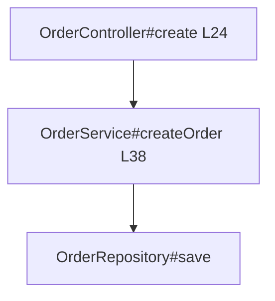
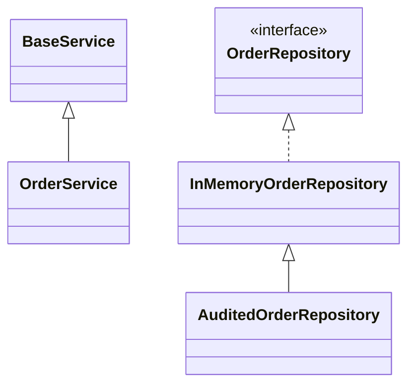

# 基于 anatomist 的 Java Agent：从“读代码猜”到“查事实再生成”

## 总结

在 Java 项目里，不使用 anatomist 的 Agent 通常靠 `rg`、打开文件和模型推理来理解代码；使用 anatomist 的 Agent 会先把项目索引成结构化代码图，再基于 `CALLS`、`REFERENCES`、`READS`、`WRITES`、`INJECTS`、`WIRES` 等事实做分析和代码生成。

核心变化：

```text
不使用 anatomist:
  搜关键词 -> 打开很多文件 -> 猜调用关系 -> 生成/修改代码

使用 anatomist:
  建索引 -> 查询代码事实 -> 定位最小证据 -> 生成/修改代码
```

| 对比项 | 不使用 anatomist | 使用 anatomist |
|---|---|---|
| 代码导航 | 靠关键词和路径猜 | 直接定位 node / relation / file line |
| 漏代码风险 | 容易漏接口实现、字段读写、XML wiring、反向调用 | 静态图内统一查询 |
| Token 消耗 | 多文件塞上下文 | 先查 JSON，再只读关键 source window |
| 代码生成 | 容易只改当前文件 | 先查影响面，再按现有结构生成 |
| 可复核性 | “我看起来是这样” | “这些 CALLS / READS / WIRES 证明” |

本文基于当前仓库的 `fixtures/mini-spring-shop` 实跑。

---

## 实验项目

`mini-spring-shop` 是一个 Java 8 多模块 Spring fixture：

```text
api
  OrderController
domain
  Order / OrderStatus / OrderCreatedEvent / DTO
service
  OrderService / OrderValidator / PriceCalculator
  OrderRepository / InMemoryOrderRepository / AuditedOrderRepository
  applicationContext.xml
```

索引命令：

```bash
java -jar target/anatomist.jar index fixtures/mini-spring-shop \
  --project-source "api/src/main/java:domain/src/main/java:service/src/main/java" \
  --no-classpath \
  --spring-xml \
  --output /tmp/anatomist-article/index.db \
  --format json

java -jar target/anatomist.jar index-docs fixtures/mini-spring-shop \
  --index /tmp/anatomist-article/index.db
```

实跑索引摘要：

| 指标 | 数值 |
|---|---:|
| source files | 16 |
| types | 17 |
| methods | 47 |
| fields | 20 |
| beans | 10 |

关系摘要：

| Relation | 数量 | 含义 |
|---|---:|---|
| `CALLS` | 50 | 方法调用 |
| `REFERENCES` | 45 | 类型引用 |
| `READS` | 23 | 字段读取 |
| `WRITES` | 19 | 字段写入 |
| `INJECTS` | 5 | Spring 注入 |
| `WIRES` | 4 | XML wiring |
| `HANDLES` | 2 | 路由处理 |

---

## 1. 分析入口：不用猜 Controller

不用 anatomist 时，Agent 常先搜：

```bash
rg -n "Controller|Mapping|Listener|Facade|Job" .
```

这会混入注释、import、测试代码，还需要人工拼 `@RequestMapping` 和 `@PostMapping`。

使用 anatomist：

```bash
anatomist search --name '*' --kind ROUTE --index /tmp/anatomist-article/index.db
```

实跑结果：

| ROUTE | 文件 | 行 |
|---|---|---:|
| `POST /api/orders` | `OrderController.java` | L22 |
| `GET /api/orders/{id}` | `OrderController.java` | L27 |

Agent 得到的是入口事实，而不是关键词命中。

---

## 2. 正向切片：从入口到 Repository

问题：

> `POST /api/orders` 会不会到 Repository？

使用 anatomist：

```bash
anatomist call-path \
  com.example.shop.controller.OrderController#create \
  com.example.shop.repository.OrderRepository#save \
  --depth 8 \
  --source-window=1 \
  --index /tmp/anatomist-article/index.db
```

实跑路径：



关键证据：

```java
24 | return ResponseEntity.ok(orderService.createOrder(request));
```

```java
38 | Order saved = orderRepository.save(order);
```

这比 Agent 打开多个文件逐段推理更短，也更可复核。

---

## 3. 反向切片：从 Repository 看影响面

问题：

> 改 `OrderRepository#save` 会影响谁？

使用 anatomist：

```bash
anatomist callers-of \
  com.example.shop.repository.OrderRepository#save \
  --depth 8 \
  --through-callbacks \
  --source-window=1 \
  --index /tmp/anatomist-article/index.db
```

实跑结果：

| 深度 | 调用方 |
|---:|---|
| 1 | `OrderService#createOrder(CreateOrderRequest)` |
| 2 | `OrderController#create(CreateOrderRequest)` |
| 2 | `OrderService#createOrder(String,List)` |

这能让 Agent 分层回答：

```text
直接影响: OrderService#createOrder(CreateOrderRequest)
上层入口: OrderController#create
重载入口: OrderService#createOrder(String, List)
```

不用 anatomist 时，`rg "save\\(|OrderRepository"` 只能给文本命中，Agent 还要自己区分声明、字段、调用、实现和 XML 配置。

---

## 4. 类型和字段切片：减少漏改

### 类型关系

```bash
anatomist hierarchy com.example.shop.service.OrderService --index <db>
anatomist implementors-of com.example.shop.repository.OrderRepository --recursive --index <db>
```

实跑事实：



注意边界：

| 问法 | 命令 |
|---|---|
| 这个类继承谁 | `hierarchy <type>` |
| 谁实现/继承它 | `implementors-of <type>` |
| 完整子类闭包 | `implementors-of <type> --recursive` |

### 字段关系

字段组合：

```bash
anatomist used-by com.example.shop.domain.entity.Order --index <db> \
  | jq '.results[] | select(.relation=="REFERENCES" and .context=="field_type")'
```

实跑事实：

```text
OrderCreatedEvent#order --REFERENCES(context=field_type)--> Order
```

字段读写：

```bash
anatomist field-access com.example.shop.domain.entity.Order#status --mode all --index <db>
```

实跑事实：

| 方法 | 关系 | 行 |
|---|---|---:|
| `Order#getStatus()` | `READS` | L25 |
| `Order#Order(String,List)` | `WRITES` | L16 |
| `Order#setStatus(OrderStatus)` | `WRITES` | L26 |

这对生成代码很关键：如果 Agent 要新增状态、改状态机、调整事件载荷，它先知道字段在哪里被读写，避免只改声明不改使用点。

---

## 5. Spring wiring 和架构切片

启用 `--spring-xml` 后，anatomist 会把 Spring 关系放进图：

| Relation | 数量 | 含义 |
|---|---:|---|
| `INJECTS` | 5 | 注解注入 |
| `WIRES` | 4 | XML bean wiring |
| `DEFINED_BY` | 10 | bean 定义 |

包依赖：

```bash
anatomist overview --deps-only --index <db>
```

节选：

| source | target | relation |
|---|---|---|
| `controller` | `service` | `CALLS` |
| `controller` | `service` | `INJECTS` |
| `service` | `repository` | `CALLS` |
| `service` | `repository` | `INJECTS` |

这让 Agent 做架构分析或生成代码时，不只看 Java 文件，还能看到配置层 wiring。

---

## 6. 对代码生成的直接价值

anatomist 不只是分析工具，也能显著提高 Agent 生成 Java 代码的准确性。

### 生成前：先确定落点

例如用户说：

> 给订单创建链路增加一个校验逻辑。

不使用 anatomist 的 Agent 可能直接打开 `OrderService` 修改。  
使用 anatomist 的 Agent 会先查：

```bash
anatomist call-path OrderController#create OrderRepository#save --depth 8 --index <db>
anatomist context OrderService --index <db>
anatomist callees-of OrderService#createOrder --depth 1 --index <db>
```

然后知道现有链路是：

```text
OrderController#create
  -> OrderService#createOrder
     -> OrderValidator#validate
     -> PriceCalculator#calculate
     -> OrderRepository#save
```

所以更合理的生成位置可能是 `OrderValidator#validate`，而不是把校验塞进 Controller 或 Repository。

### 生成中：遵守现有结构

生成代码前可以查：

| 需要遵守的结构 | anatomist 查询 |
|---|---|
| 类有哪些字段/方法 | `context <type>` |
| 调用链上下游是谁 | `callees-of` / `callers-of` |
| 接口有哪些实现类 | `implementors-of --recursive` |
| 字段读写点在哪里 | `field-access` |
| Spring 是否由注解/XML wiring | `deps-of` / `used-by` 看 `INJECTS` / `WIRES` |

这能减少几类常见生成错误：

| 常见错误 | anatomist 如何降低风险 |
|---|---|
| 改错层 | 先看包依赖和调用链 |
| 漏改调用方 | 先跑 `callers-of` |
| 漏字段读写 | 先跑 `field-access` |
| 新增实现类但漏接口关系 | 先跑 `implementors-of` |
| 不符合 Spring wiring | 先看 `INJECTS` / `WIRES` |
| 生成大量无关代码 | 只围绕切片生成 |

### 生成后：做影响面复核

生成完成后，Agent 可以重新索引并查：

```bash
anatomist index <project-root> --incremental --output <db>
anatomist callers-of <changed-method> --depth 3 --index <db>
anatomist deps-of <changed-class> --index <db>
anatomist field-access <changed-field> --index <db>
```

这相当于给代码生成加了一层“结构回归检查”。

---

## 边界

anatomist 是静态代码事实底座，不是运行时真相机。

| 场景 | 仍需补证 |
|---|---|
| 反射 / 动态代理 | 读源码、配置或运行时 trace |
| AOP / profile / 条件 bean | 结合运行环境 |
| 动态 SQL / RPC | 框架插件或人工确认 |
| 线上真实路径 | 日志、监控、链路追踪 |

正确表达应该是：

```text
anatomist 找到静态路径
Agent 基于路径做推断
运行时结论需要运行时证据
```

---

## 总结

anatomist 对 Java Agent 的价值可以概括为一句话：

```text
让 Agent 先查代码事实，再分析和生成代码。
```

在 `mini-spring-shop` 上，anatomist 能把入口、调用链、反向影响、类型关系、字段读写、Spring wiring、包依赖和文档关联变成结构化查询。  
这让 Agent 在分析时更少漏代码、更省 token；在生成代码时更容易选对位置、遵守现有结构，并能做影响面复核。
