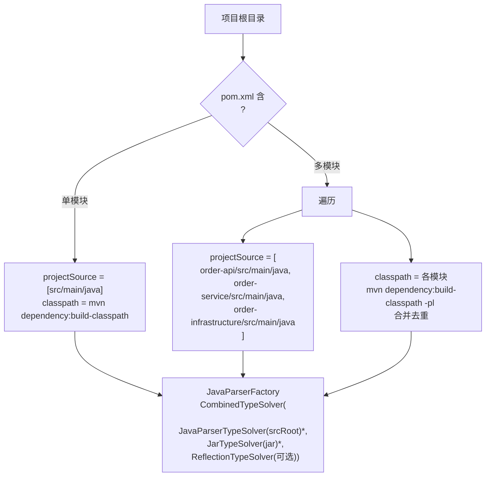
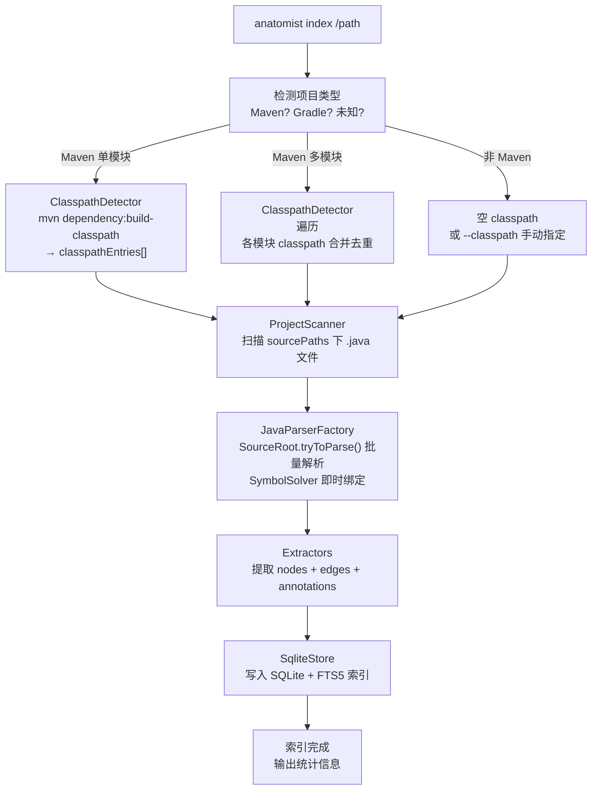
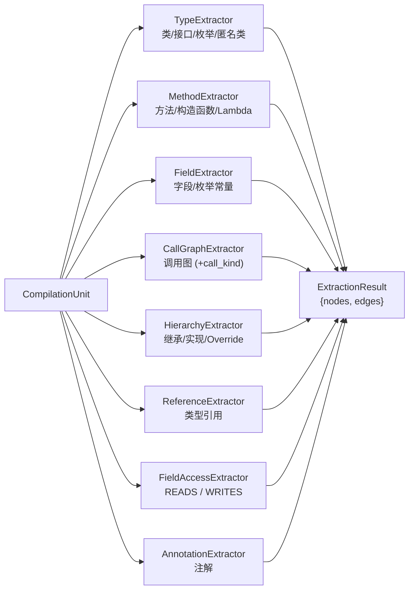
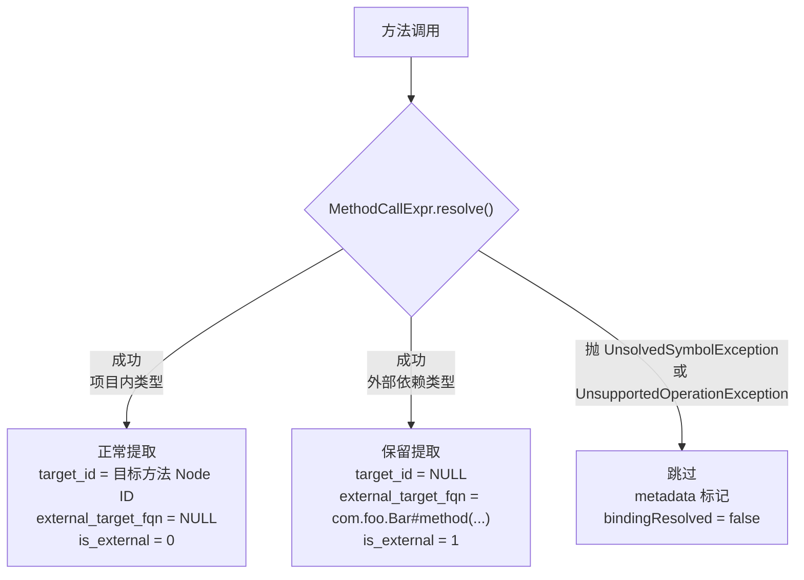
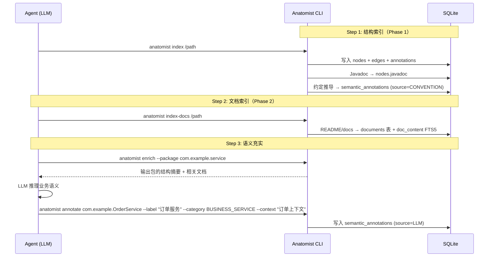

# 场景 1：索引

## 场景描述

将一个 Java 项目的源码通过 **JavaParser + SymbolSolver** 解析（外部 jar 通过 `JarTypeSolver` 由 javassist 读取字节码），提取结构化信息（节点、边、注解），持久化到 SQLite 索引库。

**核心原则**：解析器（JavaParser + SymbolSolver）只在 index 阶段参与，查询阶段完全走 SQLite。

## 详细子场景

| # | 子场景 | 命令 |
|---|--------|------|
| 1.1 | 首次索引项目 | `anatomist index /path/to/project` |
| 1.2 | 指定 Java 版本 | `anatomist index /path --java-version 8` |
| 1.3 | 排除目录 | `anatomist index /path --exclude "generated,test"` |
| 1.4 | 指定输出路径 | `anatomist index /path --output ./my-index.db` |
| 1.5 | 指定 classpath | `anatomist index /path --classpath "/lib/a.jar:/lib/b.jar"` |
| 1.6 | 指定源码目录 | `anatomist index /path --project-source "api/src/main/java:service/src/main/java"` |
| 1.7 | 无 classpath 索引 | `anatomist index /path --no-classpath` |

## 关键设计决策

| 决策 | 结论 | 原因 |
|------|------|------|
| 默认 Java 版本 | 自动检测 pom.xml，兜底 Java 8 | `<maven.compiler.source>` > `<java.version>` > 默认 8 |
| `--java-version` | 覆盖自动检测 | 强制指定 |
| null Binding | 跳过，标记 `bindingResolved: false` | 文本匹配容易误报，精确优先 |
| 外部依赖方法调用 | 保留，标记 `is_external: true`，target 存 FQN 文本 | Agent 需要知道"调了什么外部 API"，即使无法精确链接 |
| 匿名类 / Lambda | 提取 | 匿名类和 Lambda 内部有方法调用和类型引用，不能丢失 |
| Record | 不支持（Java 8 默认） | `--java-version 16+` 时才可能出现 |
| 多模块 Maven | 支持，单 index.db | 跨模块查询是 Agent 最常见场景 |
| 是否需要 mvn compile | **不需要** | `mvn dependency:build-classpath` 自动解析依赖树并下载到 .m2，不需要编译 |
| Maven classpath 获取 | `mvn dependency:build-classpath -DincludeScope=compile` | 一条命令拿到所有 jar 路径，从 .m2 读取 |
| Node ID 冲突 | 字段用 `__` 分隔，方法重载追加参数类型 | 字段/方法同名合法，方法重载常见 |
| 测试源码 | 索引，`scope` 列区分 MAIN/TEST | 测试代码有调用关系价值，可按 scope 过滤 |
| 参数注解 | 提取 | `@RequestBody`、`@PathVariable` 等 Spring 注解很重要 |
| 泛型类型引用 | 深入泛型参数提取 REFERENCES | `List<OrderItem>` 中的 `OrderItem` 是核心依赖 |
| Getter/Setter | 全部索引，metadata 标记 `isAccessor` | 跳过会断调用链；查询时默认隐藏 |
| Visitor 模式 | 独立 VoidVisitorAdapter + 共享 ExtractionContext | 可测试、可扩展，多次遍历性能可忽略 |

## index 的两个核心入参

index 命令的概念模型：

```
anatomist index --project-source <paths> --classpath <paths>
```

| 入参 | 含义 | 传入解析器 | 缺失时 |
|------|------|-----------|--------|
| `projectSource` | 项目源码目录（JavaParser 解析 AST，SymbolSolver 用 `JavaParserTypeSolver` 解析其符号） | 注册为一个或多个 `SourceRoot` + `JavaParserTypeSolver` | 必须提供，否则无从提取 |
| `classpath` | 依赖 jar 路径（只读，用于绑定外部类型） | 每个 jar 注册一个 `JarTypeSolver`（JavaParser 自带，javassist 读 .class） | 外部类型 `resolve()` 抛 `UnsolvedSymbolException`，节点被跳过 |

**关键区别**：`projectSource` 里的代码被完整解析提取为 nodes/edges；`classpath` 里的 jar 只用于类型/方法签名查找，不产生节点。

## 为什么需要 Classpath？

JavaParser 的解析分两个层次：

| 层次 | 有 classpath | 无 classpath |
|------|-------------|-------------|
| **AST 语法树** | 完整 | 完整（不需要 classpath） |
| **项目内部符号绑定** | 完整 | 完整（`JavaParserTypeSolver` 覆盖项目内所有源码） |
| **外部依赖符号绑定** | 完整（`JarTypeSolver` 读 jar 字节码） | **失败**（`@Service` 的 resolve 抛 `UnsolvedSymbolException`，`orderRepo.findById()` 同上） |

**结论**：没有 classpath 也能索引，只是外部类型的符号全部 unresolved。classpath 让 SymbolSolver 能识别外部依赖的类型信息，提取更完整的调用图和注解。

### Classpath 能力对比

| 场景 | 无 classpath | 有 classpath (mvn dependency:build-classpath) |
|------|------------|------------------------------|
| B4 按注解查找 | `@Service` 存为简名，无法区分框架 | 存 `org.springframework.stereotype.Service`，精确查询 |
| D1 调用图 | 只能看到项目内调用 | Spring Data JPA 的 `repository.findById()` 等外部调用也能追踪 |
| C4 依赖分析 | 只能看到项目内类型引用 | 完整的依赖关系，包括第三方库类型 |
| E1 领域模型 | `@Entity` 注解 unresolved | 精确识别 JPA 实体 |
| E2 限界上下文 | `@RestController`/`@Service` 注解 unresolved | 精确识别 Spring 分层 |

## Maven Classpath 获取

### 为什么不需要 mvn compile

`mvn dependency:build-classpath` 只解析依赖树输出 jar 路径列表，**不需要项目源码编译**。Maven 会自动从 .m2 下载缺失的依赖。

```bash
# 一条命令，自动解析依赖树，输出所有 jar 路径
mvn dependency:build-classpath -DincludeScope=compile
```

输出（Mac/Linux 用 `:` 分隔，Windows 用 `;`）：
```
/Users/x/.m2/repository/org/springframework/spring-core/6.0.0/spring-core-6.0.0.jar:/Users/x/.m2/repository/org/springframework/spring-beans/6.0.0/spring-beans-6.0.0.jar:...
```

按 `File.pathSeparator` 拆分即为 jar 路径数组，分别注册为 `JarTypeSolver`。

| 步骤 | 作用 | 是否必须 |
|------|------|---------|
| `mvn dependency:resolve` | 把依赖 jar 下载到 .m2 | `dependency:build-classpath` 内部自动做 |
| `mvn dependency:build-classpath` | 解析依赖树，输出 jar 路径 | **唯一需要的命令** |
| `mvn compile` | 编译源码到 target/classes | **不需要** |

### 多模块 Maven 项目

#### 典型结构

```
order-platform/               ← root (parent POM)
├── pom.xml                   ← 声明 <modules>
├── order-api/                ← module 1
│   ├── pom.xml
│   └── src/main/java/com/example/api/
├── order-service/            ← module 2, 依赖 order-api
│   ├── pom.xml
│   └── src/main/java/com/example/service/
└── order-infrastructure/     ← module 3, 依赖 order-service
    ├── pom.xml
    └── src/main/java/com/example/infra/
```

#### 跨模块 Binding 的核心问题

`order-service` 里的 `OrderService` 引用了 `order-api` 里的 `OrderRequest`。SymbolSolver 要解析这个符号，有两种方式：

| 方式 | 原理 | 效果 |
|------|------|------|
| sourcePaths 包含所有模块源码（各模块一个 `JavaParserTypeSolver`） | 从源码直接解析 | **最佳**：跨模块绑定完整，还能提取跨模块 CALLS/REFERENCES 边 |
| classpath 包含 target/classes（`JarTypeSolver`） | 从编译后的 class 查找 | **次优**：能解析类型，但无法链接到源码节点 |

**结论**：把所有模块源码都注册成独立的 `JavaParserTypeSolver` 加入 `CombinedTypeSolver`，一次性解析跨模块引用。不需要 `mvn compile`。

#### 多模块参数组装



**classpath 合并去重**：多模块各跑一次 `mvn dependency:build-classpath -pl <module>`，合并去重。模块间共享大量依赖（如 Spring Boot），不去重会传入大量重复 jar。

#### SQLite 存储：单 index.db

多模块项目**一个 index.db**，不做拆分。原因：

- Agent 问"创建订单流程"，答案跨越 api + service + infra 三个模块
- 单库查询比跨库 JOIN 简单得多
- nodes 表加 `module` 字段区分来源模块

```sql
-- nodes 表增加 module 列
CREATE TABLE nodes (
    id TEXT PRIMARY KEY,
    label TEXT,
    kind TEXT,
    qualified_name TEXT,
    source_file TEXT,
    source_location TEXT,
    module TEXT,  -- 所属模块名，如 "order-service"；单模块项目为 null
    metadata TEXT
);
```

#### 多模块完整流程

```
anatomist index /path/to/order-platform

1. 检测 pom.xml → 发现 <modules>
2. 遍历子模块:
   - projectSource += order-api/src/main/java
   - projectSource += order-service/src/main/java
   - projectSource += order-infrastructure/src/main/java
3. 各模块 classpath:
   - mvn dependency:build-classpath -pl order-api
   - mvn dependency:build-classpath -pl order-service
   - mvn dependency:build-classpath -pl order-infrastructure
   → 合并去重 → classpathEntries
4. JavaParserFactory:
   CombinedTypeSolver ts = new CombinedTypeSolver();
   ts.add(new JavaParserTypeSolver(order-api/src/main/java));
   ts.add(new JavaParserTypeSolver(order-service/src/main/java));
   ts.add(new JavaParserTypeSolver(order-infrastructure/src/main/java));
   for (jar in classpathEntries) ts.add(new JarTypeSolver(jar));
   ParserConfiguration cfg = new ParserConfiguration()
       .setSymbolResolver(new JavaSymbolSolver(ts))
       .setLanguageLevel(detectedLevel);
   for (srcRoot : projectSource) new SourceRoot(srcRoot, cfg).tryToParse();
5. 跨模块符号自然 resolve:
   order-service 的 OrderService → order-api 的 OrderRequest ✓
```

## 技术方案

### 整体流程



### 关键组件

#### ClasspathDetector

自动检测 Maven 项目并解析依赖 classpath。

**Maven classpath 获取**：

| 方式 | 命令 | 适用 |
|------|------|------|
| 单次聚合（首选） | `mvn -pl :module1,:module2,... dependency:build-classpath -Dmdep.outputFile=cp.txt -Dmdep.regenerateFile=true` | 一次 Maven 会话内聚合所有模块，比逐模块快数倍 |
| 单模块 | `mvn dependency:build-classpath -DincludeScope=compile` | 单模块项目 |
| 逐模块降级 | `mvn dependency:build-classpath -pl <module>` | 单次聚合失败时回退 |

**降级策略**（优先级从高到低）：

1. 单次聚合调用 `mvn -pl ... dependency:build-classpath`（最快，monorepo 必备）
2. 逐模块调用 `mvn dependency:build-classpath -pl <m>`，合并去重（兼容性好，但慢）
3. 空 classpath 降级（Binding 无法解析外部依赖类型，项目内 Binding 仍完整）

**进度输出**：解析多模块时持续输出 `[2/20] resolving classpath for order-service...`，避免用户以为程序卡死。

**传给 SymbolSolver**：
```java
CombinedTypeSolver ts = new CombinedTypeSolver();
ts.add(new ReflectionTypeSolver());                  // 仅当目标版本与 JVM 兼容时打开（见下文风险）
for (Path src : sourcePaths) ts.add(new JavaParserTypeSolver(src));
for (Path jar : classpathEntries) ts.add(new JarTypeSolver(jar));   // javassist 读 jar 字节码
```

#### ProjectScanner

递归扫描项目目录，收集所有 `.java` 文件。

- 默认跳过目录：`target/`、`build/`、`.gradle/`、`.git/`、`.idea/`、`node_modules/`
- `--exclude` 参数：按目录名匹配，逗号分隔（如 `"generated,test"`）
- 使用 `Files.walk()` 不跟符号链接，避免重复
- 返回 `List<Path>` 源文件列表

#### JavaParserFactory

核心解析引擎，使用 `JavaParser` + `JavaSymbolSolver`（基于 `CombinedTypeSolver`）批量解析 + 即时符号绑定。

```java
// 1) 组装 TypeSolver
CombinedTypeSolver typeSolver = new CombinedTypeSolver();
// 项目内源码：每个源码根（多模块时多个）一个 JavaParserTypeSolver
for (Path src : sourcePaths) {
    typeSolver.add(new JavaParserTypeSolver(src));
}
// 外部 jar：每个 jar 一个自实现的 JarTypeSolver（不依赖 javassist）
for (Path jar : classpathEntries) {
    typeSolver.add(new JarTypeSolver(jar));
}
// 兼容时附加 ReflectionTypeSolver（识别 JDK 内置类型 java.lang.*）
if (isRunningVMCompatibleWith(targetJavaVersion)) {
    typeSolver.add(new ReflectionTypeSolver(/*jreOnly*/ true));
}

// 2) ParserConfiguration：语言级别 + Symbol Resolver
ParserConfiguration cfg = new ParserConfiguration()
    .setLanguageLevel(toLanguageLevel(targetJavaVersion))   // JAVA_8 / 11 / 17 / 21
    .setSymbolResolver(new JavaSymbolSolver(typeSolver));

// 3) 批量解析：每个源码根用一个 SourceRoot
List<CompilationUnit> units = new ArrayList<>();
for (Path src : sourcePaths) {
    SourceRoot root = new SourceRoot(src, cfg);
    for (ParseResult<CompilationUnit> pr : root.tryToParse()) {
        pr.getResult().ifPresent(units::add);
        pr.getProblems().forEach(p -> log.warn("parse problem: {}", p));
    }
}
```

**`ReflectionTypeSolver` 风险说明**（运行时 JDK 版本高于目标项目时的"假阳性 API"问题）：
- anatomist 自身通常运行在较高版本 JDK（如 21），目标项目可能是 Java 8。
- 打开 `ReflectionTypeSolver` 会把当前 JVM 的 JDK 类暴露给符号解析，导致解析时识别出目标项目中并不存在的 API（如 `String.strip()`、`List.of()`），引入"假阳性" Binding。
- 兼容性判断：当 `targetJavaVersion <= runningVMVersion - 4` 时关闭(经验值)；用户也可用 `--vm-classpath false` 强制关闭，或通过 `--classpath` 显式提供目标版本的 `rt.jar` / `jrt-fs` 抽出的 jar，由 `JarTypeSolver` 接管。
- MVP 行为：默认关闭，文档与 README 显著提示；用户在意精度时显式打开。

**`--java-version` 映射表**：

| 参数值 | LanguageLevel |
|--------|--------------|
| `8` (默认) | `JAVA_8` |
| `11` | `JAVA_11` |
| `17` | `JAVA_17` |
| `21` | `JAVA_21` |

**为什么用 `SourceRoot.tryToParse()` 而不是逐文件 `StaticJavaParser.parse()`**：
- `SourceRoot` 内部维持一个 `JavaParser` 实例，所有解析共享同一 `SymbolResolver`，`CombinedTypeSolver` 的缓存命中率最大化
- `tryToParse()` 不抛异常，每个文件独立返回 `ParseResult`（含语法错误信息），单文件失败不影响整体
- `SourceRoot` 默认按目录递归扫描，与 `ProjectScanner` 配合时只要把每个源码根传入即可，不需要手动构造 `unitName`

#### Extractors

每个 Extractor 接收一个 `CompilationUnit`，提取特定类型的节点和边。



**提取顺序**：
1. TypeExtractor — 先提取所有类型节点（后续 Extractor 需要类型 ID）
2. MethodExtractor + FieldExtractor — 提取方法和字段（生成 CONTAINS 边）
3. CallGraphExtractor — 提取调用关系（生成 CALLS 边，标注 call_kind）
4. HierarchyExtractor — 提取继承/实现（生成 INHERITS/IMPLEMENTS/OVERRIDES 边）
5. ReferenceExtractor — 提取类型引用（生成 REFERENCES 边，含字段类型、参数类型、返回类型）
6. FieldAccessExtractor — 提取字段读/写访问（生成 READS / WRITES 边）
7. AnnotationExtractor — 提取注解（写入 annotations 表）

##### TypeExtractor

| 提取对象 | JavaParser AST 节点 | Node kind | ID 生成规则 |
|---------|---------|-----------|------------|
| 类（含内部类、静态内部类） | `ClassOrInterfaceDeclaration.isInterface() == false` | `CLASS` | FQN 原样（保留大小写）：`com.example.OrderService` |
| 接口 | `ClassOrInterfaceDeclaration.isInterface() == true` | `INTERFACE` | 同上 |
| 枚举 | `EnumDeclaration` | `ENUM` | 同上 |
| 匿名类 | `ObjectCreationExpr` 含 `getAnonymousClassBody().isPresent()` | `ANONYMOUS_CLASS` | 父方法 ID + `$anon@L<line>`：`com.example.OrderService#checkout(...)$anon@L42` |
| Record (Java 16+) | `RecordDeclaration` | `RECORD` | 同类规则 |

**匿名类的处理**：
- 匿名类没有名字，用父方法 ID + **源码起始行号**生成稳定 ID（增量更新仅在该位置真的变动时才失效）
- 匿名类内部可能有字段和方法，需要递归提取
- 匿名类有 CONTAINS 边指向其父方法

##### MethodExtractor

| 提取对象 | JavaParser AST 节点 | 说明 |
|---------|---------|------|
| 普通方法 | `MethodDeclaration` | kind = `METHOD` |
| 构造函数 | `ConstructorDeclaration` | kind = `METHOD`，metadata 标记 `isConstructor: true` |
| 抽象方法 | `MethodDeclaration.isAbstract()` | metadata 标记 `isAbstract: true` |
| Lambda 表达式 | `LambdaExpr` | kind = `LAMBDA`，ID = 父方法 ID + `$lambda@L<line>C<col>`（基于源码位置，增量稳定） |
| 方法引用 | `MethodReferenceExpr` | kind = `METHOD_REF`，指向目标方法 |

**Lambda 的处理**：
- Lambda 是匿名方法，需要提取其内部的方法调用和类型引用
- Lambda 的参数类型、返回类型需要提取 REFERENCES 边
- Lambda 内部可能有嵌套 Lambda，序号递增

```java
// Lambda 提取示例
list.stream()
    .filter(item -> item.isValid())       // lambda1: CALLS item.isValid()
    .map(item -> item.getPrice())         // lambda2: CALLS item.getPrice()
    .collect(Collectors.toList());        // lambda2: CALLS Collectors.toList()
```

提取结果：
```
Node: com.example.OrderService#checkout(...)$lambda@L7C18    kind=LAMBDA
Node: com.example.OrderService#checkout(...)$lambda@L8C13    kind=LAMBDA
Edge: com.example.OrderService#checkout(...)$lambda@L7C18 → com.example.Item#isValid()           CALLS  call_kind=INSTANCE
Edge: com.example.OrderService#checkout(...)$lambda@L8C13 → com.example.Item#getPrice()          CALLS  call_kind=INSTANCE
Edge: com.example.OrderService#checkout(...)$lambda@L8C13 → external_target_fqn=java.util.stream.Collectors#toList()  CALLS  is_external=1  call_kind=STATIC
```

##### FieldExtractor

| 提取对象 | JavaParser AST 节点 | kind |
|---------|---------|------|
| 实例字段 | `FieldDeclaration` | `FIELD` |
| 静态字段 | `FieldDeclaration.isStatic()` | `FIELD`，metadata 标记 `isStatic: true` |
| 枚举常量 | `EnumConstantDeclaration` | `ENUM_CONSTANT` |

##### CallGraphExtractor（最复杂）

| 提取对象 | JavaParser / SymbolSolver API | call_kind | 说明 |
|---------|---------|-----------|------|
| 实例方法调用 | `MethodCallExpr.resolve()` → `ResolvedMethodDeclaration` | `INSTANCE` | 主要来源 |
| 静态方法调用 | `MethodCallExpr.resolve().isStatic()` | `STATIC` | `Math.abs()` |
| 构造函数调用 | `ObjectCreationExpr.resolve()` → `ResolvedConstructorDeclaration` | `CONSTRUCTOR` | `new Order()`；E1 领域模型识别需要单查 |
| 接口方法调用 | `ResolvedMethodDeclaration.declaringType().isInterface()` | `INTERFACE` | `Repository.findById()`；多态分析需要 |
| Super 调用 | `MethodCallExpr` 的 scope 是 `SuperExpr` | `SUPER` | `super.method()` |
| 链式调用 | 多个 `MethodCallExpr` | 按各自类别 | `a.b().c()` → 两条 CALLS 边 |
| Lambda 内调用 | `LambdaExpr` body 中的 `MethodCallExpr` | 按各自类别 | 递归进入 Lambda body；source_id 是 Lambda 节点本身 |

**`call_kind` 列的查询价值**：
- **多态分析**：`WHERE call_kind = 'INTERFACE'` 找运行时可能是子类实现的调用
- **领域模型识别（E1）**：`WHERE call_kind = 'CONSTRUCTOR'` 找出谁构造了哪些实体
- **静态工具调用**：`WHERE call_kind = 'STATIC'` 区分纯函数调用与实例行为

**Lambda 在调用链遍历中的处理**：
Lambda 节点是真实节点（有 ID、有 CALLS 边出去），但 `callees-of OrderService.checkout` 用户期望看到 stream 内的 `item.isValid()`，而不是中间一个 `$lambda@L7C18` 节点。GraphTraversal 在递归 CTE 遍历 CALLS 时，遇到 LAMBDA 节点透明跨越，把 Lambda 的 callees 折算为父方法的 callees。

**符号解析三种情况的处理**：



**判断项目内 vs 外部依赖**：

```java
try {
    ResolvedMethodDeclaration m = invocation.resolve();
    ResolvedReferenceTypeDeclaration declaringType =
        m.declaringType().asReferenceType();

    // 解析此类型的 TypeSolver 来源决定 internal/external
    // - JavaParserTypeSolver 命中 → 项目内
    // - JarTypeSolver / ReflectionTypeSolver 命中 → 外部
    boolean isExternal = !context.isResolvedBySource(declaringType);
} catch (UnsolvedSymbolException | UnsupportedOperationException e) {
    context.incrementUnresolved();
    return; // 跳过，不生成边
}
```

> `ExtractionContext.isResolvedBySource()` 的实现：`JavaParserTypeSolver` 在解析符号时会返回 `JavaParserClassDeclaration` 等"基于源码"的实现类，可通过 `instanceof` 判定；`JarTypeSolver` 返回自定义的 `JavassistClassDeclaration`。判定细节见 [core/JarTypeSolver.java](../src/main/java/com/anatomist/core/JarTypeSolver.java)。

**外部依赖方法调用的数据结构**：
- `target_id`: NULL（外部方法不在 nodes 表中）
- `external_target_fqn`: 存 FQN（如 `java.util.List#add(java.lang.Object)`）
- `is_external`: 1
- 不在 nodes 表创建 ghost 节点，避免污染查询结果

##### HierarchyExtractor

| 提取对象 | JavaParser / SymbolSolver API | Edge relation |
|---------|---------|--------------|
| extends 类 | `ResolvedReferenceTypeDeclaration.getSuperClass()` | `INHERITS` |
| implements 接口 | `ResolvedReferenceTypeDeclaration.getInterfaces()` | `IMPLEMENTS` |
| 接口 extends 接口 | 同上（对 interface 而言 `getInterfaces()` 即父接口） | `INHERITS` |
| 方法 Override | 遍历 `getAllAncestors()` 中每个类型的方法，用 `MethodResolutionLogic.isApplicable(...)` 比对签名 | `OVERRIDES` |

**OVERRIDES 检测**：JavaParser/SymbolSolver 没有"`bindings.overrides(other)`"的直接 API。做法：

1. 取当前 `MethodDeclaration` 解析出的 `ResolvedMethodDeclaration` 的擦除签名（名 + 参数擦除类型列表）
2. 沿 `getAllAncestors()` 拿到所有父类/接口的 `ResolvedReferenceType`
3. 对每个父类型 `getAllMethods()`，凡同签名（同名 + 同擦除参数列表）即 OVERRIDES
4. 跳过 `private` 与 `static` 方法（不参与覆盖）

##### ReferenceExtractor

| 提取对象 | JavaParser / SymbolSolver API | context 值 |
|---------|---------|-----------|
| 字段类型 | `FieldDeclaration.getElementType().resolve()` | `field_type` |
| 方法参数类型 | `Parameter.getType().resolve()` | `parameter_type` |
| 返回类型 | `MethodDeclaration.getType().resolve()` | `return_type` |
| 类型参数 | `TypeParameter` | `generic_arg` |
| 泛型参数类型 | `ClassOrInterfaceType.getTypeArguments()` → 逐个 `.resolve()` | `generic_arg` |
| Lambda 参数类型 | `LambdaExpr.getParameters()` → 推断或显式类型 `.resolve()` | `parameter_type` |

**泛型类型引用深入提取**：
```java
private List<OrderItem> items;
private Map<String, Order> orderCache;
```

提取结果：
```
REFERENCES: com.example.OrderService#items     → external_target_fqn=java.util.List   context=field_type    is_external=1
REFERENCES: com.example.OrderService#items     → com.example.OrderItem                context=generic_arg   is_external=0
REFERENCES: com.example.OrderService#orderCache → external_target_fqn=java.util.Map     context=field_type    is_external=1
REFERENCES: com.example.OrderService#orderCache → external_target_fqn=java.lang.String  context=generic_arg   is_external=1
REFERENCES: com.example.OrderService#orderCache → com.example.Order                    context=generic_arg   is_external=0
```

**为什么泛型参数很重要**：`deps-of OrderService` 必须能看到 `OrderItem` 和 `Order`，它们藏在 `List<OrderItem>` 和 `Map<String, Order>` 的泛型参数中。

**去重策略**：同一方法中参数类型和返回类型引用同一个类时，生成**多条 REFERENCES 边**，因为 context 不同（`return_type` vs `parameter_type`），查询时需要区分。

**符号解析失败的处理**：`resolve()` 抛 `UnsolvedSymbolException` / `UnsupportedOperationException` 时跳过该引用并 `context.incrementUnresolved()`，与 CallGraphExtractor 同策略。

##### FieldAccessExtractor

为支持 F1 影响分析中"谁修改了 `order.status`"这类字段级问题，单独提取字段访问。

| 提取对象 | JavaParser / SymbolSolver API | relation |
|---------|---------|----------|
| 字段读取 | `NameExpr` / `FieldAccessExpr` → `resolve()` 为 `ResolvedFieldDeclaration`，且节点不在 `AssignExpr.getTarget()` / `UnaryExpr` (`++` / `--`) 中 | `READS` |
| 字段写入 | 字段名出现在 `AssignExpr.getTarget()` 或 `UnaryExpr` (`++`/`--`) | `WRITES` |
| 复合赋值 `+=` | `AssignExpr.getOperator()` 非纯 `=` 时，左侧字段同时产生 `WRITES` 与 `READS` | 生成一条 `WRITES` + 一条 `READS` |

**边数据**：
- `source_id`: 包含该访问的方法节点 ID（Lambda 内访问则归到 Lambda 节点，遍历时按 LAMBDA 跨越规则折算）
- `target_id`: 字段节点 ID（项目内）或 NULL
- `external_target_fqn`: 外部库字段时填充（罕见）
- `relation`: `READS` 或 `WRITES`

**示例**：

```java
public void updateStatus(Order order, String newStatus) {
    String old = order.status;        // READS Order#status
    order.status = newStatus;          // WRITES Order#status
    this.lastUpdate = System.currentTimeMillis();  // WRITES this.lastUpdate
}
```

提取结果：
```
READS:  com.example.OrderService#updateStatus(...) → com.example.Order#status
WRITES: com.example.OrderService#updateStatus(...) → com.example.Order#status
WRITES: com.example.OrderService#updateStatus(...) → com.example.OrderService#lastUpdate
```

**不提取的**：
- 局部变量读写（`String old`）：与跨方法分析无关
- 方法参数访问：参数不是字段
- getter/setter 间接访问（如 `order.getStatus()`）：仍记为 CALLS，不算 READS——避免双重计数

##### AnnotationExtractor

| 提取对象 | JavaParser / SymbolSolver API | 说明 |
|---------|---------|------|
| 类注解 | `ClassOrInterfaceDeclaration.getAnnotations()` | — |
| 方法注解 | `MethodDeclaration.getAnnotations()` | — |
| 字段注解 | `FieldDeclaration.getAnnotations()` | — |
| 参数注解 | `Parameter.getAnnotations()` | `@RequestBody`、`@Valid`、`@PathVariable` 等 |
| 注解 FQN | `AnnotationExpr.resolve().getQualifiedName()` | 必须存 FQN |
| 注解属性 | `NormalAnnotationExpr.getPairs()` / `SingleMemberAnnotationExpr.getMemberValue()` | `@RequestMapping("/api/orders")` → `{"value": "/api/orders"}` |

**注解全限定名的重要性**：`@Service` 在代码中是简写，但 SQLite 中必须存 `org.springframework.stereotype.Service`，否则 B4 场景（"所有 @RestController"）无法精确查询。

##### Spring XML 装配（可选，`--spring-xml`，默认关）

Spring 的 XML 装配（`<bean class="..."/>`、`property`/`constructor-arg` 的 `ref`）是
**仅存在于 XML 的运行时依赖**——不开此功能时完全不进图谱，"谁注入谁"在 `deps-of`/`used-by`
里看不到。`--spring-xml` 让 index 额外解析这些配置。

XML **不参与 SymbolSolver**（只有 FQN 字符串），因此它不是一个 `Extractor`（拿不到
`CompilationUnit`），而是在 Java 抽取**之后**跑的独立 pass：

- `ProjectScanner.scanSpringXml` 走查 `.xml`，按根元素 `<beans>` 嗅探出 Spring 配置（忽略
  `pom.xml`/`logback.xml` 等）。
- `SpringBeanParser`（纯 SAX，native 安全）把每个 `<bean>` 解析为 `ParsedBean(name,
  className, line, refs)`。
- `XmlBeanExtractor` 拿到 `knownIds`（本批次 result 节点 id ∪ `store.allNodeIds()`，覆盖
  Java 节点已在库中的增量场景），用**字符串相等**判定内部/外部：

| 产出 | 说明 |
|------|------|
| `BEAN` 节点 | 一个 `<bean>` 一个，`metadata` 记录 `{className, refs[]}` |
| `DEFINED_BY` 边 | `BEAN` → 它的 class 节点；class 已索引则 internal，否则 external |
| `WIRES` 边 | **CLASS→CLASS**：owner bean 的 class → ref bean 的 class。建模为类间边即可
  **零改动**地融入现有 `deps-of`/`used-by` 的 CTE（`relation IN ('CALLS','REFERENCES','WIRES')`） |

`WIRES` 仅在 owner class 是已知内部节点时发（`source_id` 必须指向存在的节点）；ref class 已知→internal，
未知（第三方 bean）→external。

> **增量/watch**：bean ref 可能跨 XML 文件，为保证 bean 图自洽，只要 reparse/delete 闭包触及任一
> spring-xml（直接改、新增、删除，或经 `file_dependencies` 被引用的 Java 类改动 realign 拉入），就
> **整体重建** bean 子图：删除全部 `BEAN` 节点与 `WIRES` 边（`WIRES` 源在 CLASS 节点上、不随 `BEAN`
> 删除级联，故显式删），在 Java 重写后对磁盘上**全部** spring-xml 重跑 XML pass。beans 数量小，整体重跑
> 廉价且鲁棒。`deriveFileDependencies` 因 `BEAN.source_file` 是 xml、边指向 java 节点，会自动产出
> `foo.xml → Bar.java` 依赖，改 `Bar.java` 即经现有 realign 闭包把 xml 拉回。

## 数据模型

### nodes 表

| 列 | 类型 | 说明 | 追溯场景 |
|----|------|------|---------|
| `id` | TEXT PK | FQN 形式，保留大小写（含方法签名） | B3 精确查找 |
| `label` | TEXT | 简名 | FTS5 搜索 |
| `kind` | TEXT | CLASS/METHOD/FIELD/INTERFACE/ENUM/ENUM_CONSTANT/ANONYMOUS_CLASS/LAMBDA/METHOD_REF/BEAN | B2 按类型筛选 |
| `qualified_name` | TEXT | 人类可读 FQN（方法不带签名） | B3 精确定位 |
| `package` | TEXT | 所属包，从 `PackageDeclaration` 直接提取 | E2 / package-deps |
| `source_file` | TEXT | 相对路径 | 按文件查询 |
| `source_location` | TEXT | `L42` | 定位代码行 |
| `module` | TEXT | 所属模块名（多模块项目），单模块为 null | INDEX | 按模块筛选 |
| `scope` | TEXT | `MAIN` 或 `TEST` | INDEX | 按源码范围过滤 |
| `metadata` | TEXT | JSON 扩展字段 | — | C3 方法签名 |

**Node ID 生成规则**：ID **保留原始大小写**，以 FQN 为基底，只引入有限的语法分隔符（`#` 分隔类与成员，`()` 包装方法签名，`$anon@Lxx` / `$lambda@LxxCxx` 标注合成符号）。

| Kind | 规则 | 示例 |
|------|------|------|
| CLASS/INTERFACE/ENUM | FQN 原样 | `com.example.OrderService` |
| METHOD | 类FQN + `#` + 方法名 + `(擦除签名)` | `com.example.OrderService#checkout(java.lang.String,java.util.List)` |
| FIELD | 类FQN + `#` + 字段名（无括号即字段） | `com.example.OrderService#orderRepo` |
| ENUM_CONSTANT | 枚举FQN + `#` + 常量名 | `com.example.OrderStatus#PENDING` |
| ANONYMOUS_CLASS | 父方法ID + `$anon@L<line>` | `com.example.OrderService#checkout(...)$anon@L42` |
| LAMBDA | 父方法ID + `$lambda@L<line>C<col>` | `com.example.OrderService#checkout(...)$lambda@L42C18` |
| BEAN | `bean:<beanName>@<相对XML路径>`（无 `#`/`$` 后缀，避开合成符号命名空间） | `bean:orderService@service/src/main/resources/applicationContext.xml` |

**关键决策**：

- **保留大小写**：`com.example.Order`（类）与 `com.example.order`（子包）是不同实体，小写化会冲突；类成员与子包同名也会撞 ID。
- **方法用完整擦除签名**：重载消歧的权威方式；直接派生自 `ResolvedMethodDeclaration` 的 `getParam(i).getType().erasure().describe()`（输出 `java.lang.String` / `java.util.List` 等擦除 FQN），不再人工把 `List<OrderItem>` 标准化为 `list`（会丢泛型导致 `process(List<A>)` 与 `process(List<B>)` 撞 ID）。
- **字段/方法用 `#` 而非 `__`**：`#` 是 Javadoc 引用惯例；字段无括号、方法有括号，语法即可区分。
- **Lambda/匿名类用源码位置**：早期序号方案（`_anon1`/`_lambda1`）在文件新增一个 Lambda 后所有后续序号全部位移，导致增量更新破坏外部所有引用；改为 `@L42C18` 后位置稳定，IDE 跳转友好。
- **冲突解决**：方法重载依靠完整签名天然区分；同源同位置不可能两个 Lambda，位置即唯一。

**metadata JSON 结构**：

```jsonc
// kind = CLASS
{
  "isAbstract": false,
  "isInterface": false,
  "typeParameters": ["<T>"],
  "superClass": "BaseService<Order>",
  "interfaces": ["Serializable"]
}

// kind = METHOD
{
  "returnType": "OrderResult",
  "parameters": [
    {"name": "orderId", "type": "String"},
    {"name": "items", "type": "List<OrderItem>"}
  ],
  "isStatic": false,
  "isAbstract": false,
  "isConstructor": false,
  "isAccessor": false,
  "modifiers": ["public"],
  "signature": "checkout(String orderId, List<OrderItem> items)"
}

// kind = LAMBDA
{
  "parameters": [{"name": "item", "type": "OrderItem"}],
  "returnType": "boolean",
  "signature": "lambda1(OrderItem item) -> boolean"
}

// kind = ANONYMOUS_CLASS
{
  "baseType": "Runnable",
  "methods": ["run"]
}

// kind = FIELD
{
  "type": "OrderRepository",
  "isStatic": false,
  "isFinal": false
}

// kind = ENUM
{
  "constants": ["PENDING", "CONFIRMED", "SHIPPED"]
}
```

### edges 表

| 列 | 类型 | 说明 | 追溯场景 |
|----|------|------|---------|
| `id` | INTEGER PK | 自增 | — |
| `source_id` | TEXT FK→nodes.id | 调用方/子类/包含方 | D1/D2/C4 |
| `target_id` | TEXT FK→nodes.id | 被调用方/父类/被包含方；**仅项目内**，外部依赖时为 NULL | D1/D2/C5 |
| `external_target_fqn` | TEXT | 外部依赖时填写 FQN（含方法签名），项目内为 NULL | 显示外部方法 |
| `relation` | TEXT | CALLS/CONTAINS/INHERITS/IMPLEMENTS/OVERRIDES/REFERENCES/READS/WRITES/DEFINED_BY/WIRES | 按关系筛选 |
| `call_kind` | TEXT | 仅 CALLS 边：INSTANCE/STATIC/CONSTRUCTOR/SUPER/INTERFACE；其他为 NULL | 多态、构造调用筛选 |
| `confidence` | TEXT | EXTRACTED | 符号解析成功均为 EXTRACTED |
| `context` | TEXT | REFERENCES: `field_type`/`parameter_type`/`return_type`/`generic_arg`；CALLS: 空 | C4 区分引用类型 |
| `is_external` | INTEGER | 0 = 项目内（target_id 有效），1 = 外部依赖（external_target_fqn 有效） | 过滤外部调用 |
| `source_file` | TEXT | 边所在文件 | — |
| `source_location` | TEXT | 边所在行 | — |
| `metadata` | TEXT | JSON 扩展 | bindingResolved 等 |

> **target 拆分原因**：原方案让 `target_id` 同时存内部 Node ID 和外部 FQN 文本（通过 `is_external` 区分），但二者命名空间相同，查询时一旦忘记 `AND is_external = 0` 就可能撞名。拆为强类型的 `target_id`（FK）和 `external_target_fqn` 后，schema 自身保证查询正确性。

**外部依赖边示例**：

```sql
-- 项目内调用
INSERT INTO edges (source_id, target_id, external_target_fqn, relation, call_kind, is_external)
VALUES ('com.example.OrderService#checkout(...)', 'com.example.OrderRepository#findById(java.lang.String)', NULL, 'CALLS', 'INSTANCE', 0);

-- 外部依赖调用
INSERT INTO edges (source_id, target_id, external_target_fqn, relation, call_kind, is_external)
VALUES ('com.example.OrderService#checkout(...)', NULL, 'java.util.List#add(java.lang.Object)', 'CALLS', 'INTERFACE', 1);
```

### annotations 表

| 列 | 类型 | 说明 | 追溯场景 |
|----|------|------|---------|
| `id` | INTEGER PK | 自增 | — |
| `node_id` | TEXT FK | 被标注的节点 | B4 反查节点 |
| `annotation_fqn` | TEXT | `org.springframework.stereotype.Service` | **B4**: 按注解名查询 |
| `attributes` | TEXT | JSON `{"value": "/api/orders"}` | E2: Spring 路由分析 |

### node_names 表 — FTS5 虚拟表

```sql
CREATE VIRTUAL TABLE node_names USING fts5(
    node_id,
    qualified_name,
    label,
    description,
    content='nodes',
    content_rowid='rowid'
);
```

## CLI 设计

```bash
# 基本用法（自动检测 Maven，默认 Java 8）
anatomist index /path/to/project

# 指定 Java 版本
anatomist index /path/to/project --java-version 11

# 排除目录
anatomist index /path/to/project --exclude "generated,test"

# 指定输出路径（默认 .anatomist/index.db）
anatomist index /path/to/project --output ./my-index.db

# 指定 classpath（跳过自动检测）
anatomist index /path/to/project --classpath "/lib/a.jar:/lib/b.jar"

# 指定源码目录（多目录用路径分隔符）
anatomist index /path/to/project --project-source "api/src/main/java:service/src/main/java"

# 无 classpath 索引（纯 AST 解析）
anatomist index /path/to/project --no-classpath

# 额外解析 Spring bean XML（<beans>）→ BEAN 节点 + DEFINED_BY / WIRES 边（默认关）
anatomist index /path/to/project --spring-xml
```

**自动检测 vs 手动指定**：

| 场景 | projectSource | classpath | 说明 |
|------|-------------|-----------|------|
| Maven 单模块 | 自动: `src/main/java` | 自动: `mvn dependency:build-classpath` | 最常见 |
| Maven 多模块 | 自动: 遍历所有子模块 `src/main/java` | 自动: 各模块 classpath 合并去重 | 第二常见 |
| 非 Maven 项目 | 自动: 递归扫描所有 `.java` 文件所在目录 | `--classpath` 手动指定 | 需要用户提供 |
| CI 环境 | `--project-source` 手动指定 | `--classpath` 手动指定 | 跳过检测，速度更快 |

**输出示例**：

```
Indexing /path/to/project...
  Detected: Maven project (3 modules)
  Classpath: 47 jars resolved
  Source paths: order-api/src/main/java, order-service/src/main/java, order-infra/src/main/java
  Source files: 156 .java files
  Parsing with JavaParser (Java 8)...
  Extracting:
    Types:         234 (class: 168, interface: 38, enum: 16, anonymous: 12)
    Methods:       1,847 (method: 1,790, constructor: 42, lambda: 15)
    Fields:        892 (field: 880, enum_constant: 12)
    Call edges:    3,241 (internal: 2,890, external: 351)
    Hierarchy:     312
    References:    1,567
    Annotations:   478
    Unresolved:    23 (bindingResolved=false)
  Writing to SQLite...
  Building FTS5 index...
Done in 4.2s → .anatomist/index.db
```

## 实现要点

1. **null Binding 处理**：`resolveMethodBinding() == null` 时跳过该边，在所在节点的 metadata 中标记 `bindingResolved: false`，统计输出中显示 Unresolved 数量。

2. **外部依赖方法识别**：Binding 非 null 但声明类不在项目源码路径内时，置 `is_external = 1`，`target_id = NULL`，`external_target_fqn` 存原始全限定名（含方法签名）。不在 nodes 表创建 ghost 节点。

3. **匿名类 ID 稳定性**：按在父方法内的出现顺序编号。重新索引时顺序可能变化（如新增匿名类），导致 ID 不稳定。Phase 4 增量更新时需注意。

4. **Lambda 提取**：Lambda 本质是匿名方法，需要递归进入其 body 提取调用和引用。Lambda 可以嵌套 Lambda。

5. **`ParseResult` Problem 处理**：JavaParser 会通过 `ParseResult.getProblems()` 报告语法错误（缺少依赖、语法错误等）。策略：**尽力提取**，单文件解析失败时记录 problem，能拿到 `CompilationUnit` 就尽量提取；对该文件节点 metadata 中标记 `hasProblems: true`。符号解析失败（`UnsolvedSymbolException`）按节点单点跳过，不影响同文件其他节点。

6. **内存管理**：10 万行项目一次完整 `SourceRoot.tryToParse()` + SymbolSolver 缓存约占 300-700MB 内存。Phase 1 不做分批，设置文件数上限 5000，超过提示。

7. **SQLite 写入性能**：批量 INSERT 用事务包裹，预期 2 万条边在单事务中 <100ms 写入完成。

8. **FTS5 索引构建**：在所有 nodes 写入后一次性构建，避免增量维护的复杂度。

9. **索引覆盖**：重复索引同一项目时，先删旧库再建新（覆盖模式）。

10. **多模块 classpath 合并**：优先用 `mvn -pl :m1,:m2,... dependency:build-classpath -Dmdep.outputFile=cp.txt` 单次聚合解析；失败再降级为各模块独立调用并合并去重。多模块共享大量依赖（如 Spring Boot），不去重会传入大量重复 jar。整个过程输出进度（`[k/N]`），避免大 monorepo 让用户误以为卡死。

11. **Java 版本自动检测**：从当前 pom.xml 的 `<maven.compiler.source>` 或 `<java.version>` 读取，`--java-version` 参数覆盖。简单 SAX 解析无法获取**父 POM 继承**的属性；需要时可调用 `mvn help:effective-pom`（慢）或递归解析 parent 链。**`--java-version` 是权威**——任何检测失败或继承场景，建议用户显式指定。检测优先级：当前 `<maven.compiler.source>` > 当前 `<java.version>` > 父 POM 继承（best effort） > 默认 Java 8。

12. **Getter/Setter 策略**：全部索引，metadata 标记 `isAccessor: true`。识别启发式：getter = `get`/`is` 开头 + 0 参数 + 非 void 返回；setter = `set` 开头 + 1 参数 + void 返回。查询时 `context` 命令默认隐藏 accessor，`--all` 显示全部；`callees-of` 始终显示（调用关系是真实的）。

13. **测试源码**：`src/test/java` 也索引，nodes 表 `scope` 列标记 `MAIN` 或 `TEST`。CLI 查询支持 `--scope main|test|all` 过滤。

14. **Visitor 实现模式**：采用独立 VoidVisitorAdapter + 共享 ExtractionContext。每个 Extractor 是独立的 visitor，可独立测试。共享 `ExtractionContext` 提供 ID 生成、is_external 判断等公共能力。每个 Extractor 从 `Resolved*` 解析结果独立计算 Node ID，不依赖其他 Extractor 先执行（ID 生成是确定性的）。多次遍历 AST 的额外开销可忽略。

15. **源码文件读取**：`Files.readString(path, StandardCharsets.UTF_8)`，读取失败（编码、权限）时跳过该文件并输出 warning。后续可扩展编码检测。

16. **错误处理**：
    - `mvn` 命令不存在 → 降级到无 classpath 模式，输出 warning
    - `mvn dependency:build-classpath` 失败 → 降级到无 classpath 模式
    - 项目路径不存在 → 报错退出
    - 0 个 .java 文件 → 报错退出
    - SQLite 写入失败 → 报错退出（事务保证不会写半截）

### ExtractionResult 数据结构

```java
class ExtractionResult {
    List<Node> nodes;
    List<Edge> edges;
    List<Annotation> annotations;
    Map<String, Object> stats; // 统计信息
}

class Node {
    String id;
    String label;
    String kind;       // CLASS, METHOD, FIELD, ...
    String qualifiedName;
    String sourceFile;
    String sourceLocation;
    String module;      // 多模块时所属模块
    String scope;       // MAIN or TEST
    String javadoc;     // Javadoc 注释文本
    String metadata;    // JSON
}

class Edge {
    String sourceId;
    String targetId;
    String relation;    // CALLS, CONTAINS, INHERITS, ...
    String confidence;  // EXTRACTED
    String context;     // field_type, parameter_type, ...
    boolean isExternal;
    String targetFqn;   // 外部依赖时存 FQN
    String sourceFile;
    String sourceLocation;
    String metadata;    // JSON
}

class Annotation {
    String nodeId;
    String annotationFqn;
    String attributes;  // JSON
}
```

### ExtractionContext 共享上下文

```java
class ExtractionContext {
    Path projectRoot;
    Set<Path> projectSourcePaths;  // 用于判断 is_external
    NodeIdGenerator idGenerator;
    String defaultModule;          // 当前模块名

    // 判断类型是否在项目内
    boolean isProjectInternal(ResolvedReferenceTypeDeclaration t) {
        // JavaParserTypeSolver 命中时返回的实现类是 JavaParserClassDeclaration /
        // JavaParserInterfaceDeclaration / JavaParserEnumDeclaration 等
        return t instanceof JavaParserClassDeclaration
            || t instanceof JavaParserInterfaceDeclaration
            || t instanceof JavaParserEnumDeclaration
            || t instanceof JavaParserAnnotationDeclaration;
    }

    // 生成 Node ID
    String generateId(ResolvedReferenceTypeDeclaration type) { ... }
    String generateId(ResolvedMethodDeclaration method)     { ... }
    String generateId(ResolvedFieldDeclaration field)       { ... }
}
```

### 完整 DDL

```sql
-- nodes 表
CREATE TABLE nodes (
    id TEXT PRIMARY KEY,
    label TEXT NOT NULL,
    kind TEXT NOT NULL,
    qualified_name TEXT NOT NULL,
    package TEXT,
    source_file TEXT NOT NULL,
    source_location TEXT,
    module TEXT,
    scope TEXT NOT NULL DEFAULT 'MAIN',
    javadoc TEXT,
    metadata TEXT
);

CREATE INDEX idx_nodes_kind ON nodes(kind);
CREATE INDEX idx_nodes_qualified_name ON nodes(qualified_name);
CREATE INDEX idx_nodes_package ON nodes(package);
CREATE INDEX idx_nodes_source_file ON nodes(source_file);
CREATE INDEX idx_nodes_module ON nodes(module);
CREATE INDEX idx_nodes_scope ON nodes(scope);

-- edges 表
CREATE TABLE edges (
    id INTEGER PRIMARY KEY AUTOINCREMENT,
    source_id TEXT NOT NULL REFERENCES nodes(id) ON DELETE CASCADE,
    target_id TEXT REFERENCES nodes(id) ON DELETE CASCADE,
    external_target_fqn TEXT,
    relation TEXT NOT NULL,
    call_kind TEXT,
    confidence TEXT NOT NULL DEFAULT 'EXTRACTED',
    context TEXT,
    is_external INTEGER NOT NULL DEFAULT 0,
    source_file TEXT,
    source_location TEXT,
    metadata TEXT,
    CHECK (
        (is_external = 0 AND target_id IS NOT NULL AND external_target_fqn IS NULL)
        OR
        (is_external = 1 AND target_id IS NULL AND external_target_fqn IS NOT NULL)
    )
);

CREATE INDEX idx_edges_source_id ON edges(source_id);
CREATE INDEX idx_edges_target_id ON edges(target_id);
CREATE INDEX idx_edges_external_target_fqn ON edges(external_target_fqn);
CREATE INDEX idx_edges_relation ON edges(relation);
CREATE INDEX idx_edges_call_kind ON edges(call_kind);
CREATE INDEX idx_edges_source_relation ON edges(source_id, relation);
CREATE INDEX idx_edges_target_relation ON edges(target_id, relation);
CREATE INDEX idx_edges_relation_external_target ON edges(relation, is_external, target_id);
CREATE INDEX idx_edges_relation_external_fqn ON edges(relation, is_external, external_target_fqn);

-- annotations 表
CREATE TABLE annotations (
    id INTEGER PRIMARY KEY AUTOINCREMENT,
    node_id TEXT NOT NULL REFERENCES nodes(id) ON DELETE CASCADE,
    annotation_fqn TEXT NOT NULL,
    attributes TEXT
);

CREATE INDEX idx_annotations_node_id ON annotations(node_id);
CREATE INDEX idx_annotations_fqn ON annotations(annotation_fqn);

-- FTS5 全文索引（external content 模式：内容来自 nodes 表）
CREATE VIRTUAL TABLE node_names USING fts5(
    qualified_name,
    label,
    javadoc,
    content='nodes',
    content_rowid='rowid'
);

-- FTS5 同步触发器：nodes 表变更时自动维护 node_names
-- 用 external content 模式时必须显式建触发器，否则 FTS5 不会自动同步
CREATE TRIGGER nodes_ai AFTER INSERT ON nodes BEGIN
    INSERT INTO node_names(rowid, qualified_name, label, javadoc)
    VALUES (new.rowid, new.qualified_name, new.label, new.javadoc);
END;

CREATE TRIGGER nodes_ad AFTER DELETE ON nodes BEGIN
    INSERT INTO node_names(node_names, rowid, qualified_name, label, javadoc)
    VALUES ('delete', old.rowid, old.qualified_name, old.label, old.javadoc);
END;

CREATE TRIGGER nodes_au AFTER UPDATE ON nodes BEGIN
    INSERT INTO node_names(node_names, rowid, qualified_name, label, javadoc)
    VALUES ('delete', old.rowid, old.qualified_name, old.label, old.javadoc);
    INSERT INTO node_names(rowid, qualified_name, label, javadoc)
    VALUES (new.rowid, new.qualified_name, new.label, new.javadoc);
END;

-- 文档表（Phase 2 才落地；Phase 1 不建空表）
CREATE TABLE documents (
    id INTEGER PRIMARY KEY,
    path TEXT NOT NULL,
    title TEXT,
    content TEXT NOT NULL,
    doc_type TEXT NOT NULL,
    module TEXT,
    indexed_at TIMESTAMP DEFAULT CURRENT_TIMESTAMP
);

CREATE INDEX idx_documents_path ON documents(path);
CREATE INDEX idx_documents_doc_type ON documents(doc_type);

-- 文档全文索引（Phase 2）
CREATE VIRTUAL TABLE doc_content USING fts5(
    doc_id,
    title,
    content,
    doc_type
);

-- 语义注解表（Phase 2 才落地）
CREATE TABLE semantic_annotations (
    id INTEGER PRIMARY KEY,
    node_id TEXT,
    doc_id INTEGER,
    category TEXT,
    business_label TEXT,
    business_description TEXT,
    domain_context TEXT,
    source TEXT NOT NULL,
    confidence TEXT DEFAULT 'HIGH',
    created_at TIMESTAMP DEFAULT CURRENT_TIMESTAMP
);

CREATE INDEX idx_semantic_node_id ON semantic_annotations(node_id);
CREATE INDEX idx_semantic_category ON semantic_annotations(category);
CREATE INDEX idx_semantic_domain_context ON semantic_annotations(domain_context);
CREATE INDEX idx_semantic_source ON semantic_annotations(source);
```

## 语义层设计

### 语义信息来源

| 层级 | 来源 | 可靠性 | 获取成本 | Phase |
|------|------|--------|---------|-------|
| 代码结构 | JavaParser + SymbolSolver 解析 | 100% 精确 | 低（自动） | Phase 1 |
| Javadoc / 注释 | 源码内嵌 | 高（开发者写的） | 低（JavaParser `Javadoc` 节点） | Phase 1 |
| 约定推导 | @Service, *Service 命名 | 中（有例外） | 零 | Phase 1 |
| 项目文档 | README, docs/, ADR | 高（项目官方） | 低（文件读取） | Phase 2 |
| LLM 推理 | Agent LLM | 中（可能误判） | 高（token 消耗） | Phase 2 |

**核心原则**：先用低成本源（Javadoc + 约定），LLM 只补缺口。

### Phase 1：Javadoc + 约定推导

#### Javadoc 提取

JavaParser 能提取 Javadoc 注释，天然绑到具体类/方法上：

```java
/**
 * 订单服务，负责处理订单的创建和支付
 */
@Service
public class OrderService { ... }
```

JavaParser API：所有 `BodyDeclaration` 节点都实现 `NodeWithJavadoc`，可通过 `getJavadoc()` 拿到 `Optional<Javadoc>`。

**存储方式**：nodes 表新增 `javadoc` 列

```sql
ALTER TABLE nodes ADD COLUMN javadoc TEXT;
```

独立列而非存 metadata JSON，因为 Javadoc 是高频查询字段，需要 FTS5 索引。

#### 约定推导

从已有结构数据直接推断，零成本：

| 推断规则 | 来源 | 语义结论 |
|---------|------|---------|
| `@Service` | annotations 表 | `category = BUSINESS_SERVICE` |
| `@Repository` | annotations 表 | `category = DATA_ACCESS` |
| `@RestController` / `@Controller` | annotations 表 | `category = API_ENDPOINT` |
| `@Entity` | annotations 表 | `category = DOMAIN_MODEL` |
| `@Transactional` | annotations 表 | `category = TRANSACTION_BOUNDARY` |
| `@Component` | annotations 表 | `category = INFRASTRUCTURE` |
| `*Service` 命名 | label 模式匹配 | `category = BUSINESS_SERVICE` |
| `*DTO` / `*Request` / `*Response` | label 模式匹配 | `category = DTO` |
| `*Repository` / `*Dao` | label 模式匹配 | `category = DATA_ACCESS` |
| `*Controller` | label 模式匹配 | `category = API_ENDPOINT` |
| `*Config` / `*Configuration` | label 模式匹配 | `category = INFRASTRUCTURE` |

推导结果写入 `semantic_annotations` 表，`source = 'CONVENTION'`。

### Phase 2：文档索引 + Agent 语义构建

#### 文档索引

项目文档（README, docs/, ADR 等）是天然的语义源：

```sql
CREATE TABLE documents (
    id INTEGER PRIMARY KEY,
    path TEXT NOT NULL,
    title TEXT,
    content TEXT NOT NULL,
    doc_type TEXT NOT NULL,       -- README, DOC, ADR, API_SPEC, CHANGELOG
    module TEXT,
    indexed_at TIMESTAMP DEFAULT CURRENT_TIMESTAMP
);

CREATE INDEX idx_documents_path ON documents(path);
CREATE INDEX idx_documents_doc_type ON documents(doc_type);

-- FTS5 全文索引
CREATE VIRTUAL TABLE doc_content USING fts5(
    doc_id,
    title,
    content,
    doc_type
);
```

**文档扫描范围**：

| 路径 | doc_type | 说明 |
|------|---------|------|
| `README.md` | README | 项目总览 |
| `docs/**/*.md` | DOC | 项目文档 |
| `**/ADR-*.md` | ADR | 架构决策记录 |
| `**/CHANGELOG.md` | CHANGELOG | 变更记录 |
| `**/swagger*.json` / `openapi*.json` | API_SPEC | API 规范 |

#### 文档与代码的关联

| 关联方式 | 示例 | 可靠性 | 实现 |
|---------|------|--------|------|
| Javadoc | `/** 订单服务 */` 直接绑到类 | 100% | JavaParser 提取，写入 nodes.javadoc |
| 文档内嵌代码引用 | "OrderService 负责订单处理" | 高 | FTS5 搜索文档中的类名 → 匹配 nodes |
| 文档目录结构 | `docs/order-module/` | 中 | 目录名模式匹配模块名 |
| Agent LLM 关联 | LLM 读文档后判断 | 中 | `anatomist annotate` 写回 |

**FTS5 做文档→代码关联**：

```
文档: "订单处理流程由 OrderService 负责，调用 PaymentService 完成支付"
  ↓ FTS5 搜索 "OrderService" 在 nodes 表
  ↓ 命中 com.example.OrderService
  → 语义关联建立
```

#### Agent 语义构建工作流



### semantic_annotations 表

详细 DDL 见[完整 DDL](#完整-ddl)章节。

| 列 | 类型 | 说明 |
|----|------|------|
| `id` | INTEGER PK | 自增 |
| `node_id` | TEXT | 关联 nodes 表（可为 null，文档级语义不绑节点） |
| `doc_id` | INTEGER | 关联 documents 表（语义来源） |
| `category` | TEXT | DOMAIN_MODEL, BUSINESS_SERVICE, DATA_ACCESS, API_ENDPOINT, DTO, INFRASTRUCTURE, TRANSACTION_BOUNDARY |
| `business_label` | TEXT | "订单服务" |
| `business_description` | TEXT | "负责订单创建、支付、发货" |
| `domain_context` | TEXT | "订单上下文" |
| `source` | TEXT | CONVENTION / JAVADOC / DOC / LLM |
| `confidence` | TEXT | HIGH(文档/javadoc) / MEDIUM(约定) / LOW(LLM) |
| `created_at` | TIMESTAMP | 创建时间 |

**source 标注来源，confidence 标注可信度**：Javadoc 写的比 LLM 猜的更可信。

### enrich 命令设计

| 命令 | 说明 | Phase |
|------|------|-------|
| `anatomist index-docs <path>` | 索引项目文档到 documents 表 | Phase 2 |
| `anatomist enrich --node <fqn>` | 输出单个节点的结构摘要供 LLM 分析 | Phase 2 |
| `anatomist enrich --package <pkg>` | 输出包内所有类的结构摘要 | Phase 2 |
| `anatomist annotate <node-id> --label <text> --category <cat> --context <ctx>` | 写入语义注解 | Phase 2 |

**enrich 粒度**：

| 粒度 | LLM 输入 | 适用场景 |
|------|---------|---------|
| 单节点 | 1 个类的 context + javadoc + 相关文档 | 快速了解单个类 |
| 包级 | 包内所有类摘要 + 相关文档 | 分析限界上下文 |
| 全量 | 分批发送，每批一个包 | 完整语义覆盖 |

### 全文搜索 vs 向量相似度

| 能力 | 解决什么 | 示例 | 技术方案 | Phase |
|------|---------|------|---------|-------|
| FTS5 全文搜索 | 关键词匹配 | "OrderService" → 找到相关文档 | 已有，零成本 | Phase 1 |
| Agent LLM 语义扩展 | 语义匹配 | "创建订单" → LLM 提取 "Order,create,checkout" → FTS5 搜索 | Agent 运行时 | Phase 2 |
| 向量相似度 | 直接语义匹配 | "订单处理" ≈ "order processing" ≈ "OrderService.checkout" | 嵌入向量 + 余弦相似度 | Phase 4 |

**Phase 1-2 不需要向量搜索**：FTS5 + Agent LLM 已覆盖语义需求。Agent 的 LLM 做关键词扩展 + 推理，实际替代了向量搜索的语义能力。向量搜索是 Phase 4 的性能优化（大项目减少 LLM 调用），不是功能必需。

## 已知限制

设计有意不覆盖以下场景，避免用户期望偏差。需要时由 Agent 显式提示限制范围。

| 类别 | 不覆盖的内容 | 影响场景 | 缓解 |
|------|------------|---------|------|
| 动态代理 / AOP | Spring `@Async` / `@Transactional` / `@Cacheable` 通过 CGLib 代理产生的"真实"调用路径；`this.foo()` 自调用绕过代理与运行时不一致 | F1 影响分析可能漏报/误报 | metadata 标注被代理方法 `proxied: true`，CLI 在结果中追加 warning |
| 反射 / SPI | `Class.forName` / `Method.invoke` / `ServiceLoader` 触发的调用 | D3 调用链 | 不提取，需要时 Agent 自行用 FTS5 搜索 `Class.forName` 字符串字面量 |
| 字符串 SQL / ORM 注解 | `@Query("SELECT ...")` / MyBatis XML / JPA Repository 派生方法名所暗示的表与字段访问 | E2 限界上下文 | 列入 Phase 5 或非目标；FTS5 可对 `@Query` 字符串内容做关键词搜索 |
| 配置驱动 | `application.yml` / Spring XML 配置中的 Bean 装配 | E2 | 非目标 |
| 代码生成 | Lombok 生成的 getter/setter、MapStruct、注解处理器产物 | C1 类全貌 | JavaParser 看到的是源文件中的原始 AST（未经注解处理器扩展）；Lombok 等编译期生成的方法在源码中不可见，会丢失。可通过 `--classpath` 引入构建产物 jar 让 SymbolSolver 看到 |
| 跨项目联邦 | 多 repo 间 `OrderService` 调用关系 | D3 | 列入 Phase 4，每项目一个 db，提供 `--link` 联邦查询能力 |
| Java 21+ 新特性 | sealed classes / pattern matching / record patterns 的语义 | 较新代码库 | JavaParser 3.26+ 已覆盖；`--java-version 21` 启用 |
| Binding 失败的调用 | 编译错误、缺失依赖导致 `resolveMethodBinding() == null` 的调用 | F1 准确性 | 跳过且 `bindingResolved: false` 标记；统计输出 Unresolved 数量 |

## Phase 归属

Phase 1（核心实现）

> 说明：本场景已知限制章节同时适用于所有查询/分析场景；Agent 在做影响分析等高风险结论前应主动提示用户存在上述边界。
