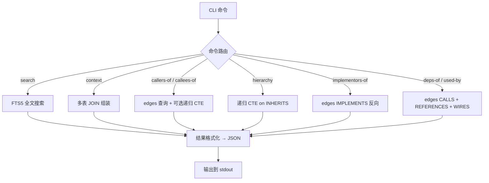

# 场景 2：查询

## 场景描述

通过 CLI 对已索引的项目进行结构化查询，支持精确语句查询和模糊自然语言查询。查询只走 SQLite，不触发解析器（JavaParser+SymbolSolver）重新解析。

**核心原则**：查询 = SQL + FTS5 + 递归 CTE，毫秒级响应。

## 详细子场景

### B. 符号定位

| # | 子场景 | 命令 | 查询方式 |
|---|--------|------|---------|
| B1 | 按名称搜索类 | `anatomist search OrderService` | FTS5 全文搜索 |
| B2 | 按名称搜索方法 | `anatomist search checkout --kind METHOD` | FTS5 + kind 过滤 |
| B3 | 按全限定名精确定位 | `anatomist context com.example.service.OrderService` | qualified_name 索引 |
| B4 | 按注解查找 | `anatomist search @RestController --by-annotation` | annotations 表 JOIN |
| B5 | 按接口查找实现类 | `anatomist implementors-of OrderRepository` | edges IMPLEMENTS 反向（is_external=0） |

### C. 结构理解

| # | 子场景 | 命令 | 查询方式 |
|---|--------|------|---------|
| C1 | 查看类的全貌 | `anatomist context OrderService` | nodes + CONTAINS edges + annotations（不含 callees，需用 `--with-callees`） |
| C2 | 查看继承链 | `anatomist hierarchy OrderService` | 递归 CTE on INHERITS |
| C3 | 查看方法签名 | `anatomist context OrderService.checkout` | nodes + metadata JSON |
| C4 | 查看类的依赖 | `anatomist deps-of OrderService` | edges CALLS + REFERENCES + WIRES |
| C5 | 查看谁依赖了这个类 | `anatomist used-by OrderService` | edges CALLS + REFERENCES + WIRES 反向 |

### D. 调用链追踪

| # | 子场景 | 命令 | 查询方式 |
|---|--------|------|---------|
| D1 | 方法调用了谁 | `anatomist callees-of OrderService.checkout` | edges CALLS |
| D2 | 谁调用了这个方法 | `anatomist callers-of OrderService.checkout` | edges CALLS 反向 |
| D3 | 完整调用链（多跳） | `anatomist callees-of ... --depth 5` | 递归 CTE on CALLS |
| D4 | 入口方法追踪 | `anatomist callees-of Controller.create --depth 5` | 递归 CTE on CALLS |

### F. 影响分析

| # | 子场景 | 命令 | 查询方式 |
|---|--------|------|---------|
| F1 | 方法修改影响 | `anatomist callers-of checkout --depth 5` | 递归 CTE on CALLS 反向 |
| F2 | 接口变更影响 | `anatomist implementors-of OrderRepository` | edges IMPLEMENTS |
| F3 | 类删除影响 | `anatomist used-by DiscountService` | edges CALLS + REFERENCES + WIRES 反向 |

## 技术方案

### 查询架构



### 核心查询实现

#### FTS5 全文搜索（B1/B2）

```sql
-- B1: 按名称搜索
SELECT n.id, n.label, n.kind, n.qualified_name, n.source_file
FROM node_names nn
JOIN nodes n ON nn.node_id = n.id
WHERE node_names MATCH ?
ORDER BY rank
LIMIT 20;

-- B2: 按名称搜索方法
SELECT n.id, n.label, n.kind, n.qualified_name, n.source_file
FROM node_names nn
JOIN nodes n ON nn.node_id = n.id
WHERE node_names MATCH ? AND n.kind = 'METHOD'
ORDER BY rank
LIMIT 20;
```

#### 按注解查找（B4）

```sql
SELECT n.id, n.label, n.kind, n.qualified_name, n.source_file
FROM nodes n
JOIN annotations a ON n.id = a.node_id
WHERE a.annotation_fqn LIKE ?
ORDER BY n.qualified_name;
-- 匹配: %RestController%
```

#### 类全貌（C1）

```sql
-- 1. 节点基本信息
SELECT * FROM nodes WHERE id = ?;

-- 2. 包含的字段和方法
SELECT n.id, n.label, n.kind, n.source_location, n.metadata
FROM edges e
JOIN nodes n ON e.target_id = n.id
WHERE e.source_id = ? AND e.relation = 'CONTAINS'
ORDER BY n.kind, n.source_location;

-- 3. 注解
SELECT annotation_fqn, attributes FROM annotations WHERE node_id = ?;

-- 4. （可选，仅 --with-callees）每个方法的 N 层 callees
--   默认 context 不包含 callees；Agent 需要时显式追加该选项
SELECT e.target_id, n.label, n.qualified_name
FROM edges e
JOIN nodes n ON e.target_id = n.id
WHERE e.source_id = ? AND e.relation = 'CALLS' AND e.is_external = 0;
```

#### 递归调用链（D3/D4）

```sql
WITH RECURSIVE chain AS (
    -- 起点
    SELECT source_id, target_id, relation, source_file, source_location, 1 AS depth
    FROM edges
    WHERE source_id = ? AND relation = 'CALLS'

    UNION ALL

    -- 递归展开
    SELECT e.source_id, e.target_id, e.relation, e.source_file, e.source_location, c.depth + 1
    FROM edges e
    JOIN chain c ON e.source_id = c.target_id
    WHERE e.relation = 'CALLS' AND c.depth < ?
)
SELECT c.source_id, c.target_id, c.depth,
       src.label AS source_label, tgt.label AS target_label,
       c.source_file, c.source_location
FROM chain c
JOIN nodes src ON c.source_id = src.id
JOIN nodes tgt ON c.target_id = tgt.id
ORDER BY c.depth, c.source_id;
```

#### 继承链（C2）

```sql
WITH RECURSIVE hierarchy AS (
    -- 起点
    SELECT id, label, qualified_name, 'self' AS role, 0 AS depth
    FROM nodes WHERE id = ?

    UNION ALL

    -- 向上追溯父类
    SELECT n.id, n.label, n.qualified_name, 'extends' AS role, h.depth + 1
    FROM nodes n
    JOIN edges e ON n.id = e.target_id
    JOIN hierarchy h ON e.source_id = h.id
    WHERE e.relation = 'INHERITS' AND h.depth < 10
)
SELECT * FROM hierarchy ORDER BY depth;

-- 同时查 implements
SELECT n.id, n.label, n.qualified_name
FROM nodes n
JOIN edges e ON n.id = e.target_id
WHERE e.source_id = ? AND e.relation = 'IMPLEMENTS';
```

### 模糊自然语言查询

Agent 通过 FTS5 搜索 + 自己的 LLM 推理实现模糊查询，anatomist 本身不处理自然语言。

```
用户: "创建订单的流程"
  → Agent LLM 分解: search "order" → search "create" → context → callees-of --depth
```

anatomist 只提供精确的结构化查询原语，语义理解由 Agent 负责。

## CLI 设计

### 搜索命令

```bash
# 按名称搜索（FTS5）
anatomist search "OrderService"
anatomist search "checkout" --kind METHOD

# 按注解搜索
anatomist search "@RestController" --by-annotation
anatomist search "@Entity" --by-annotation --kind CLASS

# 限制结果数量
anatomist search "order" --limit 10

# 指定索引库路径
anatomist search "order" --index ./my-index.db
```

### 上下文命令

```bash
# 查看类全貌（含字段、方法签名、注解，但不含 callees）
anatomist context com.example.service.OrderService

# 同上 + 每个方法 1 层 callees
anatomist context com.example.service.OrderService --with-callees

# 同上 + 每个方法 N 层 callees
anatomist context com.example.service.OrderService --with-callees=3

# 查看方法签名
anatomist context com.example.service.OrderService#checkout

# 简写：用类名简写（如果有唯一匹配）
anatomist context OrderService
```

> **为什么 callees 不默认带**：大类（数十方法 × N callees）输出会膨胀，浪费 Agent 上下文窗口；而且与 `callees-of` 重复。Skill 文件会指导 Agent 何时叠加。

### 调用链命令

```bash
# 单跳
anatomist callees-of OrderService.checkout
anatomist callers-of OrderService.checkout

# 递归多跳
anatomist callees-of OrderController.create --depth 5
anatomist callers-of OrderService.checkout --depth 3
```

### 结构查询命令

```bash
anatomist hierarchy OrderService
anatomist implementors-of OrderRepository
anatomist deps-of OrderService
anatomist used-by OrderService
```

### 输出格式

所有查询输出 JSON 到 stdout，方便 Agent 解析：

```json
{
  "query": "callees-of OrderController.create --depth 5",
  "results": [
    {
      "source": "com.example.controller.OrderController#create(com.example.dto.CreateOrderRequest)",
      "source_label": "create",
      "target": "com.example.service.OrderService#createOrder(com.example.dto.CreateOrderRequest)",
      "target_label": "createOrder",
      "target_qualified_name": "com.example.service.OrderService#createOrder",
      "relation": "CALLS",
      "call_kind": "INSTANCE",
      "depth": 1,
      "source_file": "src/main/java/com/example/controller/OrderController.java",
      "source_location": "L24"
    }
  ],
  "stats": {"total_edges": 6, "max_depth": 2}
}
```

## 实现要点

1. **FTS5 tokenizer**：Java 类名/方法名以英文 + 驼峰为主，FTS5 默认 tokenizer + `unicode61` 已足够。Javadoc 中的中文目前按 `unicode61` 分词（粗粒度）即可，必要时再考虑切换 tokenizer，此处不作 MVP 要求。

2. **递归 CTE 性能**：万级节点的图，5 层递归 CTE 在 SQLite 中 <10ms。但需要加 `depth < N` 限制防止无限递归（如循环调用）。

3. **循环调用检测**：递归 CTE 中同一节点可能被多次访问。需要用 `NOT IN` 或 `VISITED` 集合防止重复展开。SQLite 递归 CTE 不支持 `CYCLE` 子句（PostgreSQL 支持），需要应用层去重。

4. **模糊匹配策略**：FTS5 默认前缀匹配。`search "order"` 可匹配 `OrderService`、`OrderRepository` 等。但如果用户搜索 "order" 期望精确匹配，FTS5 的 `MATCH` 可能返回过多结果。建议：先精确匹配 qualified_name，再 FTS5 全文搜索补充。

5. **context 命令默认轻量**：早期设计让 `context` 自动带 1 层 callees，导致大类输出膨胀且与 `callees-of` 重复。改为默认 node + fields + method signatures + annotations，需要时显式 `--with-callees[=N]`。

6. **索引库发现**：命令默认查找当前目录下的 `.anatomist/index.db`。支持 `--index` 参数指定路径。

## Phase 归属

Phase 2（核心实现）

## 实现状态

**所有 8 个子命令已落地并通过测试**（截至 2026-05-31）。

### 代码入口

| 命令 | picocli 类 | QueryService 方法 |
|------|-----------|-------------------|
| `search` | `com.anatomist.cli.SearchCommand` | `search(...)` / `searchByAnnotation(...)` |
| `context` | `com.anatomist.cli.ContextCommand` | `context(fqn, withCalleesDepth)` |
| `callees-of` | `com.anatomist.cli.CalleesOfCommand` | `calleesOf(methodRef, depth)` |
| `callers-of` | `com.anatomist.cli.CallersOfCommand` | `callersOf(methodRef, depth)` |
| `hierarchy` | `com.anatomist.cli.HierarchyCommand` | `hierarchy(typeRef)` |
| `implementors-of` | `com.anatomist.cli.ImplementorsOfCommand` | `implementorsOf(typeRef)` |
| `deps-of` | `com.anatomist.cli.DepsOfCommand` | `depsOf(typeRef)` |
| `used-by` | `com.anatomist.cli.UsedByCommand` | `usedBy(typeRef)` |

底座是 `com.anatomist.query.QueryService`（每条命令开新 SQLite 连接 → 跑 SQL → 关），输出统一封装为 `QueryEnvelope { query, results[], stats }`，通过 `JsonFormatter`（snake_case + INDENT_OUTPUT）序列化到 stdout。

### FQN 解析约定

- 类型：`resolveTypeIds(input)` 先按 `nodes.qualified_name = ?` 精确匹配，未命中回退到 `nodes.label = ?` 短名匹配
- 方法：`resolveMethodIds(input)` 支持四种语法
  - `pkg.Class#method(p1,p2)` — 精确匹配 `nodes.id`
  - `pkg.Class#method` — 匹配 `qualified_name`（所有 overload）
  - `pkg.Class.method` / `Class.method` — 改写为前两种之一
  - `method`（裸名）— 匹配 `nodes.label`，全项目所有同名方法

### 递归 CTE 防护

- 深度上限 `QueryService.MAX_DEPTH = 20`
- 应用层 `dedup(source, target, depth)` 去重，处理 fan-in 图在同 depth 多次访问同一节点
- SQLite 不支持 PostgreSQL 的 `CYCLE` 子句，靠 `depth < ?` + dedup 等价实现

### 测试覆盖矩阵

| 层 | 类 | 覆盖 |
|----|----|------|
| L2 集成 | `QueryServiceIT` | 17 条，B1/B2/B3/B4/B5 + C1/C2/C3/C4/C5 + D1/D2/D3 + F1/F2/F3 + 递归深度安全 |
| L3 golden | `GoldenFileIT` + `tests/scenarios/` | 8 种子场景（B1/B3/C1/C2/D1/D2/D3/F1），`-Dgolden.update=true` 刷新 |

详细 fixture 与刷新机制见 [`docs/testing-strategy.md` §四 Golden File 模式](testing-strategy.md#四golden-file-模式)。
