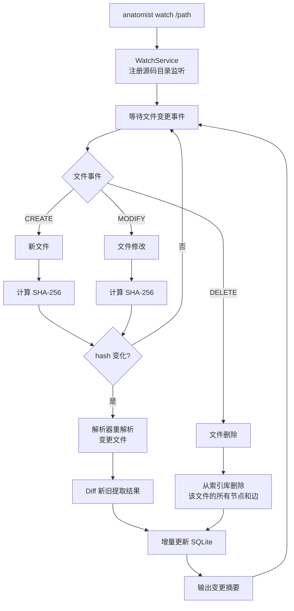
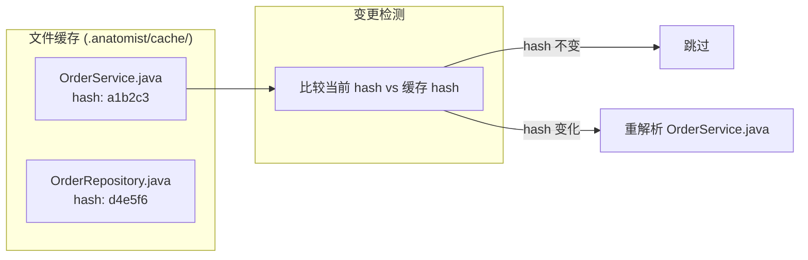
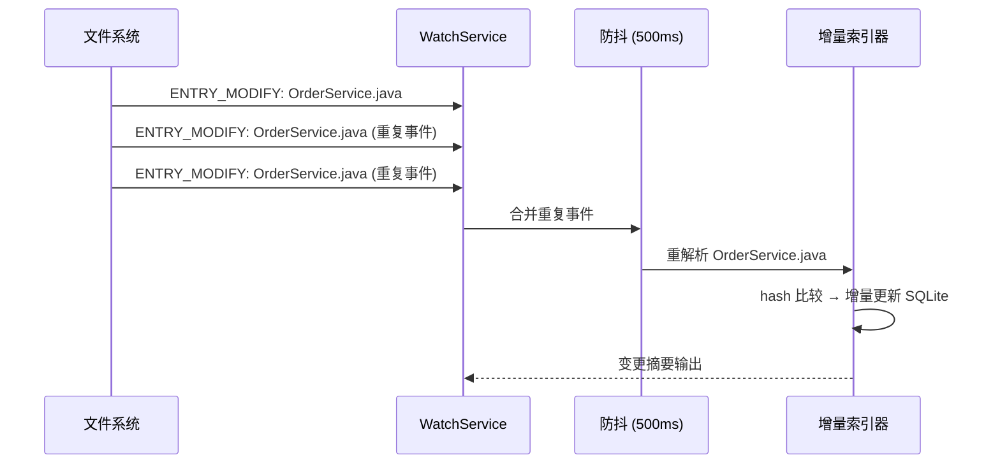
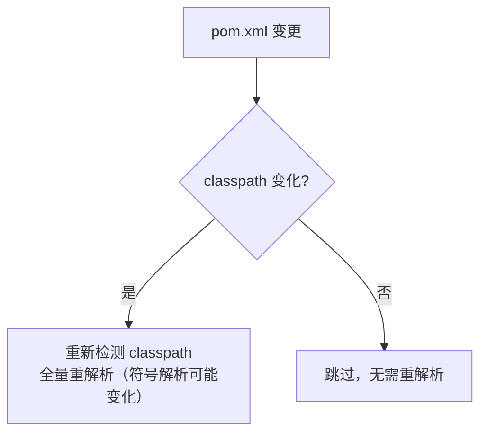

# 场景 3：监控 + 增量更新

## 场景描述

监控 Java 项目中的文件变更，当源码文件发生变化时，自动触发增量重解析并更新 SQLite 索引库，保持索引数据与源码同步。

**核心原则**：只重解析变更的文件，复用未变更文件的缓存结果。

## 详细子场景

| # | 子场景 | 命令 |
|---|--------|------|
| 3.1 | 启动文件监控 | `anatomist watch /path/to/project` |
| 3.2 | 手动增量更新 | `anatomist index /path/to/project --incremental` |
| 3.3 | 监控 + 自动增量 | `anatomist watch /path/to/project --auto-index` |
| 3.4 | 监控特定文件类型 | `anatomist watch /path/to/project --extensions ".java,.xml"` |

## 技术方案

### 整体流程



### 增量策略

#### 文件级增量

基于文件内容 SHA-256 hash 检测变更，只对变更文件重解析。



**缓存结构**（存储在 `.anatomist/cache.json`）：

```json
{
  "version": 1,
  "javaVersion": "21",
  "files": {
    "src/main/java/com/example/OrderService.java": {
      "hash": "a1b2c3d4e5f6",
      "lastIndexed": "2026-06-01T10:30:00Z",
      "nodeCount": 5,
      "edgeCount": 8
    },
    "src/main/java/com/example/OrderRepository.java": {
      "hash": "1a2b3c4d5e6f",
      "lastIndexed": "2026-06-01T10:30:00Z",
      "nodeCount": 3,
      "edgeCount": 4
    }
  }
}
```

#### 增量重解析

单文件重解析时，JavaParser 无法像全量 `SourceRoot.tryToParse()` 那样让 SymbolSolver 一次性持有所有源码的解析缓存。需要处理：

| 场景 | 处理方式 |
|------|---------|
| 文件内符号 | `JavaParser.parse(file)` + 已挂 `JavaSymbolSolver` 的 `ParserConfiguration` 即可 |
| 跨文件符号（引用项目内其他类） | `JavaParserTypeSolver(srcRoot)` 必须覆盖所有项目源码根；外部 jar 走 `JarTypeSolver` |
| 符号解析失败 | 标记 `bindingResolved: false`，保留文本信息 |

#### 增量更新 SQLite

**删除旧数据**：先删除该文件关联的所有节点和边，再写入新数据。

```sql
-- 1. 找到该文件的所有节点 ID
SELECT id FROM nodes WHERE source_file = ?;

-- 2. 删除关联的边（source 或 target 指向这些节点）
DELETE FROM edges WHERE source_file = ?;

-- 3. 删除关联的注解
DELETE FROM annotations WHERE node_id IN (SELECT id FROM nodes WHERE source_file = ?);

-- 4. 删除节点
DELETE FROM nodes WHERE source_file = ?;

-- 5. 删除 FTS5 条目（自动通过 content 同步）

-- 6. 插入新数据（复用全量索引的 Extractor 逻辑）
```

**符号解析影响扩散（同趟传递重对齐）**：如果修改的是接口、基类或常被引用的类型，依赖它的源文件的符号解析 / OVERRIDES / CALLS 边会随之失效。SQLite 的 `edges.target_id ... ON DELETE CASCADE` 在被依赖文件重解析（先删后插）时，会顺带删除依赖方指向它的跨文件边——只有把这些依赖方在**同一趟**里一并重解析，才能重建这些边。

处理策略是**同趟传递重对齐（transitive realign）而非仅标记**：

1. 索引阶段维护 `file_dependencies` 反向依赖表：记录"文件 A 的解析结果引用了文件 B 中的类型"。
2. 文件 B 变更 / 删除时，沿 `file_dependencies` 反查依赖闭包（迭代到不动点），把仍存在于磁盘的依赖方文件一并并入本趟的重解析集合。
3. 重解析集合在单事务内 delete-then-reinsert，跨文件边随之重建，索引始终与磁盘对齐——不再遗留陈旧数据，也无需用户手动 `--full`。
4. 闭包文件数超过 `--max-realign-files`（默认 200）时，增量自动退回全量索引（`degraded to full`），保证可预测的上界开销。

```sql
CREATE TABLE file_dependencies (
    source_file TEXT NOT NULL,            -- 解析方
    depends_on_file TEXT NOT NULL,        -- 被依赖方（项目内）
    PRIMARY KEY (source_file, depends_on_file)
);
CREATE INDEX idx_file_deps_target ON file_dependencies(depends_on_file);
```

`file_dependencies` 每趟末尾全量重建（`clearFileDependencies` + `deriveFileDependencies`），两端文件名都从 `nodes.source_file` 推导，反映上次提交后的稳定状态。

watch 输出示例：
```
[MODIFY] src/main/java/com/example/BaseService.java
  Index updated: ~2 nodes, ~4 edges
  Realigned 3 dependent file(s): OrderService, PaymentService, UserService
```

### WatchService 监控

使用 Java NIO `WatchService` 监听源码目录：



**防抖**：IDE 保存文件可能连续触发多个 MODIFY 事件，需要 500ms 防抖合并。

### XML 文件变更

`pom.xml` / `build.gradle` 变更需要重新检测 classpath：



## 数据模型变更

增量更新需要额外存储：

### 新增：file_cache 表

```sql
CREATE TABLE file_cache (
    source_file TEXT PRIMARY KEY,
    hash TEXT NOT NULL,                   -- 源码 SHA-256
    schema_version INTEGER NOT NULL,      -- 索引器版本；版本升级时整库失效
    last_indexed TEXT NOT NULL,
    node_count INTEGER,
    edge_count INTEGER
);
```

**何时视为需要重解析**：
- `hash` 与磁盘 SHA-256 不同 → 本文件内容变更
- `schema_version` 与当前索引器版本不同 → DDL / Extractor 升级，整库失效
- 被依赖文件变更 → 沿 `file_dependencies` 闭包将依赖方一并纳入本趟重解析（见 [符号解析影响扩散](#符号解析影响扩散同趟传递重对齐)）
- pom.xml / build.gradle 的 classpath hash 变化 → 全量重解析

### 新增：项目元数据表

```sql
CREATE TABLE project_meta (
    key TEXT PRIMARY KEY,
    value TEXT NOT NULL
);
-- 存储: java_version, classpath_hash, project_type, index_version, etc.
```

## CLI 设计

```bash
# 启动监控（仅输出变更事件）
anatomist watch /path/to/project

# 启动监控 + 自动增量索引
anatomist watch /path/to/project --auto-index

# 手动增量更新
anatomist index /path/to/project --incremental

# 监控特定扩展名
anatomist watch /path/to/project --extensions ".java,.xml,.gradle"

# 调整重对齐闭包上限（默认 200，超限退全量）
anatomist index /path/to/project --incremental --max-realign-files 500
```

**watch 输出示例**：

```
Watching /path/to/project for changes...
[MODIFY] src/main/java/com/example/OrderService.java
  - class OrderService: method applyDiscount signature changed
  + class OrderService: new method cancelOrder
  Index updated: +1 node, +2 edges, ~1 node modified

[DELETE] src/main/java/com/example/DeprecatedService.java
  - class DeprecatedService: removed (3 methods, 2 fields)
  Index updated: -6 nodes, -12 edges

[CREATE] src/main/java/com/example/OrderValidator.java
  + class OrderValidator: new (2 methods)
  Index updated: +3 nodes, +4 edges
```

## 实现要点

1. **防抖窗口**：500ms 是 IDE 保存场景的合理值。太大的窗口导致响应迟钝，太小则可能重复解析。

2. **符号解析一致性**：增量重解析的单文件符号绑定可能不如全量 `SourceRoot.tryToParse()` 精确（缺少其他文件的解析缓存）。如果用户发现绑定精度下降，可手动触发全量 `index` 刷新。

3. **大文件重解析**：单个大文件重解析通常 <100ms。但如果一个文件包含大量内部类，重解析 + 重新提取可能需要几百毫秒。

4. **事务安全**：增量更新 SQLite 必须在事务内完成（删除旧数据 + 插入新数据），避免中间状态被查询读到。

5. **Maven/Gradle 文件变更**：`pom.xml` 变更可能导致 classpath 变化，需要全量重解析。检测方式：比较 classpath hash。

## Phase 归属

Phase 4（增量解析 + WatchService）
