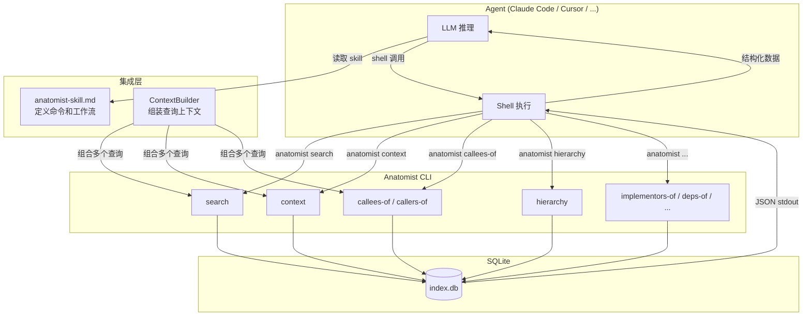
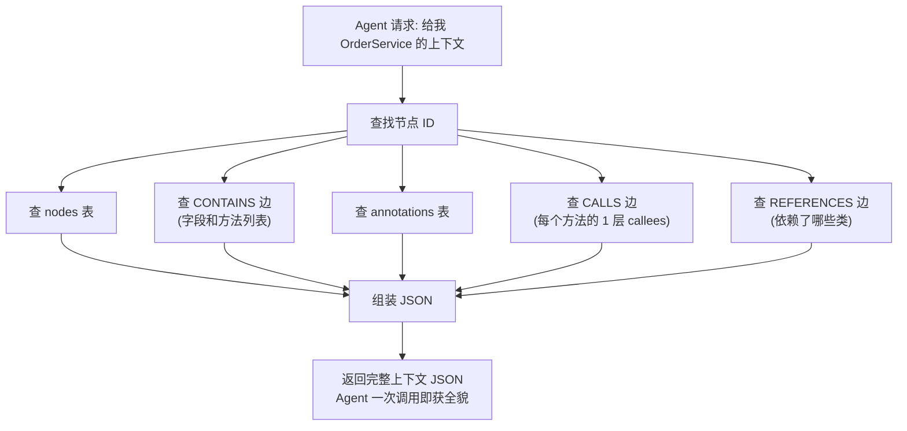
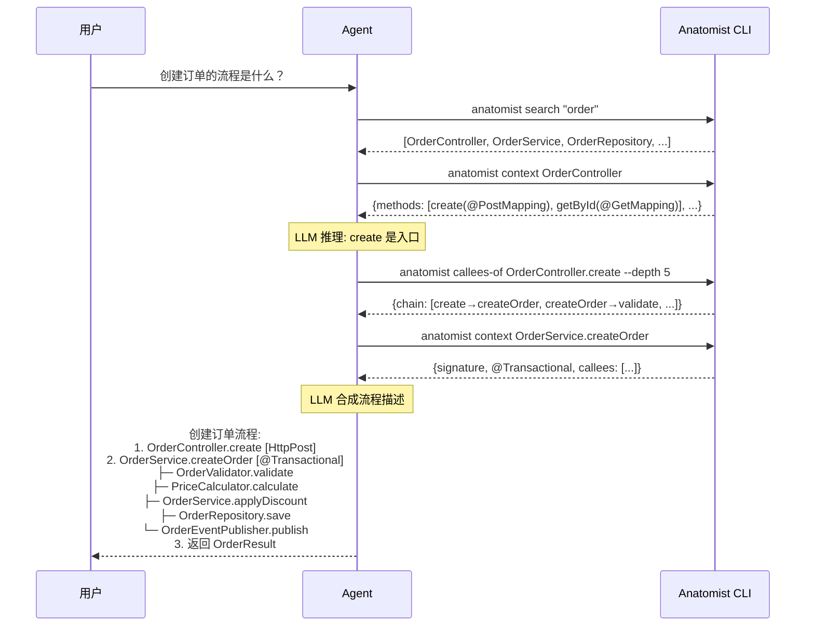
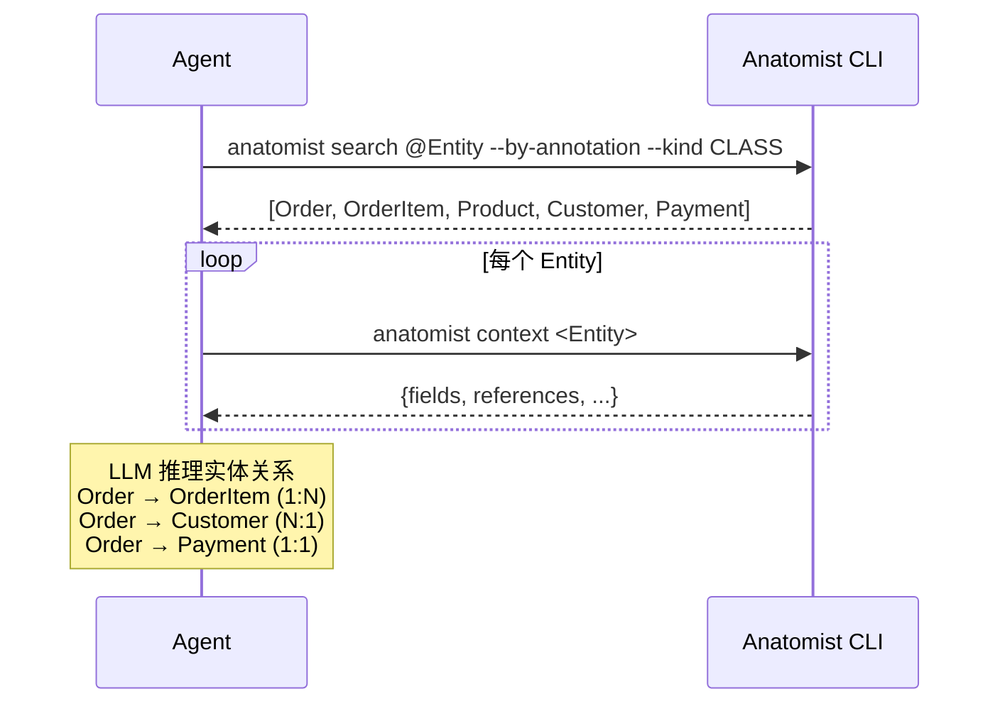
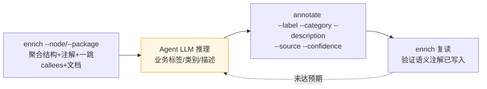

# 场景 4：Skills 对接 CLI

## 场景描述

通过 Agent Skills 将 anatomist 的 CLI 能力暴露给 Agent（Claude Code / Cursor / Copilot 等），让 Agent 利用自身 LLM 推理能力 + anatomist 的结构化数据，实现语义理解和领域分析。

**核心原则**：anatomist 提供结构化查询原语（CLI），Agent 负责 LLM 推理。anatomist 不嵌入 LLM 调用。Agent 通过 Skill 文件了解如何调用 anatomist CLI。

## 详细子场景

### E. 领域分析（Agent 推理）

| # | 子场景 | Agent 工作流 |
|---|--------|-------------|
| E1 | 识别核心领域模型 | B4 查 @Entity → C1 看字段关系 → LLM 推理 Entity 关系 |
| E2 | 识别限界上下文 | B4 查 @Service/@RestController → C4 依赖 → 包结构分组 → LLM 推理边界 |
| E3 | 分析业务流程 | B4 查 Controller → D3/D4 追踪调用链 → LLM 组装流程 |
| E4 | 识别领域事件 | B1 搜索 "*Event" → D2 查 publish 调用 → LLM 推理事件流 |

### 通用 Agent 集成

| # | 子场景 | 说明 |
|---|--------|------|
| 4.1 | Skill 文件引导 Agent | anatomist-skill.md 定义可用命令和工作流 |
| 4.2 | Agent 直接调用 CLI | Agent 通过 shell 执行 anatomist CLI 命令 |
| 4.3 | ContextBuilder 组装上下文 | 为 Agent 的单次 LLM 调用组装最优上下文 |

## 技术方案

### 整体架构



### Skill 文件设计

#### anatomist-skill.md

```markdown
# Anatomist — Java Code Intelligence Skill

## Description
Anatomist provides precise structural analysis of Java projects using JavaParser + SymbolSolver.
Use it to find code symbols, trace call chains, understand class hierarchies,
and analyze dependencies.

## When to Use
- User asks about Java code structure, call flows, or inheritance
- User needs to locate specific classes or methods
- User wants to understand how a feature is implemented
- User asks about impact of code changes

## Available Commands

### Search
- `anatomist search <query>` — Full-text search for code symbols
- `anatomist search <query> --kind METHOD` — Search only methods
- `anatomist search @<annotation> --by-annotation` — Find by annotation

### Context
- `anatomist context <qualified_name>` — Basic context of a class/method
  (fields, method signatures, annotations; **does NOT include callees by default**)
- `anatomist context <qualified_name> --with-callees[=N]` — Add N-level callees for each method (N defaults to 1)

### Call Chain
- `anatomist callees-of <method>` — What does this method call?
- `anatomist callers-of <method>` — Who calls this method?
- `anatomist callees-of <method> --depth N` — Recursive call chain (N levels)
- `anatomist callers-of <method> --depth N` — Recursive reverse call chain

### Structure
- `anatomist hierarchy <class>` — Inheritance chain and interfaces
- `anatomist implementors-of <interface>` — Classes implementing an interface
- `anatomist deps-of <class>` — What does this class depend on? (incl. Spring `WIRES` when indexed with `--spring-xml`)
- `anatomist used-by <class>` — Who depends on this class?
- `anatomist call-path <from> <to> [--depth N]` — Shortest CALLS path between two methods
- `anatomist package-deps` — Package → package edge aggregation

### Field-level impact
- `anatomist field-readers <field>` — Who reads this field?
- `anatomist field-writers <field>` — Who writes this field?

### Semantic enrichment (write business intent back to the index)
- `anatomist enrich --node/--package <target>` — Aggregate structure + annotations for LLM reasoning
- `anatomist annotate <node-id> --label --category --description --source --confidence` — Persist a semantic annotation

> **Export is NOT implemented.** Mermaid / dot / GraphML export (DESIGN.md 场景 5)
> is deferred — do not advertise `anatomist export` to the Agent.

## Typical Workflows

### Find how a feature works
1. `anatomist search "order"` — Find order-related classes
2. `anatomist context OrderController` — Find the entry method
3. `anatomist callees-of OrderController.create --depth 5` — Trace the call chain

### Find all REST endpoints
1. `anatomist search @RestController --by-annotation`
2. `anatomist context <controller>` for each — See endpoints and mappings

### Analyze change impact
1. `anatomist callers-of <method> --depth 3` — Who depends on this method
2. `anatomist used-by <class>` — Who uses this class

### Understand domain model
1. `anatomist search @Entity --by-annotation --kind CLASS`
2. `anatomist context <entity>` for each — See fields and relationships
3. `anatomist deps-of <entity>` — See entity dependencies
```

### ContextBuilder 设计

> **实现现状**：ContextBuilder 未作为独立 Java 组件落地——它的"一次调用拿全貌"
> 职责由 `context`（结构）与 `enrich`（结构 + 注解 + 一跳 callees + 相关文档，
> 供 LLM 分析）两个 CLI 命令承担。下文描述其逻辑组装意图。

ContextBuilder 为 Agent 的单次 LLM 调用组装最优上下文，减少 Agent 需要的 CLI 调用次数。



**context 输出结构**（类级别，默认轻量；`--with-callees[=N]` 才附加 callees 字段）：

```json
{
  "node": {"id": "com.example.service.OrderService", "label": "OrderService", "kind": "CLASS"},
  "annotations": [{"annotation_fqn": "org.springframework.stereotype.Service"}],
  "fields": [
    {"label": "orderRepo", "type": "OrderRepository", "annotations": ["@Autowired"]}
  ],
  "methods": [
    {
      "label": "createOrder",
      "id": "com.example.service.OrderService#createOrder(com.example.dto.CreateOrderRequest)",
      "signature": "createOrder(CreateOrderRequest request)",
      "returnType": "OrderResult",
      "annotations": ["@Transactional"]
    }
  ],
  "dependencies": ["OrderRepository", "PriceCalculator", "OrderValidator"],
  "superClass": "BaseService",
  "interfaces": []
}
```

附加 `--with-callees=1` 时，每个 method 对象多一个 `callees` 数组：

```json
"callees": [
  {"label": "validate", "id": "com.example.service.OrderValidator#validate(...)", "call_kind": "INSTANCE"},
  {"label": "calculate", "id": "com.example.service.PriceCalculator#calculate(...)", "call_kind": "INSTANCE"},
  {"label": "save", "id": "com.example.repository.OrderRepository#save(...)", "call_kind": "INTERFACE"}
]
```

## FQN 语法约定

解析器接受由严到松的多种写法，指向同一目标（与 scenario-2 §FQN 解析约定一致）：

| 写法 | 例子 | 何时命中 |
|---|---|---|
| 全 FQN | `com.example.service.OrderService` | 精确 `qualified_name` |
| 类 + 方法 | `com.example.service.OrderService#createOrder` | 该方法的所有 overload |
| 类 + 方法 + 签名 | `...#createOrder(com.example.dto.CreateOrderRequest)` | 单个精确 overload（id 匹配） |
| 简写 | `OrderService.createOrder` | 末位 `.` 拆类/方法，类按短名匹配 |
| 裸名 | `OrderService`（类）/ `createOrder`（方法） | 按 `nodes.label` |

> 方法参数 FQN 用**擦除签名**——`java.util.List`，不是 `java.util.List<String>`。

## 重要契约（Agent 必须知道）

- **JSON 形态被 golden file 锁死**（`tests/scenarios/*/expected.json`）：字段名、key 顺序、snake_case 跨运行稳定。
- **递归 `--depth` 上限 20**（`QueryService.MAX_DEPTH`），传更大值静默 clamp。
- **external 边**（指向 JDK / Spring 等项目外代码）带 `is_external=true` + `external_target_fqn`，**没有** `target` id——不要对它做递归追踪。
- **`--no-classpath` 模式**抑制 Spring 注解解析，只剩 `@Override`/`@Deprecated`/`@SuppressWarnings`；要查 `@RestController`/`@Service` 必须**带** classpath 索引。
- **匿名类方法**的 id 形如 `<外层方法>$anon@L<line>`，callers/callees 结果里以此形式出现。

## 领域分析工作流示例

### E3: "创建订单的流程是什么？"



### E1: "识别核心领域模型"



## 语义闭环：enrich → reason → annotate → enrich

skill 的最大增量能力——把"从代码反推出的业务语义"写回索引，让下一个会话受益。



1. **aggregate** — `enrich` 拉出成员、注解、已有语义注解、一跳 callees、相关文档（`--with-docs`）+ 建议的后续查询，单个 markdown blob（≤200 行）。
2. **reason** — Agent 据此合成业务标签 / 类别 / 描述。现有类别：`BUSINESS_SERVICE`/`BUSINESS_REPOSITORY`/`BUSINESS_CONTROLLER`/`BUSINESS_ENTITY`/`BUSINESS_VALUE_OBJECT`。
3. **annotate** — 写回结论。同 `(node-id, category, source)` 重跑为 upsert，可反复细化措辞。
4. **verify** — 复跑 `enrich` 确认语义注解出现在 *Semantic Annotations* 表。

**source 字段规则**：

| source | 含义 | CLI 允许？ |
|---|---|---|
| `LLM` | Agent 推理得出（默认） | ✅ |
| `DOC` | 逐字摘自项目文档 | ✅ |
| `CONVENTION` / `JAVADOC` | 保留给 `SemanticPostProcessor`（Spring stereotype 扫描）/ 未来 javadoc 抽取器 | ❌ CLI 传入即 exit 1 |

## 实现要点

1. **Skill 文件位置**：实际交付为仓库根目录的 [`anatomist-skill.md`](../anatomist-skill.md)（一页 playbook）。用户把它放进自己 Agent 的 skills / context 即可；不再依赖 `skills/skill.md` 自动识别约定。

2. **CLI 输出格式**：所有查询输出 JSON 到 stdout，Agent 直接解析。错误信息输出到 stderr，不影响 JSON 解析。

3. **ContextBuilder 的职责边界**：只做数据组装，不做 LLM 推理。组装的 JSON 应该是"Agent 一次调用就能理解全貌"的结构，而不是原始的表记录。

4. **错误处理**：当查询的 qualified_name 不存在时，返回友好错误 + 建议的相似节点（用 FTS5 模糊搜索）。

5. **Agent 调用方式**：Agent 通过 shell 执行 `anatomist` 命令，读取 stdout JSON。无需额外协议层。

6. **并发访问**：多个 Agent 可以同时执行 anatomist CLI 查询（SQLite 只读），但不支持查询期间并发 `index` 写入——需要 SQLite WAL 模式来处理。

## Phase 归属

Phase 3（Agent Skills + ContextBuilder）
