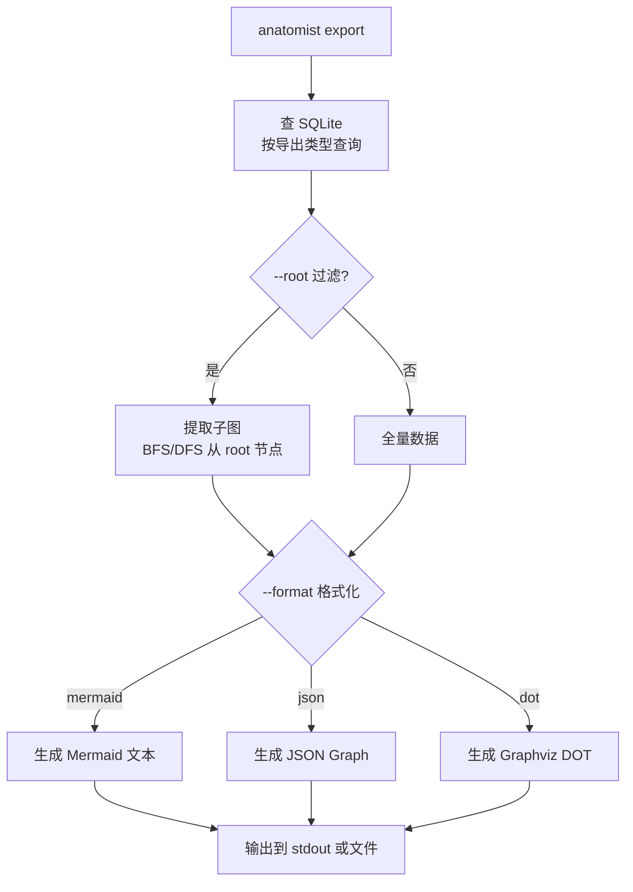
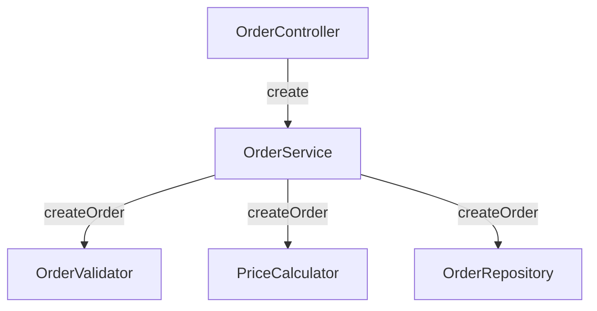
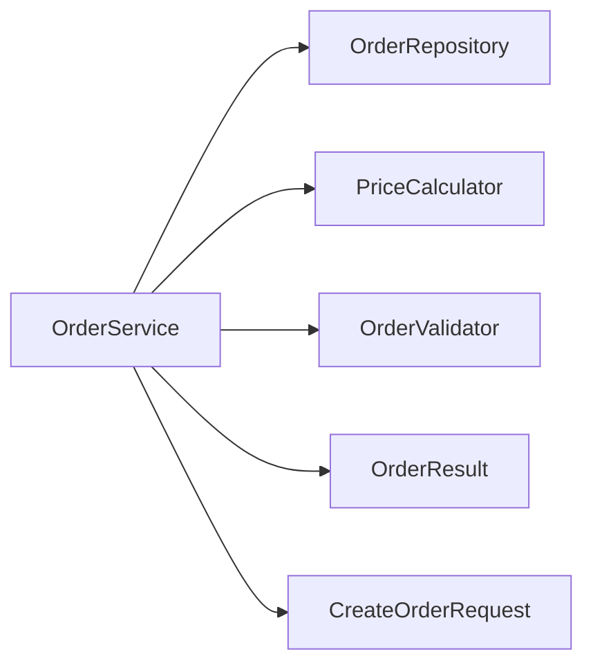

# 场景 5：导出 / 可视化

## 场景描述

将索引库中的结构化数据导出为各种格式（Mermaid、JSON Graph、PlantUML 等），用于文档生成、架构可视化和团队沟通。

**核心原则**：查询 SQLite → 格式化输出 → 外部工具渲染，anatomist 本身不做图形渲染。

## 详细子场景

| # | 子场景 | 命令 |
|---|--------|------|
| 5.1 | 导出调用图为 Mermaid | `anatomist export --format mermaid --type call-graph` |
| 5.2 | 导出类依赖为 Mermaid | `anatomist export --format mermaid --type class-deps` |
| 5.3 | 导出继承图为 Mermaid | `anatomist export --format mermaid --type hierarchy` |
| 5.4 | 导出完整图为 JSON | `anatomist export --format json` |
| 5.5 | 导出子图 | `anatomist export --format mermaid --root OrderService --depth 3` |
| 5.6 | 导出包级依赖图 | `anatomist export --format mermaid --type package-deps` |

## 技术方案

### 导出流程



### 导出格式

#### Mermaid 调用图

```
anatomist export --format mermaid --type call-graph --root OrderService --depth 2
```

输出：



#### Mermaid 类依赖图

```
anatomist export --format mermaid --type class-deps --root OrderService
```

输出：



#### Mermaid 继承图

```
anatomist export --format mermaid --type hierarchy --root OrderService
```

输出：

```mermaid
graph TD
    BaseService --> OrderService
    OrderService ..|> Serializable
    OrderService ..|> Runnable
```

#### JSON Graph

```
anatomist export --format json
```

输出（与 Graphify 格式兼容）：

```json
{
  "nodes": [
    {"id": "com.example.OrderService", "label": "OrderService", "kind": "CLASS", "source_file": "..."},
    {"id": "com.example.OrderService#createOrder(com.example.dto.CreateOrderRequest)", "label": "createOrder", "kind": "METHOD"}
  ],
  "edges": [
    {"source": "com.example.OrderController", "target": "com.example.OrderService", "relation": "REFERENCES", "confidence": "EXTRACTED"},
    {"source": "com.example.OrderService#createOrder(...)", "target": "com.example.OrderValidator#validate(...)", "relation": "CALLS", "call_kind": "INSTANCE", "confidence": "EXTRACTED"}
  ]
}
```

### 子图提取

`--root` 参数指定中心节点，`--depth` 控制展开层数，BFS 提取子图。**双向展开 + 循环依赖** 在环图上可能指数膨胀，需要应用层 BFS 维护 `visited` 集合（SQLite 不支持 `CYCLE` 子句）：

```python
# 伪代码：应用层 BFS（CTE 双向展开在循环依赖图上不安全）
visited = {root_id}
frontier = [root_id]
for depth in range(max_depth):
    next_frontier = []
    rows = db.execute("""
        SELECT
          CASE WHEN source_id IN (?) THEN target_id ELSE source_id END AS neighbor
        FROM edges
        WHERE source_id IN (?) OR target_id IN (?)
    """, frontier, frontier, frontier)
    for r in rows:
        if r.neighbor and r.neighbor not in visited:
            visited.add(r.neighbor)
            next_frontier.append(r.neighbor)
    frontier = next_frontier

# visited 即为子图节点集合，再 SELECT edges WHERE source_id IN visited AND target_id IN visited
```

### 包级聚合

将节点级依赖聚合为包级依赖，用于架构视图：

```
com.example.controller.OrderService → com.example.service.OrderService
                                    → com.example.repository.OrderRepository

聚合为:

com.example.controller → com.example.service
                       → com.example.repository
```

```sql
-- 包级聚合查询：直接 GROUP BY nodes.package（在 index 阶段从 PackageDeclaration 提取，无需字符串切片）
SELECT
    n1.package AS source_pkg,
    n2.package AS target_pkg,
    COUNT(*) AS weight
FROM edges e
JOIN nodes n1 ON e.source_id = n1.id
JOIN nodes n2 ON e.target_id = n2.id
WHERE e.relation IN ('CALLS', 'REFERENCES', 'READS', 'WRITES')
  AND e.is_external = 0
  AND n1.package IS NOT NULL
  AND n2.package IS NOT NULL
  AND n1.package != n2.package          -- 跳过同包内部依赖
GROUP BY source_pkg, target_pkg
ORDER BY weight DESC;
```

> 早期方案用 `SUBSTR`/`INSTR` 从 `source_file` 切包路径，在多模块共享前缀（`order-api/.../com/example/` vs `order-service/.../com/example/`）或 `--project-source` 自定义路径时不可靠。改用 `nodes.package` 显式列。

## CLI 设计

```bash
# 导出调用图（Mermaid）
anatomist export --format mermaid --type call-graph

# 导出类依赖（Mermaid），限制子图
anatomist export --format mermaid --type class-deps --root OrderService --depth 2

# 导出继承图
anatomist export --format mermaid --type hierarchy --root OrderService

# 导出包级依赖
anatomist export --format mermaid --type package-deps

# 导出完整 JSON Graph
anatomist export --format json

# 导出到文件
anatomist export --format mermaid --type call-graph --output call-graph.mmd

# Graphviz DOT 格式
anatomist export --format dot --type class-deps
```

## 实现要点

1. **Mermaid 语法限制**：Mermaid 对节点 ID 有字符限制（不能有 `.`、`#` 等），需要用标签映射。节点 ID 用简名，label 用全限定名。

2. **大图裁剪**：全量项目的调用图可能有数千节点，Mermaid 渲染性能差。需要：
   - `--depth` 限制展开层数
   - `--root` 指定中心节点
   - `--max-nodes` 限制节点总数
   - 智能裁剪：优先保留高连接度节点

3. **JSON 格式兼容**：考虑与 Graphify 的 graph.json 格式兼容，方便用户迁移或使用 Graphify 的可视化工具。

4. **包路径解析**：直接读 `nodes.package` 列（index 阶段由 `PackageDeclaration` 提取，原始且权威），不再从 `source_file` 字符串切片。

5. **Mermaid 样式**：可按节点 kind 设置不同样式（CLASS 蓝色、INTERFACE 绿色、ENUM 橙色等），增强可读性。

## Phase 归属

Phase 2（基础 Mermaid/JSON 导出）+ Phase 4（包级聚合、DOT 格式、大图裁剪）
