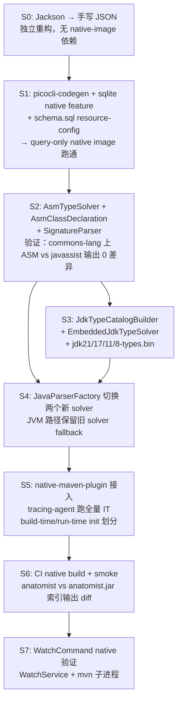

# 场景 6：Native Image 分发

## 场景描述

把 anatomist 全部命令（**包括 index / index-docs / watch 的全量与增量索引**）编译成 GraalVM native image，做到：

- **冷启动 < 50ms**（JVM 当前 ~300ms）→ Agent 调用每条命令的延迟可忽略
- **单二进制零运行时依赖**（不依赖系统装 JDK）
- **内存占用 < 100MB**（JVM 索引 commons-lang 时峰值 ~600MB）

约束：**index 阶段的功能不能降级**。这排除了"native image 只覆盖 query phase"的取巧方案，强制我们解决 JavaParser/SymbolSolver 的反射阻塞。

> **设计原则（写入 CLAUDE.md）**：新增/修改任何 production 代码前，都要先问"这一步在 native image 下还成立吗？"。任何引入 `Class.forName` / 动态代理 / ServiceLoader / 运行时字节码生成 / 反射 POJO 读写的方案，必须在 design.md 给出 native-image 适配方案才能合入。

## 详细子场景

| # | 子场景 | 命令 |
|---|--------|------|
| 6.1 | 用 native binary 完成首次索引 | `./anatomist index /path` |
| 6.2 | native binary 跑增量索引 | `./anatomist index /path`（命中 file_cache） |
| 6.3 | native binary 跑 watch 监听 | `./anatomist watch /path --auto-index` |
| 6.4 | native binary 跑全部 query / enrich / annotate 子命令 | 同 JVM 版 |
| 6.5 | 构建期生成 reflect/resource/init 配置 | `mvn -Pnative package` |
| 6.6 | CI 在 commons-lang fixture 上验证 native binary 与 JVM binary 索引结果一致 | `make native-smoke` |

## 关键设计决策

### 决策 1：抛弃 javassist，自写 ASM-based 符号解析器

`JarTypeSolver`（javaparser-symbol-solver-core 内置）通过 javassist 的 `ClassPool` 动态加载 jar 中的 `.class`，触发 `ClassLoader.loadClass`，与 native-image 的 closed-world 模型直接冲突。

但 **`JarTypeSolver` 真正用到的只是字节码读取能力，不是字节码加载能力** —— 符号解析只需要拿到类的 FQN、继承链、方法签名、字段签名。这刚好是 ASM `ClassReader` 的拿手活，全程不碰 `ClassLoader`。

替换方案：
- 新增 `AsmTypeSolver implements TypeSolver`
- 新增 `AsmClassDeclaration implements ResolvedReferenceTypeDeclaration`（参考 javaparser 内部 `JavassistClassDeclaration` ~600 LOC）
- 新增 `AsmSignatureParser` —— 用 ASM `SignatureReader` / `SignatureVisitor` 把泛型签名翻译成 `ResolvedType`（最难的一步，泛型 grammar）
- `JavaParserFactory` 内部把 `JarTypeSolver` 换成 `AsmTypeSolver`，javassist 依赖从生产剥离

依赖变化：`-javassist (750KB) + ASM (250KB)`。javaparser-symbol-solver-core 内部本身就 transitive 依赖了 ASM，可能 piggy-back。

### 决策 2：抛弃 `ReflectionTypeSolver`，改用"JDK 类型目录"预生成

`ReflectionTypeSolver` 对每个被引用的 JDK 类型跑 `Class.forName(...)`。native-image 不能在构建期穷举目标项目会引用哪些 JDK 类，配 reflect-config 不可行。

替换方案：**构建期预抽取一份 JDK 类型表，作为二进制资源 ship 在 anatomist 自己的 jar 里。**

- anatomist 构建流程跑一次 `JdkTypeCatalogBuilder`，用决策 1 的 `AsmTypeSolver` 扫 `$JAVA_HOME/lib/modules`（jimage），导出每个 JDK 类的 FQN + 父类 + 接口 + 字段签名 + 方法签名
- 输出到 `META-INF/anatomist/jdk21-types.bin`（自定 binary 编码，无需 jackson；估算 5–8 MB）
- 运行时 `EmbeddedJdkTypeSolver` mmap / 一次性读入；查询 O(1)
- 多版本支持：同时 ship `jdk8-types.bin` / `jdk11-types.bin` / `jdk17-types.bin` / `jdk21-types.bin`，按 `ClasspathDetector.detectJavaVersion` 选择

优点：100% closed-world、零反射、查询比 jrt-fs 快、版本可预测。
缺点：anatomist 二进制体积增加 ~30MB（4 个版本目录）；新增 JDK 版本需要 anatomist 跟版。

### 决策 3：抛弃 Jackson，手写 JSON I/O

Jackson 走反射读写 POJO 字段，native-image 要么写 reflect-config、要么改用编译期 codegen 库（dsl-json / jackson-jr）。但是：

- anatomist 涉及 JSON 序列化/反序列化的类**只有 14 个**：`NodeRow` / `EdgeRow` / `ContextResult` / `HierarchyResult` / `HierarchyResult.Entry` / `QueryEnvelope` / `EnrichResult` / `DocSnippet` / `SemanticAnnotationRow` / `SemanticAnnotation` 等
- 全部是扁平 public-field POJO，无嵌套继承、无注解依赖、无定制序列化器
- 输入仅一处：`annotate --from-json`
- 输出仅一处：`JsonFormatter.emit(QueryEnvelope)`

手写一组 `JsonWriter` / `JsonReader`：~300 LOC，零依赖、零反射，native-image 不需任何配置。比引 dsl-json 工程更轻。

唯一棘手处：`annotations` 列存的是已序列化的 JSON 字符串，QueryService 当前会 `json.readValue(attrs, JsonNode.class)` 解一层。改成 raw string 透传到 CLI 输出（命名 `attributes_raw`），CLI 消费方（Agent）自己解。

依赖变化：`-jackson-databind -jackson-core -jackson-annotations`（合计 ~1.5MB）。

### 决策 4：picocli 走 codegen，sqlite-jdbc 用现成 feature

- `picocli-codegen` annotation processor 编译期生成 `META-INF/native-image/info.picocli/picocli/{reflect,resource,proxy}-config.json`。零代码改动。
- `sqlite-jdbc 3.47+` 已 ship `META-INF/native-image/org.xerial/sqlite-jdbc/native-image.properties` + `SqliteJdbcFeature`，多平台原生库自动解包。零改动。

### 决策 5：build-time vs run-time 初始化划分

native-image 要求每个类显式划定初始化时机：

- **build-time**：anatomist 自己所有类、javaparser AST 类、ASM 类、guava 子集
- **run-time**：sqlite-jdbc（已自动）、SecureRandom、（若选 jrt-fs 路线）`jdk.internal.jrtfs.SystemImage`
- 残余配置走 GraalVM tracing-agent + `IndexCommandIT` + `CommonsLangSmokeIT` 覆盖

### 决策 6：保留 JVM 二进制作为兜底

native binary 与 JVM jar 并行 ship。CI 同步出两份产物：
- `anatomist`（native，~80MB，含 4 个 JDK 类型目录）
- `anatomist.jar`（JVM，~15MB）

理由：
1. 新 JDK 类型目录尚未跟上时，JVM jar 仍可用 `ReflectionTypeSolver` 兜底
2. native binary 在罕见的符号解析边缘场景出错时，JVM jar 作为对照
3. CI 跑 fixture 对比 `anatomist index` vs `java -jar anatomist.jar index` 输出 SQLite 差异，作为回归基线

## 技术方案

### 阶段流水



### 模块边界

```
src/main/java/com/anatomist/
  ├── core/
  │   ├── JavaParserFactory.java          ← 替换 JarTypeSolver / ReflectionTypeSolver 装配
  │   └── nativeimage/                    ← 新包
  │       ├── AsmTypeSolver.java
  │       ├── AsmClassDeclaration.java
  │       ├── AsmMethodDeclaration.java
  │       ├── AsmFieldDeclaration.java
  │       ├── AsmSignatureParser.java
  │       ├── JdkTypeCatalog.java         ← 二进制格式定义
  │       ├── JdkTypeCatalogBuilder.java  ← 构建期工具，main()
  │       └── EmbeddedJdkTypeSolver.java  ← 运行时
  └── json/                               ← 新包，替换 jackson
      ├── JsonWriter.java
      ├── JsonReader.java
      └── JsonCodec.java                  ← 14 个 DTO 的手写 codec

src/main/resources/
  ├── schema.sql
  ├── META-INF/native-image/
  │   └── com.antcodes/anatomist/
  │       ├── reflect-config.json         ← 由 tracing-agent 生成 + 人工剪枝
  │       ├── resource-config.json
  │       └── native-image.properties
  └── META-INF/anatomist/
      ├── jdk8-types.bin
      ├── jdk11-types.bin
      ├── jdk17-types.bin
      └── jdk21-types.bin

src/build-tools/                          ← 构建期独立工具，不打进 prod jar
  └── java/com/anatomist/build/
      └── BuildJdkCatalog.java            ← Maven exec:java 调用，输出 *-types.bin
```

### 数据模型

#### JDK 类型目录二进制格式（草案）

```
Header:
  magic        u32  "ATCT"
  version      u16  1
  jdk_release  u16  21
  type_count   u32  ~40000

StringPool:
  count        u32
  entries      utf8[]   ← 所有 FQN / 方法名 / 签名共享，索引指代

TypeTable (type_count 条):
  fqn_idx              u32 → StringPool
  flags                u16 (class/interface/enum/record/abstract/final/...)
  super_idx            u32 → TypeTable (或 0xFFFFFFFF for Object/None)
  iface_count          u8
  iface_idx[]          u32 → TypeTable
  field_count          u16
  field_idx[]          u32 → FieldTable
  method_count         u16
  method_idx[]         u32 → MethodTable

FieldTable, MethodTable: 类似结构，签名走 StringPool
```

二进制读取走 `MappedByteBuffer`，初始化 < 50ms。

### Maven 配置（关键片段）

```xml
<profiles>
  <profile>
    <id>native</id>
    <build>
      <plugins>
        <plugin>
          <groupId>org.graalvm.buildtools</groupId>
          <artifactId>native-maven-plugin</artifactId>
          <version>${graalvm.native.version}</version>
          <configuration>
            <mainClass>com.anatomist.cli.AnatomistCli</mainClass>
            <buildArgs>
              <arg>--no-fallback</arg>
              <arg>-H:+ReportExceptionStackTraces</arg>
              <arg>--initialize-at-build-time=com.anatomist</arg>
              <arg>--initialize-at-build-time=com.github.javaparser</arg>
              <arg>--initialize-at-build-time=org.objectweb.asm</arg>
              <arg>--initialize-at-run-time=java.security.SecureRandom</arg>
            </buildArgs>
          </configuration>
        </plugin>
        <plugin>
          <groupId>org.apache.maven.plugins</groupId>
          <artifactId>maven-compiler-plugin</artifactId>
          <configuration>
            <annotationProcessorPaths>
              <path>
                <groupId>info.picocli</groupId>
                <artifactId>picocli-codegen</artifactId>
                <version>${picocli.version}</version>
              </path>
            </annotationProcessorPaths>
          </configuration>
        </plugin>
      </plugins>
    </build>
  </profile>
</profiles>
```

## 工作量与风险

| 阶段 | 工作内容 | 估时 | 风险 |
|------|---------|-----|------|
| S0 | Jackson → 手写 JSON | 1.5d | 低 |
| S1 | picocli-codegen + sqlite + schema.sql resource + tracing query 路径 | 1.5d | 低 |
| S2 | `AsmTypeSolver` + `AsmClassDeclaration` + `SignatureParser` + commons-lang diff 验证 | 4d | **中高（泛型签名 grammar）** |
| S3 | JDK 类型目录生成器 + `EmbeddedJdkTypeSolver` + 多版本 ship | 3d | 中 |
| S4 | `JavaParserFactory` 接入两个新 solver、保留旧版 fallback | 0.5d | 低 |
| S5 | `IndexCommandIT` + `CommonsLangSmokeIT` 跑 tracing-agent + 写 reflect/resource/init config | 2d | 中 |
| S6 | `native-maven-plugin` 集成、build-time/run-time init 调通 | 1.5d | 中 |
| S7 | CI native build + native vs JVM 输出 diff 验证 | 1d | 低 |
| S8 | WatchCommand native 验证 | 1d | 低 |
| **合计** | | **~16 天** | |

### 已知风险

- **泛型签名解析（S2）**：ASM 给的是 raw signature 字符串，要翻译成 `ResolvedType` 需要完整实现 grammar（嵌套泛型、wildcard、bounded type parameter、递归 `<T extends Comparable<T>>`）。这是最大不确定性。
- **JDK 类型目录与目标项目 JDK 不匹配**：目标项目用 JDK 24 但 anatomist 只 ship 到 21，需要清晰降级策略（拒绝索引还是退回 jrt-fs？）。
- **JavaParser 升级风险**：JavaParser 新版本可能引入新的反射点，需要回归 tracing-agent。锁定版本 + 升级前跑 native smoke。
- **`mvn dependency:build-classpath` 子进程**：native binary 仍依赖系统装 mvn。文档需要明确这一约束。

## 验证基线

S2 完成后，验收门槛：

```
# 用 AsmTypeSolver 索引 commons-lang，与现状（javassist）输出 0 差异
mvn test -Dtest=AsmVsJavassistDiffIT
```

S6 完成后：

```
# native binary 索引 mini-spring-shop，与 JVM 版输出二进制相同（除时间戳）
sqlite3 jvm.db .dump > /tmp/jvm.dump
sqlite3 native.db .dump > /tmp/native.dump
diff /tmp/jvm.dump /tmp/native.dump
```

S8 完成后：

```
# native binary 索引 commons-lang 在 < 10s 内完成（JVM 当前 ~5s + JVM 启动 ~2s）
time ./anatomist index fixtures/external/commons-lang
```

## 与现有场景的关系

- **场景 1（index）**：S2 + S3 直接影响。`JavaParserFactory` 改动需要保证 javassist/ReflectionTypeSolver 路径仍可用（JVM 兜底）。
- **场景 3（watch + incremental）**：S8 验证。
- **场景 2/4/5（query/enrich/skills）**：S0 + S1 即可受益（query-only native image 可独立 ship）。
- **场景 4（skills）**：Agent 调 native binary 时延迟从 300ms 降到 < 50ms，对交互式体验提升显著。
