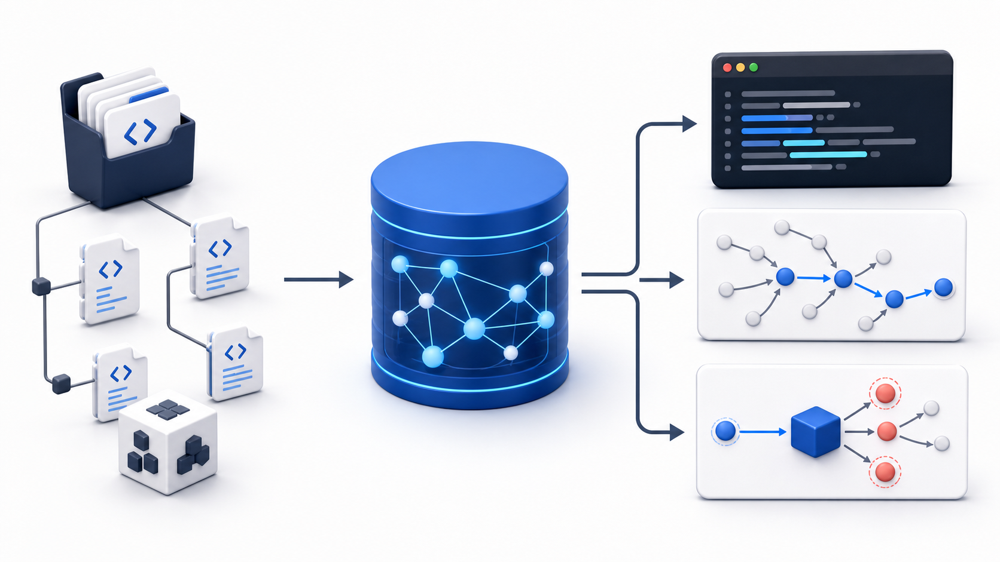

# Anatomist：把 Java 项目变成可查询的工程事实

Anatomist 是面向 Java 项目和代码 Agent 的命令行代码智能工具。它先把源码、类型关系、调用关系和框架配置索引到本地 SQLite，再用 JSON 查询回答问题。

它适合解决这类日常工程问题：**从哪里进入、下一步会调用什么、谁会受影响、某个字段在哪里读写、接口有哪些实现、Spring 是怎样装配的、项目直接调用了哪些三方类型。**

它不是运行时探针，也不内置大模型。它提供可追溯的静态代码事实；人或 Agent 再基于这些事实判断业务含义。



## 先看全貌

```text
Java 源码 + Maven/Gradle 依赖 + 可选 Spring XML
                     │
                     ▼
       解析 AST，尝试按真实类型/方法解析符号
                     │
                     ▼
   SQLite 快照：节点、边、全文索引、健康度、来源位置
                     │
       ┌─────────────┼──────────────┐
       ▼             ▼              ▼
   找定义/结构     调用与影响       配置与数据流
```

一次索引通常需要秒到分钟；随后查询只读取本地 SQLite，适合在大项目里反复追问，而不是每次都从头扫描源码。

## 能力：能回答哪些问题

| 你想解决的问题 | Anatomist 给出的静态事实 | 常用命令 |
|---|---|---|
| 类、方法、接口在哪里 | 类型、成员、注解、源码位置 | `search`、`context` |
| 这个方法接下来会调用谁 | `CALLS` 出边，可按深度展开 | `callees-of`、`call-path` |
| 改这个方法会影响谁 | 入站 `CALLS`、`REFERENCES` | `callers-of`、`used-by` |
| 哪些类实现/继承了接口或父类 | `IMPLEMENTS`、`INHERITS` | `implementors-of`、`hierarchy` |
| 字段在哪些地方被读写 | `READS`、`WRITES` 边 | `field-access` |
| 某段 if/else 或循环里调用了什么 | 带控制上下文的调用/字段访问 | `branches-of`、`--in-branch`、`--in-loop` |
| Spring 请求从哪里进入、Bean 如何注入 | `ROUTE`、`HANDLES`、`BEAN`、`INJECTS` | `search --kind ROUTE`、`deps-of` |
| Spring XML 的 property/map/list/ref 如何配置 | XML 配置树和 `WIRES` 边 | `bean-config`、`--spring-xml` |
| 项目调用了哪些外部 classpath 类型 | 以 `external_target_fqn` 保存的外部调用边 | `search --kind EXTERNAL_CLASS`、`used-by`、`callers-of` |
| 某个值、异常或污点可能如何传播 | 可选 CFG、def-use、跨方法摘要 | `flow-of`、`flow-path`、`exception-flow`、`taint-path` |
| 项目整体有哪些模块、包依赖和规模 | 节点/边计数、包依赖骨架 | `overview`、`survey-baseline` |

### 一个典型排查过程

需求是：“修改 `OrderService#createOrder` 会影响哪里？”

```bash
# 先建立或更新本地索引；integrity 保证解析和图完整性没有缺口
anatomist index /path/to/project \
  --incremental \
  --health-policy integrity \
  --format json \
  --output /tmp/project.db

# 再看直接及递归调用方
anatomist callers-of \
  com.example.order.OrderService#createOrder \
  --depth 3 \
  --source-window=2 \
  --index /tmp/project.db
```

结果会给出调用方、模块、源码文件、行号、调用种类，以及可选的源码窗口。这样可以先定位“哪里受影响”，再回到源码确认业务规则，不需要从包名或全文搜索开始猜。

## 为什么它会有效

### 1. 不是只按名字搜，而是建立带语义的图

普通全文搜索能找到字符串，却无法可靠区分同名类、重载方法、接口调用和构造器调用。Anatomist 从 Java AST 提取声明与使用关系，并在可解析时用 SymbolSolver 解析实际类型和方法。

例如，调用关系会区分 `INSTANCE`、`STATIC`、`CONSTRUCTOR`、`SUPER`、`INTERFACE` 和受限的 `REFLECTION`；方法标识包含擦除后的完整参数签名：

```text
com.example.OrderService#create(java.lang.String,java.util.List)
```

因此重载方法不会因为只看方法名而混在一起。多模块、主代码、测试代码和生成代码也使用独立的存储标识，减少同名符号碰撞。

### 2. 一次构图，多次查询

索引把类型、方法、字段、Bean、路由等保存为节点，把 `CALLS`、`REFERENCES`、`READS`、`WRITES`、`INHERITS`、`IMPLEMENTS`、`INJECTS` 等保存为边，并使用 SQLite FTS5 支持名字检索。

这把“每个问题都重新解析工程”的成本，转化成“先构建一次快照，后续按图查询”。查询结果默认分页，调用链按深度限制，适合 Agent 在上下文有限时逐步展开。

### 3. 结果带证据和质量信息

索引记录源码根目录、Git 快照、Java 版本、classpath 形态、诊断和健康度。查询 JSON 也带 `evidence`、`stats`、分页信息和来源位置。

这让使用者能区分下面两种情况：

| 情况 | 正确解读 |
|---|---|
| 找到了调用或依赖 | 这是有源码位置支撑的正向静态事实。 |
| 没找到结果且 `evidence.status=confirmed_empty` | 在当前索引覆盖范围内，可以较有把握地认为没有匹配。 |
| 没找到结果但证据为 `indeterminate` | 不能下“没有”的结论；可能受 classpath、解析失败或覆盖范围影响。 |

### 4. 外部依赖也可反查，但不强制展开全部 JAR

项目调用第三方类时，不需要先把全部 Maven 依赖都索引为源码节点。Anatomist 会把已有的外部调用事实写到 `edges.external_target_fqn`，并把它虚拟化为可查询的 `EXTERNAL_CLASS`。

```bash
# 查项目直接使用该外部类的地方
anatomist used-by com.vendor.json.SafeFastjsonParser --index /tmp/project.db

# 按完整外部方法签名精确查调用方
anatomist callers-of \
  'com.vendor.json.SafeFastjsonParser#parseObject(java.lang.String)' \
  --index /tmp/project.db
```

外部结果会标注 `external_target=true`、`resolution` 和 `confidence`，避免误把它当成本项目源码声明。这样既能做直接调用方反查，也不会把全部依赖 JAR 无限制展开成巨大图。

## 它的边界：什么不能承诺

Anatomist 是静态分析工具，下面的边界必须保留：

| 不能直接证明的事 | 原因 | 应补充什么证据 |
|---|---|---|
| 某条路径在生产环境一定执行过 | 静态调用关系表示“可能发生”，不是运行记录 | 日志、Trace、指标、压测或线上调用链 |
| 动态代理、无限制反射、AOP 最终落到哪里 | 运行时目标可能由配置、字节码或数据决定 | 运行配置、代理实现、运行时证据 |
| 所有第三方符号都已精确解析 | classpath 缺失或版本不匹配会降低外部解析度 | 保持 Maven/Gradle classpath 可用，检查 health/diagnostics |
| 精确堆别名、任意路径可达性 | 工具不是全量 SAT/别名分析器 | 结合单测、调试和领域约束 |

最实用的原则是：**把它当作“可追溯的代码事实底座”，不要当作运行时真相或自动业务结论。**

## 安装

当前预构建发布物面向 **macOS Apple Silicon（arm64）**。一条命令安装 native 二进制和常用 Agent 的 Anatomist skill：

```bash
curl -fsSL http://6.12.3.250:8100/dist-bin/install.sh | sh
```

安装位置默认为 `~/.local/bin/anatomist`。随后验证：

```bash
anatomist --version
```

如果 shell 找不到命令，把下面一行加入 `~/.zshrc` 或对应 shell 配置，再重启终端：

```bash
export PATH="$HOME/.local/bin:$PATH"
```

### 自定义安装位置

```bash
curl -fsSL http://6.12.3.250:8100/dist-bin/install.sh | \
  ANATOMIST_INSTALL_DIR=/usr/local/bin sh
```

安装脚本默认会为 Codex 和 Qoder 安装 `SKILL.md`。只给 Codex 安装：

```bash
curl -fsSL http://6.12.3.250:8100/dist-bin/install.sh | \
  ANATOMIST_SKILL_CLIENTS="codex" sh
```

不希望安装 skill：

```bash
curl -fsSL http://6.12.3.250:8100/dist-bin/install.sh | \
  ANATOMIST_INSTALL_SKILL=0 sh
```

### 从源码构建

适用于非 macOS arm64，或希望从当前源码构建的情况。

前置条件：JDK 21+、Maven 3.9+；构建 native 二进制还需要 GraalVM 25+。`just` 是可选但更方便的任务运行器。

```bash
# JVM fat jar
just jar

# macOS 本机 native 二进制（需要 GraalVM）
just native

# 直接使用 JVM 版本
java -jar target/anatomist.jar --version
```

## 五分钟上手

下面用一个真实 Maven 项目示例。默认会发现多模块 `src/main/java`，并尝试探测项目 classpath：

```bash
# 1. 首次构建索引
anatomist index /path/to/java-project \
  --health-policy integrity \
  --format json \
  --output /tmp/java-project.db

# 2. 找类或虚拟外部类型
anatomist search OrderService --index /tmp/java-project.db

# 3. 看类的成员、注解和局部调用
anatomist context com.example.order.OrderService --index /tmp/java-project.db

# 4. 正向追调用链
anatomist callees-of \
  com.example.order.OrderService#createOrder \
  --depth 3 --index /tmp/java-project.db

# 5. 反向评估影响面
anatomist callers-of \
  com.example.order.OrderService#createOrder \
  --depth 2 --index /tmp/java-project.db
```

如果分析的是 Java 9–17 目标，native 二进制可按需读取本机匹配 JDK 并缓存 catalog：

```bash
anatomist index /path/to/java-project \
  --java-version 17 \
  --jdk-home /path/to/jdk-17 \
  --output /tmp/java-project.db
```

如果需要 Spring XML，再在首次索引和后续 watch 中都加上 `--spring-xml`。如果使用 `--no-classpath`，索引会更快，但第三方类型解析和外部调用精度会下降。

## 如何持续保持结果新鲜

临时问一次问题时，先增量索引再查询：

```bash
anatomist index /path/to/java-project \
  --incremental \
  --health-policy integrity \
  --format json \
  --output /tmp/java-project.db \
&& anatomist search OrderService --index /tmp/java-project.db
```

持续开发时可以启动 watcher：

```bash
anatomist watch /path/to/java-project \
  --auto-index \
  --output /tmp/java-project.db \
  --full-policy background
```

首次索引用过的 `--project-source`、`--include-tests`、`--spring-xml`、classpath 策略、`--java-version` 和 `--jdk-home`，应在 watch 中保持一致。这样索引形态不会悄悄变化。

## 下一步

- 完整命令参数：[docs/commands.md](docs/commands.md)
- 数据模型和关系语义：[docs/data-model.md](docs/data-model.md)
- 架构与索引流水线：[docs/architecture.md](docs/architecture.md)
- 常见问题和恢复方式：[docs/troubleshooting.md](docs/troubleshooting.md)
- 面向 Agent 的查询使用约定：[SKILL.md](SKILL.md)
