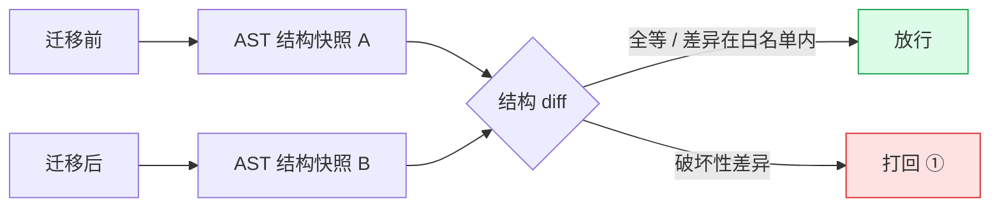
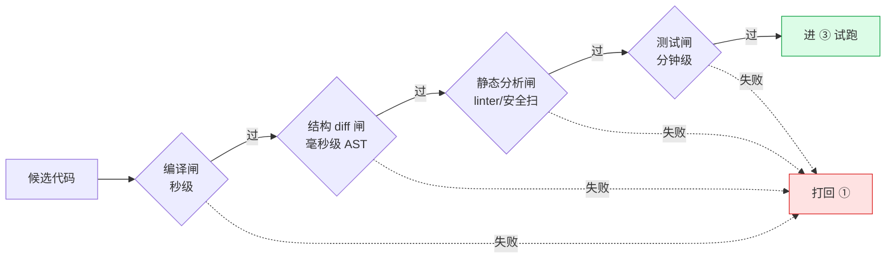
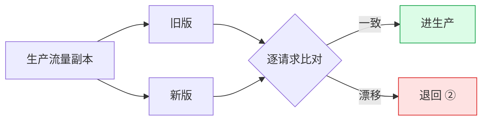
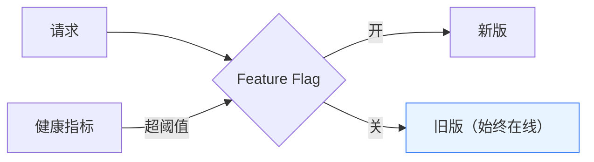
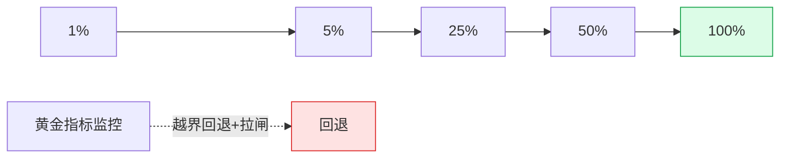

# 代码风格迁移：从结构验证到生产放量

代码风格迁移的本质是 **"保行为、只改形"**。难点不在"怎么改"，而在
**"怎么证明没改坏"**，以及"万一改坏了怎么及时止损"。

核心思想一句话：

> **风险左移**——便宜的验证手段尽量靠前，能在编译期拦下的问题绝不放到生产；
> 同时右侧备好逃生与灰度，因为静态验证证明不了 100% 的运行时行为。

---

## 一、总流程

五个阶段，从左到右"越来越真实、越来越昂贵、越来越难回滚"：

| 阶段 | 验证什么 | 主要手段 | 出问题怎么退 |
|---|---|---|---|
| ① 编写 | 变换是否越界 | 受限变换目录 + 范式样板 | 重新生成 |
| ② 验证 | 编译期 + 静态结构等价 | 编译 / 结构 diff / 静态扫 / 测试 | 打回 ① |
| ③ 试跑 | 运行时行为等价 | 影子回放 / 契约 / 数据 diff | 退回 ② |
| ④ 逃生 | 能否秒级切回 | Feature Flag + 自动拉闸 | 拉闸回旧版 |
| ⑤ 放量 | 真实流量下稳定 | 渐进灰度 + 黄金指标 | 自动回退 + 拉闸 |

一次结构对比是毫秒级零副作用，一次生产事故代价是几小时。**把拦截能力往左堆，是成本最优解。**

---

## 二、左侧：用静态语法树分析守住"结构没改坏"

把项目的源码解析成**抽象语法树（AST）**，提取出结构骨架——有哪些类/方法/字段，以及
它们之间谁调用谁、谁继承谁、谁读写了哪个字段。迁移**前后各分析一次做 diff**，就是一个
毫秒级、零成本的回归预检：结构对不上的候选直接打回，不用进编译和测试。

纯风格迁移应保持以下**不变量**，任一变化即需拦截或人审：

| 不变量 | 变了说明什么 |
|---|---|
| 公共 API 签名 / 可见性 | 对外契约被改，高危 |
| 调用关系（谁调用谁） | 调用链断了/多了 |
| 继承 / 实现 | 多态结构被动，高危 |
| 方法的字段读写 | 行为指纹变了，可疑 |
| 注解（事务/路由/注入） | 运行时语义被动，高危 |

判定分档：**纯风格迁移**要求结构全等；**重构型迁移**允许差异，但必须落在变换清单声明的范围内。

② 阶段按成本递增叠多道闸，越早拦住越省：

> 关键设计：**约束变换空间，而不是让 LLM 自由重写**。白名单内的等价变换可枚举、可验证、可回滚。
>
> **静态分析的边界**：它看不到运行时多态分发、反射/配置驱动、并发时序、外部系统交互——
> 这些靠右侧兜底。对无测试的老代码，迁移前先生成 characterization test 把当前行为钉死。

---

## 三、右侧：试跑、逃生、灰度

### ③ sim 试跑（行为等价）

贴近生产的隔离环境里，拿真实流量副本喂新旧两版，**逐请求比对输出**——发现"编译过、
测试过，但行为悄悄变了"的最有效手段。配合契约校验、性能基线、数据一致性比对。
退出标准：diff 可解释 + 性能无回归 + 契约全绿。

### ④ 逃生开关（放量前必须先建好）

新旧两版**同时在线**，Feature Flag 运行时路由，秒级切回无需发版。多级粒度（全局→模块→用户），
绑定健康指标**超阈值自动拉闸**。迁移不能产生不可逆副作用，否则配双写/兼容读。

### ⑤ 生产灰度放量

流量按 1% → 5% → 25% → 50% → 100% 渐进，每档停留观察窗口、稳定才进下一档。
先内部/灰度用户 → 核心流量。黄金指标（错误率/延迟/饱和度/业务转化）**新旧并排对比**，
越界自动回退上一档并拉闸。不可逆改动放慢加人工卡点，纯等价改动可放快。

---

**一句话总结**：用静态语法树分析把住"结构没改坏"这道最便宜、最靠左的闸，毫秒级 diff
拦掉大批问题；它证明不了运行时行为，所以 ③ 用影子回放补行为等价、④ 备秒级逃生、
⑤ 用灰度摊薄残余风险。**左移拦截省成本，右侧逃生兜底线，两头都不能缺。**
